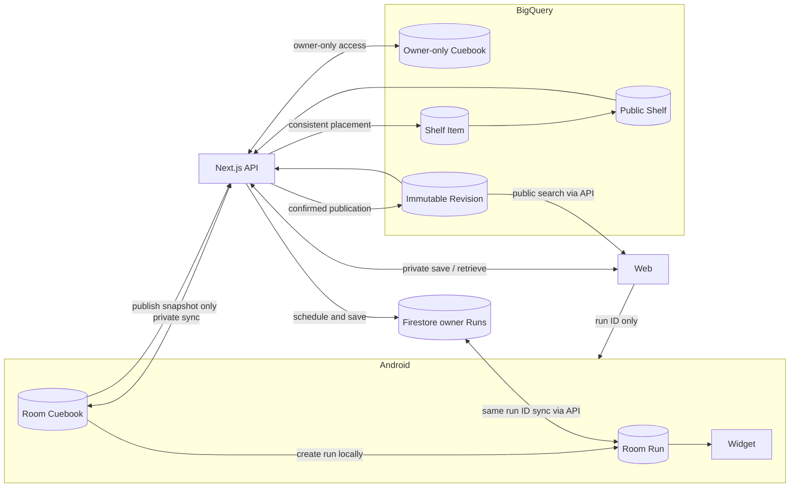
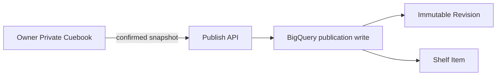
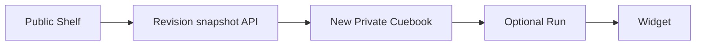
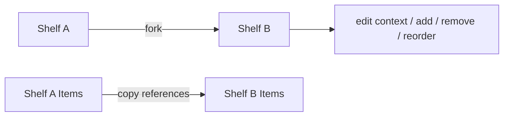
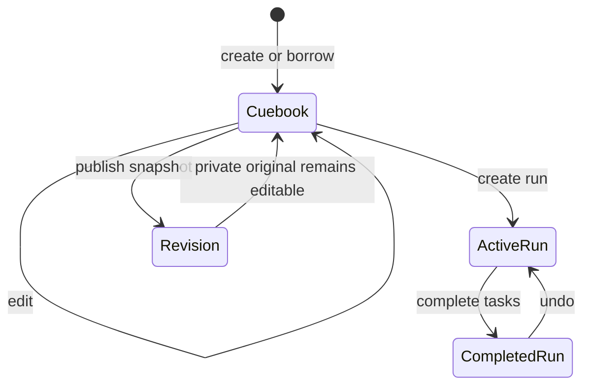
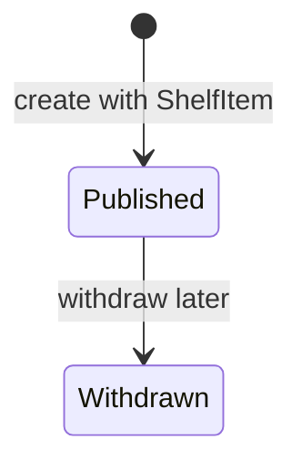
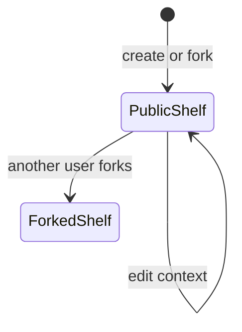

# Cuckoo Cue Design v2

Status: Draft

Updated: 2026-09-12

Scope: Core-domain MVP / Web / Android / Widget / BigQuery Cuebook and Shelf / Firestore Run sync

2026-09-10確認: Cuebook/Shelfと公開Revision・配置の共有正本はBigQuery、実行中・完了履歴のRun系はFirestore。以前の「Firestore公開モデル＋旧BQ検索」の保存先選定は撤回する。Entityの区別は維持し、BQのtable/STRUCT構成は別途確定する。Webでは最終日を入力し、再利用用の日数情報から各タスクの日程を自動展開してRunを保存する。Androidへ渡すのはそのRun ID。iOSは後追いとし、今回の実装を止めない。

## 1. Product shape

Cuckoo Cueは、再利用可能な私的なTodoの型を持ち、今回の日程へ展開し、日々はWidgetで実行する道具である。

型を他人へ渡すときは、私的な原本を直接公開せず、公開時点の不変なRevisionを作る。Revisionは特定の文脈を持つShelfへ置かれ、別の利用者が借りると、その人のPrivate Cuebookになる。

```text
Private Cuebook
→ Private Run
→ Widget execution

Private Cuebook
→ Immutable Revision
→ Public Shelf
→ another user's Private Cuebook
```

### 1.1 Fixed invariants

> Cuebookは、本棚なしで私的に作成・編集・再利用できる。
>
> Cuebookの不変なRevisionをShelfへ置くことが公開である。
>
> Shelfから借りたRevisionは、利用者自身のPrivate Cuebookになる。

この3要件を維持する限り、Cuebook、Run、CuebookRevisionを同じEntityで代用しない。

### 1.2 Three aggregates

| Aggregate | Entities | Lifecycle |
| --- | --- | --- |
| 個人の型 | Cuebook / CuebookTask | 私的に作成・編集し、複数回利用する |
| 今回の実行 | Run / RunTask | 今回だけの日程・変更・完了を持つ |
| 公開された本棚 | CuebookRevision / Shelf / ShelfItem | 公開時点を固定し、文脈ごと配置・forkする |

Entity数を減らすために異なるライフサイクルを統合しない。Private Cuebookの保存・同期はWebとモバイルで私的原本を共有するために含める。比較、集計、AIはMVP対象外とする。

---

## 2. Why the entities are required

### 2.1 Cuebook and Run

```text
海外出張Cuebook
→ 11月Runではホテル確認を2日前へ変更
```

Runの変更が今回だけなのか、次回の型にも必要なのかは自動判定できない。CuebookとRunを分け、Runの変更をCuebookへ自動反映しない。

これにより、Run Aを変更・完了しても、元Cuebookと同じCuebookから作ったRun Bは変わらない。

### 2.2 Cuebook and CuebookRevision

Private Cuebookは公開後も私的に編集される。

```text
公開時: 郵便転送を申し込む
後日、私的原本へ追加: 田中さんへ新住所を送る
```

ShelfがPrivate Cuebookを直接参照すると、私的な追記が公開面へ漏れる。公開時に本文とTaskを不変コピーしたCuebookRevisionが必要である。

### 2.3 CuebookRevision and ShelfItem

同じRevisionは複数の文脈へ置ける。

```text
「郵便転送」Revision
├ 猫と暮らす人の引っ越し
├ 一人暮らしの引っ越し
└ 県外転居の手続き
```

作品と配置を分けるため、ShelfItemを独立させる。

### 2.4 Shelf fork

既存Shelfの文脈が惜しい場合は、Shelf全体をforkする。新しいShelfとShelfItemを作り、Revision本文は共有参照する。

fork後はcontext、Revision構成、順序を変更でき、元Shelfは変わらない。

---

## 3. MVP scope

### 3.1 Included

- AndroidでPrivate Cuebookを作成・編集する
- 完了Runの完了タスクを編集して整え、新しいPrivate Cuebookとして保存する
- 完了Runから選んだタスクだけで新しいRunを作れる。この経路では日付・優先度・完了状態をクリアし、Cuebook作成と最終日入力を要求しない
- Private CuebookをShelf所属なしで保持し、Webとモバイルから取得・編集・同期できる
- CuebookTaskを相対日で保持する
- Cuebookからtarget anchor dayを指定してRunを作る
- RunTaskへabsolute dateと今回の状態をコピーする
- Runの変更をCuebookへ自動反映しない
- 既存App / WidgetでRunを実行、完了、Undoする
- WidgetはRun横断の実行キューであり、footerと文脈色はCueタイトルではなくRun文脈を表す
- AppはRun一覧を実行中リストの管理に集中させる。Widgetに出るかどうかは、Cueの優先度・日付を設定する場所で即時に示す。トップ画面にWidgetの再現カードや独立したプレビュー画面を置かない
- Cuebookから不変なCuebookRevisionを作る
- RevisionとShelfItemをBigQueryに整合した公開結果として確定する
- Public Shelfを認証なしで取得できる
- RevisionをShelfへ置く
- Revisionを借りてPrivate Cuebookを保存し、Webで日程設定済みRunを作ってAndroidへRun IDを渡す
- Shelf全体をforkする
- fork後のcontext、Revision追加・除外、並び順を編集する
- 補完関係にある複数Revisionを置いた初期Shelf一件
- 既存Run、BigQuery検索、既存公開経路を壊さない

### 3.2 Excluded

- Run差分のCuebookへの部分反映
- Revision同士の比較
- Revisionの自動更新
- Shelf familyの集約検索・代表決定
- AIによるShelf選択、PII検査、品質評価
- Observation / Outcome / 自動改善
- 利用実績、ランキング、コメント、いいね、フォロー
- Private Cuebookと既存Run同期以外への一般的な双方向同期の拡張
- 他人のShelfへの掲載申請
- Shelf共同編集、非公開Shelf
- グローバル検索の全面移行
- 既存BigQuery公開データの完全移行
- iOS対応

### 3.3 MVP hypotheses

| ID | Hypothesis | Evidence |
| --- | --- | --- |
| H1 | CuebookはRunと別の「次回も使う型」として理解される | 同じCuebookからRun A / Bが作られる |
| H2 | 私的原本と公開Revisionの分離に安心感がある | 公開後もCuebookを私的に編集できる |
| H3 | 複数の補完的RevisionをShelfとして見る意味がある | Shelfの文脈から複数作品が利用される |
| H4 | 他人のRevisionを自分のCuebookとして編集できる | 借用後の編集と再利用が行われる |
| H5 | 条件差をShelf forkで表現できる | fork後にcontextまたは構成が変更される |
| H6 | このモデルを経てもWidget実行まで重くない | 借用からRun作成・Widget利用まで到達する |

---

## 4. Minimal domain model

```text
Cuebook
  id
  title
  origin_revision_id nullable
  updated_at

CuebookTask
  id
  cuebook_id
  title
  relative_day nullable
  position

Run
  id
  source_cuebook_id nullable
  target_anchor_day nullable
  completed_anchor_at nullable

RunTask
  id
  run_id
  source_task_id nullable
  title
  scheduled_day nullable
  status

CuebookRevision
  id
  source_cuebook_id
  revision
  title
  tasks[]
  published_at
  withdrawn_at nullable

Shelf
  id
  title
  context
  forked_from_shelf_id nullable
  created_by

ShelfItem
  shelf_id
  revision_id
  position
```

### 4.1 Identity rules

- Cuebookはユーザーが所有する私的原本であり、Shelfに所属しなくても存在する。
- 同じユーザーのWebとモバイルは、保存・同期された同じCuebookを扱う。同期方式は6.1で扱う。
- CuebookTask IDはCuebook内で安定する。
- Runは`source_cuebook_id`を参照する。
- RunTaskは`source_task_id`で元CuebookTaskを参照する。
- Run作成時にCuebookTaskの本文と相対日をRunTaskへコピーする。
- Run作成後、CuebookとRunは独立する。
- Revisionは公開時のCuebookTaskをnested immutable copyとして持つ。
- Revisionは`source_cuebook_id`を来歴として持つが、Private Cuebookを公開readしない。
- ShelfItemは特定の`revision_id`を参照する。
- 同じRevisionを複数Shelfへ置ける。
- 借用時は新しいCuebook IDを発行し、`origin_revision_id`を保存する。
- Shelf forkはShelfとShelfItemだけを複製する。
- Webの全件コピーでは元Shelfの確認済み`updated_at`と配置Revision一覧を固定する。コピー先の公開名・contextを確認し、元の本文を所有するPrivate CuebookやRunは作らない。配置編集は名前・context・追加/除外/順序を一つの更新要求で確定し、再訪はShelf IDからサーバーの保存内容を読み直す。UIの未保存draft・再送情報は端末内の一時状態で、EntityやBQ列を追加しない。操作・検証範囲はweb-experience-spec.md第18節。

### 4.2 Date and status mapping

Webで利用者が入力する基本の日付は最終日（`target_anchor_day`）。Cuebookに保存された日単位のduration/相対日程から、各タスクのabsolute scheduleを自動生成する。全タスクの開始日・期限の手入力を要求しない。生成後の日程は今回のRunについて修正できる。

最小domainの`relative_day`は最終日からの相対日、`scheduled_day`は展開結果を表す。現行コードは`relative_start_day/end_day`も扱う。durationという語から、タスク依存関係や順次実行・工数の新モデルを推測追加しない。日数表現の物理field対応は実装時に明示し、自動生成と再利用時の逆変換を検証する。

```text
target_anchor_day = 利用者が指定する最終日
CuebookTask.relative_day
→ RunTask.due_at = target_anchor_day + relative_day

RunTask.status=pending
→ completed_at = null

RunTask.status=completed
→ completed_at != null
```

現行の`available_from_at`と`user_priority`はRunTaskに残す。Cuebookで再利用する必要がある場合は、CuebookTask snapshotのoptional fieldとして保持できるが、新しいEntityやライフサイクルは増やさない。

入力が最終日1つであることと、保存データの欠損は別。検証するのは自動展開後の値がRun保存・Android受信で失われないこと。`completed_anchor_at`等の完了操作時刻を最終日の代わりには使わない。

### 4.3 Immutability

- Cuebookは可変。
- Runは今回の実行中に可変。
- CuebookRevisionのtitleとtasksは作成後に変更しない。
- `withdrawn_at`だけは公開ライフサイクルの停止fieldとして変更可能。
- ShelfItemはRevisionを固定参照し、新Revisionへ自動追従しない。
- 新しい公開内容は新しいRevisionとして作る。

MVPではRevision比較とwithdraw更新用の公開APIを作らない。`withdrawn_at`はschemaに含め、公開ライフサイクルを停止できる境界だけ確保する。

---

## 5. Current implementation

以下は2026-09-06時点の実装記録であり、最新の実装完了状況を示さない。旧保存方針の記述も含み、2026-09-10のBQ/Firestore分担決定で置き換えられている。現在の設計上の決定は第6節以降を参照する。

### 5.1 Android

`android/app/src/main/java/app/cuckoocue/data/Entities.kt`には次がある。

```text
runs
run_tasks
widget_cues
```

Private Cuebook / CuebookTaskはない。RunとRunTaskは可変で、WidgetCueは表示projectionである。

`CuckooRepository.reuseCompletedRun()`は完了Runを相対日に戻し、新しいtarget dayへコピーできる。この既存機能は互換用として残すが、新しいPrivate Cuebookの代用にはしない。

### 5.2 Firestore

現在はowner Run snapshotだけを保持する。

```text
users/{uid}/runs/{runId}
```

公開Revision、Shelf、ShelfItemはない。

### 5.3 BigQuery

既存公開コーパスは`task_list_entries`にある。MVPでは既存検索と既存公開経路を維持するが、新しいCuebookRevision / Shelfの正本にはしない。

新しいFirestore公開モデルからBigQueryへのprojectionは作らない。

### 5.4 Web

現在はBigQuery検索API、Android Import用データ取得、完了Runの既存公開APIがある。Private Cuebook APIとShelf APIはない。

既存公開経路はMVP中に廃止しない。新しいShelf経路と並存させ、完全移行は行わない。

---

## 6. Storage architecture

| Storage | Stores | Does not store |
| --- | --- | --- |
| Android Room | Private Cuebook / CuebookTask / Run / RunTask / Widget projection | Public Revision / Shelf |
| BigQuery | Cuebook / CuebookTask / CuebookRevision / Shelf / ShelfItem。既存検索データとの対応は移行時に整理 | 日々変化するRunの正本 |
| Firestore owner path | Run / RunTaskのsnapshot。実行中と完了履歴 | 公開Cuebook / Shelfの正本 |

Private CuebookはBQ上でも本人専用。保存先がBQであることは公開を意味しない。APIが所有者を検証し、公開検索は明示公開したRevisionだけを対象にする。ユーザーの参加Shelf ID一覧の物理保存先は、この分担だけから推測決定しない。



### 6.1 Private Cuebook ownership and sync

- Private CuebookはShelf所属なしで保存できる。Private Shelfは追加しない。
- Webで完了タスクを編集して整えた内容は、自分のPrivate Cuebookとして残す。公開後も私的原本を編集・再利用できる。
- Webとモバイルから同じユーザーのCuebookを取得・編集できるよう、ユーザー専用の共有保存と同期を導入する。Androidローカルだけを正本とする従来方針は撤回する。
- 端末内の操作は引き続きオフラインで可能とする。アカウントへの保存・同期と端末内保存の関係は同期契約で定義する。
- Private Cuebookの保存と公開Revisionの作成は別の操作である。同期で公開Revisionや他人のCuebookを書き換えない。
- 私的原本の共有保存先はBigQuery。所有者の物理表現、競合解決、削除伝播、未同期データの扱いは未決。保存先の合意を、これらの詳細まで確定したものとして扱わない。

### 6.2 Public data stays together

CuebookRevision、Shelf、ShelfItemの正本と公開検索をBigQuery側に置く。Firestore公開データを別途BQへprojectionする二重構成は採らない。

公開は、確認したRevisionと配置が揃った結果として見えること、再試行で重複しないことを要求する。BQの具体的な書込・原子性・同時更新制御は物理実装時に確定し、Firestore transactionのコードをそのまま移植できるとは扱わない。

Firestore RunからBQ原本を作る際は、本人の完了Runを読み、新しいCuebookとして保存する。元Runを移動・削除する操作ではなく、二つのDBをまたぐ公開transactionも作らない。

---

## 7. Physical data changes

### 7.1 Android Room before / after

Before:

```text
runs
run_tasks
widget_cues
```

After:

```diff
+ cuebooks
+   id
+   title
+   origin_revision_id nullable
+   updated_at

+ cuebook_tasks
+   id
+   cuebook_id
+   title
+   relative_day nullable
+   position

  runs
    id
+   source_cuebook_id nullable
+   target_anchor_day nullable
    completed_anchor_at
    ...existing fields

  run_tasks
    id
    run_id
+   source_task_id nullable
    title
    due_at
    completed_at
    ...existing fields

  widget_cues
    ...unchanged projection
```

Room migrationはadditiveにする。既存Runは`source_cuebook_id=null`のone-off Runとして維持し、Cuebookへ強制変換しない。

### 7.2 BigQuery reusable data

第4節のCuebook/CuebookTask、CuebookRevision、Shelf/ShelfItemをBigQueryに表現する。論理Entity数をそのままtable数にしない。nested tasks、固定Revision参照、所有者専用の取得、公開検索、配置・forkの操作を満たすtable/STRUCT定義を次の実装で確定する。

旧Firestore公開パス`publicCuebooks/.../revisions`、`shelves/.../items`、DocumentReferenceの`revision_ref`は採用schemaから外す。BQにFirestore用technical containerを模倣して追加しない。参照はdomainのIDを用いる。

既存`task_list_entries`からの対応付け・移行範囲は整理が必要。新しい公開を別のFirestore経路に置き、BQ検索に出ないまま並存させる構成にはしない。

### 7.3 Firestore execution data

```text
users/{uid}/runs/{runId}
  Run snapshot with tasks
```

実行中・完了履歴とも同じRun系を扱う。Webで自動展開して保存したRunをAndroidが同じIDで取得する。`source_cuebook_id`、`target_anchor_day`、taskの由来と生成日程を保持し、取得時に新Runを再作成しない。既存snapshot APIに足りないfield/取得処理は実装TODOとして補う。

---

## 8. Core data flows

### 8.1 Private Cuebook to Run


1. Cuebookとposition順のCuebookTaskを読む。
2. 新しいRun IDを発行する。
3. Runへ`source_cuebook_id`と`target_anchor_day`を保存する。
4. 各CuebookTaskから新しいRunTaskを作る。
5. `source_task_id`を保存する。
6. relative dayをabsolute dayへ変換する。
7. completionをpendingに初期化する。

以後、Runの編集はCuebookを更新しない。

### 8.1.1 Completed Run to tasks-only Run

2026-09-11合意。完了履歴をWebで確認し、対象タスクを選んだ後の操作を二つに分ける。

- 「タスクだけもう一度使う」: 本人の完了Runから選択した本文を元の並び順でコピーし、Firestoreへ新しいRun/RunTask IDで保存する。今回の日付・優先度・完了状態・アーカイブ状態はnull。Cuebookと公開Revisionは作らず、元Runも変更しない。最終日の入力は不要。
- 「再利用用に整える」: 選択した実績をPrivate Cuebookの編集へ渡す。相対日程・優先度を確認・修正して残す。原本保存と公開の分離は従来どおり。上の直接再利用のためにこの編集を必須にしない。

追加Entityではなく既存Runへの生成経路の追加。元CuebookTaskそのものをコピーする経路ではないため、新Runのsource_cuebook_id/source_task_idは未設定とする。Androidには同じ保存済みRun IDを渡す方式を維持するが、受信実装がない段階で端末反映済みとは表示しない。

Web APIの実装: `POST /api/runs/{id}/reuse` はoperation_idと選択task_idsだけを受け、本人のFirestore原本を読み、task本文をクライアントから受け付けない。同じ操作IDの再送は同じRunを返し、保存後の実行変更を上書きしない。異なる選択内容で同じ操作IDを再送した場合は409。`GET /api/runs/{id}/snapshot` は本人の保存済みRunをそのまま取得する。

日程相対化: snapshotのtarget_anchor_dayはAndroid Roomと同じepoch millis（そのtime_zoneでの予定最終日）を受け、Web draftではISO日へ変換する。completed_anchor_atは相対化の基準にしない。予定最終日が未同期なら相対日程はnullとし、編集画面にその事実を表示する。完了日で代用したり、絶対の基準日入力をCuebook編集へ戻したりしない。Android送受信とWeb履歴への復元は第16節の実装に接続済み。過去の欠損データを完了日から推定補完するものではない。

### 8.2 Publish Revision and place on Shelf



Request:

```text
revision_id              // client-generated idempotency key
source_cuebook_id
title
tasks[]
shelf_id
```

公開操作の要件（BQでの物理実現は別途確定）:

1. Firebase userを検証する。
2. 本人のPrivate CuebookをBigQueryから読む。
3. 原本の所有者と、利用者が確認したsnapshotを検証する。
4. 対象Shelfの`created_by`一致を確認する。
5. 同時公開・再試行を考慮してrevision番号を決める。
6. immutable RevisionをBigQueryへ保存する。
7. ShelfItemの配置を整合した公開結果として確定する。
8. 保存したRevisionと公開先を返す。

事前生成した`revision_id`で再試行を冪等にする。すでに同じ所有者・内容・公開先の操作結果があれば同じ結果を返し、revision番号を再度増やさない。Revisionだけ、またはShelfItemだけの状態を公開成功として見せない。

MVPでは他人が作成したShelfへ直接掲載できない。必要ならそのShelfをforkし、自分が編集できる派生ShelfへRevisionを置く。

Webまたはモバイルは、本人が作成またはforkしたShelfのIDと、確定時点の自分のCuebook snapshotをPublish APIへ送る。APIはPrivate Cuebookの所有者を検証する。私的保存の成功と公開の成功を別に扱い、公開失敗時も保存済みの私的原本を失わない。

完了履歴からの経路は、完了Runの実際に完了したタスクを起点に編集し、新しいPrivate Cuebookとして保存してから、その不変なRevisionをShelfへ配置する。元Runや元Cuebookへ変更を自動反映しない。日付の相対化と編集途中の保存方式は別途確定する。

### 8.3 Borrow Revision



1. WebはShelfItemの`revision_id`からBigQueryのRevisionをAPI経由で読む。
2. withdrawnでないことを確認する。
3. 借用するユーザー専用にRevision snapshotをコピーする。Webでの借用でも、モバイル到達前に私的原本を保存できる。
4. 新しいCuebook IDを発行する。
5. `origin_revision_id`を設定する。
6. Revision tasksをCuebookTaskとしてコピーする。
7. 借用後の編集は借用者自身のPrivate Cuebookだけを変える。その同期も同じユーザーの範囲に限定する。

借用には、Private Cuebookだけを作る場合と、Private Cuebookの作成後にtarget anchor dayを指定してRunまで作る場合がある。

2026-09-09のWeb要件では、借用後のRun作成・今回の日程確定までWebで完了し、同じユーザーのモバイルへ保存結果を同期することを対象とする。今回の日付変更はRunTaskに閉じ、公開Revisionや借用元Cuebookを変更しない。共有保存の成功と端末反映の完了は区別し、保存結果のIDをもとに同じRunを取得する。端末連携時に同一内容のRunを再作成しない。同期・競合・冪等性の物理契約は6.1の未決事項と合わせて定義する。

2026-09-10確認: 最終日入力→日数から日程を自動生成→FirestoreにRun保存→Androidへ`run_id`だけを渡す→本人の同じRunを受信、が初期導線。別のimport payloadや日程の再入力を要求しない。受信側の実装不足はTODOであり、受渡し方式の未決ではない。iOSはこの契約に後から追いつかせる。

### 8.4 Shelf fork



fork時に新しいShelf IDとShelfItemを作る。Revision本文はコピーしない。新Shelfの`created_by`はfork実行ユーザー、`forked_from_shelf_id`は元Shelf IDになる。

fork後の変更は新Shelfだけに適用する。元Shelfの後続変更もforkへ自動反映しない。

---

## 9. State machines

### 9.1 Cuebook and Run



`Revision --> Cuebook`はRevisionを戻す遷移ではなく、公開後もPrivate Cuebookが独立して存在することを表す。

### 9.2 Revision



MVPの公開APIはwithdraw更新を提供しないが、本文の不変性とwithdraw境界はschemaで守る。

### 9.3 Shelf



Shelfは常にpublicで、visibility stateを持たない。

---

## 10. API surface

| Endpoint purpose | Auth | Result |
| --- | --- | --- |
| Public Shelf list/detail | 不要 | ShelfとRevision summaries |
| Create Shelf | 必須 | 作成者が編集できるPublic Shelf |
| Fork Shelf | 必須 | 独立したShelfとcopied ShelfItems |
| Edit Shelf/items | 必須、`created_by`一致 | contextと配置を更新 |
| Publish Cuebook to Shelf | 必須、私的CuebookとShelfの所有者一致 | BigQueryへ整合したRevision + ShelfItemを保存 |
| Place existing Revision | 必須、Shelfの`created_by`一致 | 既存Revisionを別Shelfへ配置 |
| List editable Shelves | 必須 | 現在ユーザーが公開先に指定できるShelf一覧 |
| Read public Revision | 不要 | 再利用用snapshot |
| Borrow/save Private Cuebook | 本人認証 | BigQueryの本人専用Cuebook |
| Private Cuebook retrieve/update/sync | 本人認証 | BigQueryの自分のCuebookとtasks。物理schemaは未決 |
| Save/retrieve Run | 本人認証 | Firestoreの同じRun IDと日程・実行状態 |

Next.js server APIが認証、所有、入力上限、ID参照、保存結果の整合性を検証する。公開・再利用系はBigQuery、Run系はFirestoreへ接続する。

Private Cuebookの保存・取得・更新・同期APIを追加する。公開APIとは所有権と公開範囲を分離する。削除と競合処理を含む詳細契約は6.1の未決事項を解消してから定義する。

---

## 11. Development elements

### A. Android Private Cuebook

- Room `cuebooks` / `cuebook_tasks`
- additive migration
- Cuebook CRUD
- 同じユーザーのWebとのPrivate Cuebook保存・同期
- Cuebook → Run copy
- borrowed Revision → Cuebook copy
- Cuebook snapshotを一度だけ送るpublish client
- 自分が編集できるShelfの取得
- legacy Run互換

Exit:

- CuebookからRun A / Bを作り、Aの変更がCuebookとBへ影響しない。

### B. BigQuery reusable data

- owner-only Cuebook / CuebookTask
- immutable Revision
- Shelf / ShelfItem
- security validation
- Revision + ShelfItemの整合した保存と冪等性
- Shelf forkの固定参照コピー

Exit:

- 公開版と配置が揃った結果を返し、公開検索にPrivate Cuebook本文を混入させない。

### C. Web public-data integration

- 完了Runの完了タスクから整えたPrivate Cuebookの保存・取得・更新API client
- Public Shelf list/detail API client
- Shelf create API client
- Shelf fork API client
- Shelf contextとShelfItemの追加、除外、並び替えAPI client
- 最終日からの日程生成、Firestore Run保存、Run IDによるAndroid App Link

Exit:

- Shelfから借用してWebで日程確定・保存し、Androidが同じRunを受信できる。

### D. Compatibility

- existing BigQuery search/import/publicationを維持
- existing Run syncを維持
- existing Widget complete/Undoを維持
- Widget footerはAndroid/iOSともRun文脈を示す。Androidのfooter tip/filterとright railはRun ID/Run title由来にし、Cueタイトル由来の二重ナビにはしない
- `reuseCompletedRun()`を維持

Exit:

- 新しいdomain導入後も既存Runと公開データが使える。

---

## 12. Implementation order

1. `Cuebook / CuebookTask`をAndroid Roomへ追加する。
2. CuebookからRunを作り、既存Widgetで実行できるようにする。
3. Private Cuebookの共有保存・同期契約を確定し、Webで整えた原本をモバイルで取得・編集できるようにする。
4. BigQueryにCuebookRevision / Shelf / ShelfItemを表現し、整合した公開・検索を接続する。
5. Web Shelfから借用し、最終日から日程生成してFirestoreへRun保存。AndroidへRun IDを渡す。
6. Shelf全体をforkし、context、追加、除外、並び順を独立編集できるようにする。
7. 私的保存・同期・公開のE2Eと既存機能regressionを通す。

検索projection、既存CuebookへのRun差分反映、AI、Observationはこの順序に含めない。

---

## 13. Verification

### 13.1 Private Cuebook and Run separation

```text
CuebookからRun AとRun Bを作る
→ Run Aを編集・完了する
→ CuebookとRun Bが変わらない
```

Checks:

- relative dayが各target anchor dayへ正しく展開される。
- RunTaskにsource task IDが残る。
- Runのcompletion、title、date変更がCuebookへ戻らない。
- 既存Runはmigration後も開ける。

### 13.2 Public Revision immutability

```text
CuebookからRevision 1を公開する
→ Private Cuebookを変更する
→ Shelf上のRevision 1は変わらない
```

Checks:

- BigQueryの公開版と配置が整合して見える。
- 保存途中の失敗を公開成功として見せず、再試行で同じ結果へ復帰できる。
- 同じoperationのretryでRevision番号が増えない。
- Revision title/tasksのupdate APIが存在しない。

### 13.3 Borrow ownership separation

```text
User BがUser AのRevision 1を借りる
→ User BのPrivate Cuebookが作られる
→ User Bが編集してもUser AとShelfは変わらない
```

Checks:

- 新しいCuebook IDを発行する。
- origin revision IDを保存する。
- 公開版の閲覧にはsign-in不要。本人用の共有保存時に認証する。
- borrowed CuebookからRunとWidgetへ進める。

### 13.4 Shelf fork separation

```text
Shelf AをforkしてShelf Bを作る
→ Bのcontextと構成を変更する
→ Aは変わらない
```

Checks:

- Bに新しいShelf IDと現在ユーザーの`created_by`を設定する。
- `forked_from_shelf_id=A`になる。
- ShelfItemは同じRevisionへのreferenceをコピーする。
- Bの追加、除外、並び替えがAへ影響しない。
- Aの後続変更がBへ影響しない。

### 13.5 Existing behavior

- App / Widget completeとUndoが変わらない。
- existing BigQuery search/importが動く。
- existing publication pathが動く。
- existing Run syncが動く。
- completed Run reuseが動く。

### 13.6 Private save and publication

- 完了Runから整えたCuebookが、Shelf所属なしで本人の原本として保存される。
- Webで保存したCuebookを同じユーザーのモバイルで取得でき、変更を共有できる。
- 他のユーザーは私的原本を取得・更新できない。
- 公開後に私的原本を変更しても、既存の公開Revisionは変わらない。
- 公開失敗時にも保存済みの私的原本が残る。
- オフライン、競合、削除の期待結果は、同期契約を確定したうえで検証条件に追加する。

---

## 14. Deferred work and triggers

| Deferred work | Start only when |
| --- | --- |
| Run差分 → Cuebook部分反映 | 利用者が同じ変更を手でCuebookへ戻す負担を示す |
| Revision比較 | 同じCuebookの複数Revision参照が実際に発生する |
| 別検索projection | BQ正本の検索で不足が実測された場合のみ再検討 |
| Shelf family grouping | fork数の増加により個別Shelfの取得・検索が妨げられる |
| AI Shelf assistance | 人手での検索・差分理解がボトルネックになる |
| Observation | 実行結果を公開作品へ戻す価値が確認される |
| iOS integration | Android/WebのE2Eが成立した後 |

---

## 15. Settled decision

MVPで残すのは、要件から直接必要な7 Entityである。

```text
Cuebook / CuebookTask
Run / RunTask
CuebookRevision
Shelf / ShelfItem
```

削るのはEntityではなく、その周辺の高度な機能である。

```text
Keep: distinct lifecycle and ownership boundaries, owner-only Cuebook save/sync
Cut: generic sync expansion, diff application, revision comparison, search projection, AI, analytics
```

この境界を、実装量だけを理由に再びRunやBigQuery Entryへ統合しない。要件自体を変える場合だけ、domain modelを再検討する。

## 16. Web保存経路の物理契約（2026-09-12）

本節は3章・8章の未接続だった物理保存契約の実装内容。EntityやPrivate Shelfは追加しない。全体の残作業はweb-experience-spec.md第14節、検索からAndroid実行・Web履歴への往復は同第16節、完了履歴から公開し別ユーザーが再利用する経路は同第17節で管理する。

| 保存先 | 内容 | 境界 |
| --- | --- | --- |
| BQ `cuebooks` | `id, owner_user_id, origin_revision_id, title, tasks, domain, context_text, task_groupings, updated_at` | 本人の私的原本。すべての読み書きにowner条件を付ける。検索対象外 |
| BQ `cuebook_revisions` | `id, owner_user_id, source_cuebook_id, title, tasks, domain, context_text, task_groupings, search_text, context_embedding, created_at` | 確認済み原本の不変snapshot。created_atは公開日時。これだけを全文検索・類似度計算の対象とする |
| BQ `shelves` | `id, title, context, forked_from_shelf_id, created_by, created_at, updated_at, items` | 公開グループ。itemsは`ARRAY<STRUCT<revision_id, position>>`。本文の複製ではない |
| Firestore `users/{uid}` | `shelf_ids` | 参加する既存Shelf IDの配列。参加で編集権限は増えない |
| Firestore `users/{uid}/runs/{runId}` | Run snapshot、tasks | 実行・完了履歴。`source_cuebook_id`、taskの`source_task_id`、`target_anchor_day`を保持する |

- tasksは`ARRAY<STRUCT<id, text, default_priority, relative_start_day, relative_end_day>>`。配列順を推奨順とし、独立したtasksテーブルや追加のorder列は作らない。タスクIDは並べ替え・削除取消で変えない。借用先のCuebookTaskには新IDを割り当てる。
- domain/context_text/task_groupingsは原本上では準備前のnullを許容。APIの`enrichment`はこれらをまとめた応答形式であり、BQ上の追加Entityではない。
- 私的保存はLLM処理や公開を必須にしない。公開時は準備済み原本のupdated_at・タイトル・タスクと確認snapshotを照合する。明らかな個人情報を検出した場合は公開を拒否する。私的保存済み原本は失わない。
- 完了履歴で選択した内容を編集し、私的原本として保存してから再訪・LLM準備・確認・再保存・公開できる。公開版と配置を作るまで私的原本は検索へ出さない。別ユーザーの借用は新しい私的原本/Task IDと実行Runを作り、借用元Revisionを固定する。公開後の原本編集は、公開版・借用先・実行履歴を変更しない。
- 公開グループの名前・contextにも既存の明らかな個人情報チェックを適用する。作成前の400/422では公開先入力を訂正できる。書込結果不明の通信失敗では同じ操作ID・内容で再試行し、確認できない成功を表示しない。グループ作成、自動参加、Revision公開の全体は単一transactionではない。
- 公開Revision作成とShelf配置を1つのBQ transactionで確定する。Shelf全件forkは、利用者が確認したupdated_atに対応する配置一式を固定コピーする。以後は元の更新へ追従しない。
- WebのShelf forkは操作IDと確認済みupdated_atを一緒に、利用者・元Shelf別に一時保存する。通信失敗・再読込後の再送で元Shelfの最新版へ差し替えない。公開と日程付き再利用の再送も利用者・原本の版別に保持する。
- 私的原本/Shelfの更新はexpected_updated_atで競合を検出し、無条件上書きをしない。Webでは最新の保存内容を確認してから、明示的に自分の編集で更新できる。
- BQのINSERTはtransactionだけでは重複を防げないため、owner・操作IDから固定Job IDを作る。同じ操作IDの異なる入力はJobのrequest hashで拒否する。Job metadataは運用上の再送照合であり、domainの版Entityにはしない。[BQ transactionの同時実行仕様](https://docs.cloud.google.com/bigquery/docs/transactions#transaction_concurrency)。
- 検索は公開Revision IDごとに返す。本文が同じという理由で別の公開版を除去しない。関連Shelfは配置の逆引きのみ。検索cursorはJobの用途・利用者labelを照合し、私的なBQ queryのJob IDへ差し替えて読めないようにする。
- Run更新はsnapshotのETagをIf-Matchで照合。同一内容の再送は成功とし、古い版の異なる送信は409。再利用作成時の`creation_request_hash`は運用metadataとして保持し、後のタスク編集・削除後も同じ作成操作を再送できる。snapshot APIやAndroidのRunモデルには含めない。
- 日程付き再利用は`POST /api/reuse`。公開版の場合は先に私的Cuebookを借用保存し、同じ操作IDでRun作成まで再試行する。私的原本から使う場合は原本を複製しない。暦日の演算にはTemporalを使い、timezoneと夏時間を考慮し、nullの開始/期限を補完しない。
- Webの日程確定では、全タスクの`task_dates: [{task_id, available_from_day, due_day}]`を上のAPIへ渡す。task_idは画面で確認した原本/公開版の既存Task ID。日付はISO暦日またはnullで、サーバーがIDの全件一致と日程を検証し、Runの既存absolute fieldへ変換する。公開版借用時はそのTask IDから借用先Task IDへ対応付ける。BQに日程修正用の列やEntityは追加しない。APIでtask_datesを省略した場合は従来の自動生成のみ。
- 最終日変更時は「個別の変更を残す」「すべて再計算」「変更を取り消す」を選べる。保持では修正したタスクの開始/期限の組を固定し、未修正タスクだけを再計算する。日程の修正は今回のRunに限り、私的原本・公開版の日数情報を変更しない。
- Androidへのリンクは`/import?run_id=...`だけ。Androidは本人のsnapshotを同じIDでRoomへ受信する。既存Runをリンク再訪で上書きしない。アプリ再開時は本人のRun一覧をページング取得し、新規のRunだけを受信する。既存Runの他端末変更をマージする仕組みとは区別する。
- Androidで実行・完了・Undoしたsnapshotは同じFirestore RunへETag付きで送信する。送信はWorkManagerへ利用者IDとRun IDだけを渡し、実行時にRoomの最新状態を読む。通信失敗はネットワーク接続条件とbackoff付きで再送する。操作中の追加変更は後続Jobへ渡し、同じ操作の再送でRunを増やさない。認証・入力・競合の確定エラーは自動上書き/無限再試行しない。ログイン・アプリ再開時にも送信を予約する。WorkManagerの運用情報を新しいドメインEntityとはしない。
- OSがApp Linkを処理しない場合、Webの`/import`は本人の保存済みsnapshotを読み取り表示する。保存済みと端末受信済みを区別し、同じRunへのリンクと完了履歴への導線を出す。閲覧や再試行によるRun再作成は行わない。
- ログイン/再開による一括再送は、同期metadataの所有者がログイン中UIDと一致するRunだけ。所有者不明の既存ローカルRunを、ログインしたという理由だけでそのアカウントへアップロードしない。既存ローカルデータのアカウント移行や表示分離はG06で別途扱う。
- Androidの完了画面からWebへ戻る際は、同期成功を確認して`/?run_id=...`へ遷移する。Webはサーバーの完了状態を読み取り、予定最終日から相対日を復元する。履歴一覧はWebへの再訪/タブ復帰時に読み直し、完了取消が同期されたRunは一覧から外す。既存原本・公開版には反映しない。
- 旧`POST /api/task-list-entries`とShelfの単独item追加は410。旧Firestore公開モデルへの新規書込・BQへの二重projectionは行わない。Private Shelf、削除伝播、公開停止、双方向マージは未決/残作業を勝手に実装しない。
