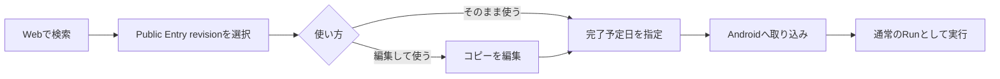
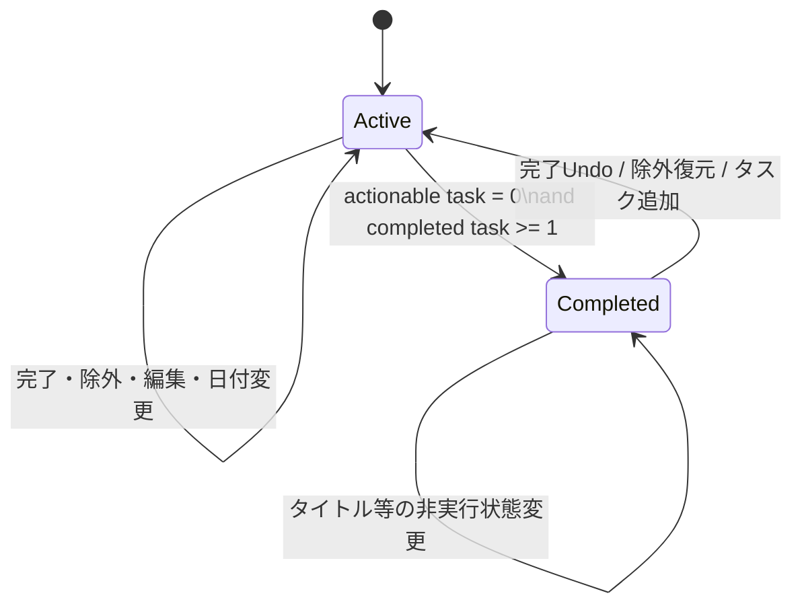
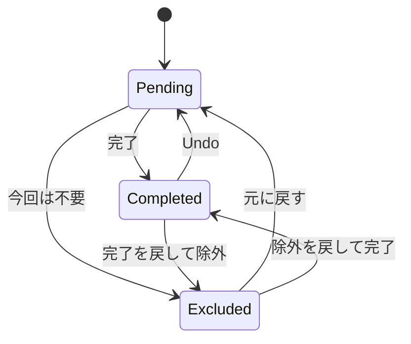
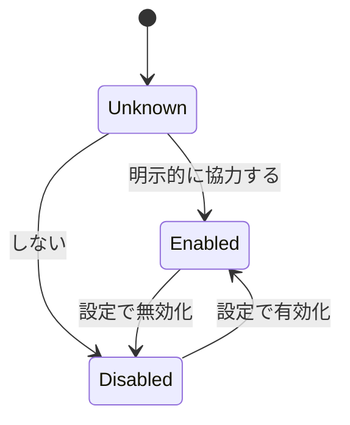
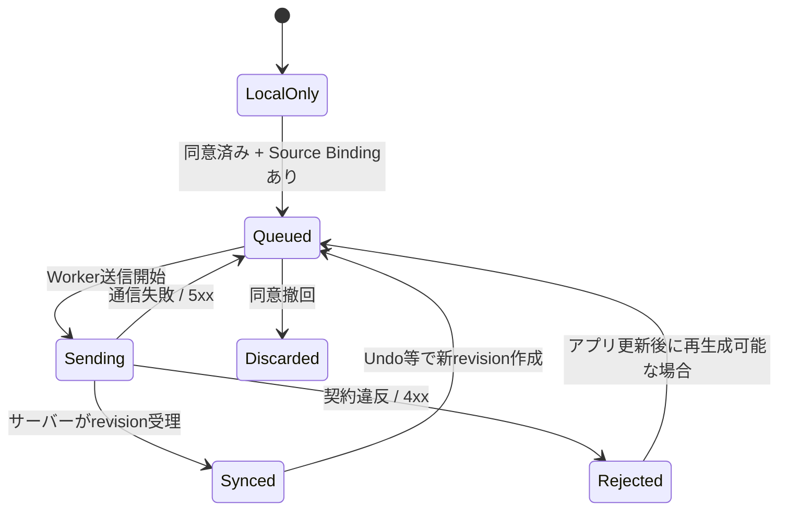
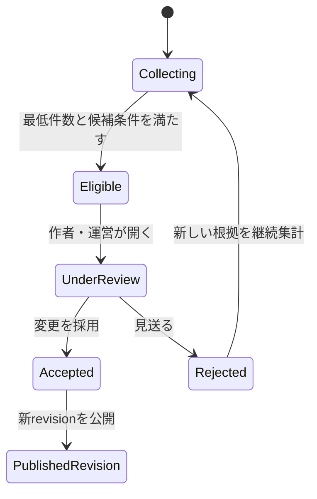
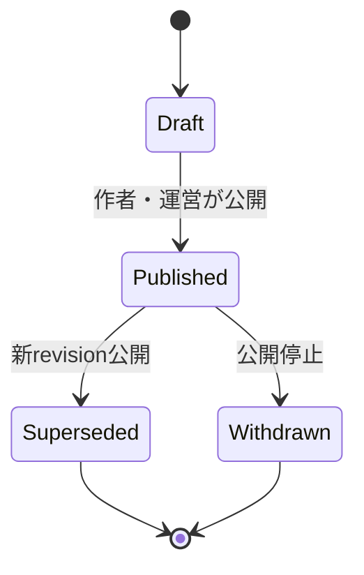
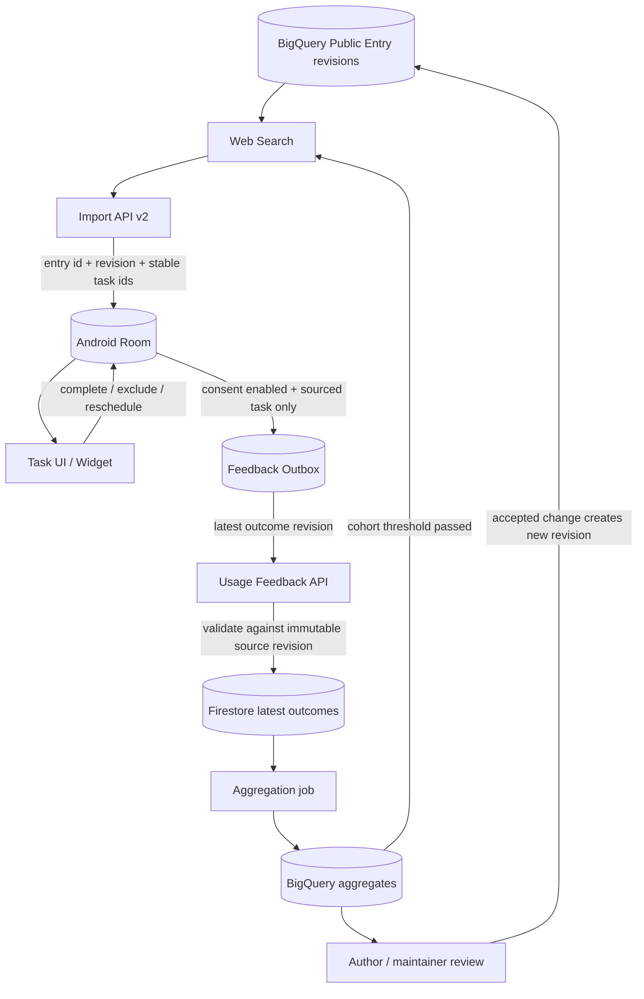
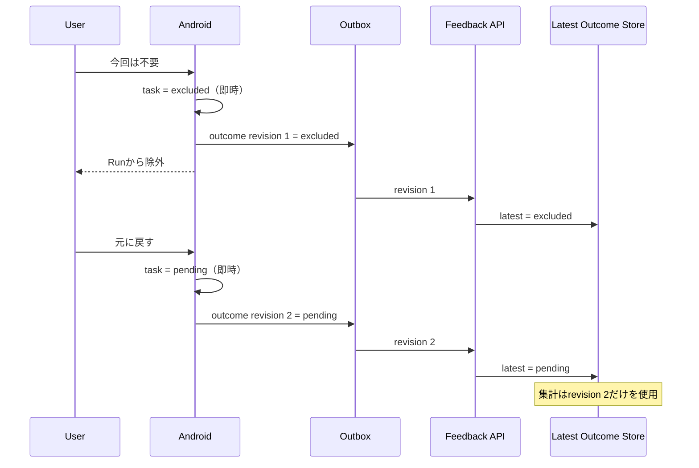

# Cuckoo Cue Playbook Participation Design

Last updated: 2026-09-06

> Superseded as the current product/MVP design by [Design v2](design_v2.md).
> This document remains a detailed reference for stateful, privacy-minimized
> Outcome synchronization.

## 1. Purpose

Cuckoo Cue の表側は、自分の Run を静かに実行する Todo 道具であり続ける。
裏側では、公開 Playbook を使った結果を、本人の作業を増やさずに次の Cue の改善へ使う。

この設計は、次の循環を成立させるための状態機械、データ境界、開発要素を定義する。

```text
公開 Playbook を探す
  -> 自分の Run として使う
  -> 完了 / 今回は不要 / 日付変更
  -> 同意済みなら構造化された利用結果だけ同期
  -> 集計とレビュー
  -> 新しい Playbook revision
  -> 次の利用者の Cue が改善される
```

### Product principle

> 表では、自分のタスクを処理するだけ。裏では、その結果が元 Playbook の条件・時期・鮮度を少しずつ改善する。

## 2. Decisions

1. 通常の完了画面で、一般公開やコミュニティへの投稿を要求しない。
2. 完了した Run は、共有状態に関係なく本人が再利用できる。
3. 完了版の操作は `そのまま使う` と `編集して使う` とする。
4. 公開 Playbook 由来の Run だけが、元 Playbook への利用結果を持つ。
5. 取り込み元 Entry、revision、元タスク ID をAndroidに保持する。
6. 本人に必要な `完了`、`今回は不要`、日付変更から結果を作る。貢献専用操作を必須にしない。
7. 自由文、追加したタスク名、メモ、Run 名、実日付は利用結果APIへ送らない。
8. 同意は事前に明示的に得る。未選択や拒否を同意として扱わない。
9. 結果は追記イベントの総和ではなく、`利用セッション × 元タスク` の最新状態として同期する。Undo は新しいrevisionで訂正する。
10. 集計結果から条件分岐を自動公開しない。作者または運営のレビューで新しいPlaybook revisionを作る。
11. 公開済みrevisionは不変とし、既存Runの再現性を守る。
12. UIでは「匿名」と断言せず、実装に即して `個人情報を含まない利用結果` と説明する。

## 3. Non-goals

- SNS、タイムライン、フォロー、コメント、ランキング、バッジ
- 全利用者を公開投稿者に変えること
- AIによる自動的な正解Playbook生成
- 追加された私的タスクを自動で公開候補へ送ること
- 1件の報告だけでCueの表示条件を変えること
- 完了操作をネットワーク成功に依存させること
- このフェーズでのiOS同期実装。ただしデータ契約はプラットフォーム非依存にする。

## 4. Terms

| Term | Meaning |
| --- | --- |
| `Public Entry` | 検索可能な公開Playbookの論理ID。既存のBigQuery `task_list_entries` に対応する。 |
| `Entry Revision` | 特定時点の不変なPlaybook。タスクの安定IDを持つ。 |
| `Source Binding` | ローカルRun/Taskと、取り込み元Entry revision/taskの対応。 |
| `Usage Session` | 1つの公開revisionを1回Runとして使用した単位。ランダムな`contribution_id`で識別する。 |
| `Task Outcome` | 元タスクが現在 `pending`、`completed`、`excluded` のどれかを示す最新状態。 |
| `Feedback Outbox` | Androidでローカル操作をブロックせず、結果を再送するためのキュー。 |
| `Aggregate` | 公開可能な最低件数を満たした利用結果の集計。 |
| `Improvement Candidate` | 集計から作られ、作者・運営の確認を待つ変更候補。 |

## 5. User flows

### 5.1 Public Playbookを使う



`そのまま使う` と `編集して使う` のどちらでも、Source Bindingを保持する。
編集で追加されたタスクには `source_task_id` を付けない。
元タスクのタイトルを変更した場合は `content_modified=true` とし、元内容の完遂率へ無条件に加算しない。

### 5.2 実行中にタスクを処理する

```text
固定電話を移転する

[完了] [今回は不要]
```

`今回は不要` は、その場で現在のRunから外す。理由回答は任意であり、キャンセルしても除外は成立する。

```text
今回は不要の理由

[自分には該当しない]
[すでに済んでいた]
[情報が古い]
[回答しない]
```

### 5.3 Runを完了する

完了画面に投稿CTAを置かない。

```text
引っ越し準備を完了しました

今回の内容は完了済みリストから再利用できます。

[閉じる]
```

利用結果提供へ同意済みで、Source Bindingがある場合だけ、裏側で最新Outcomeを同期する。

### 5.4 完了版を再利用する

完了済みRunの操作は次の2つにする。

```text
[そのまま使う]
[編集して使う]
```

- `そのまま使う`: 新しい完了予定日だけ選び、相対日程・順番・優先度を保って未完了Runを作る。
- `編集して使う`: 完了版を下書きへ複製し、項目・日程・優先度を編集してから未完了Runを作る。
- 元RunがPublic Entry由来なら、新RunにもSource Bindingを引き継ぐ。
- 再利用後のRunも、完了すれば再び本人が再利用できる。

### 5.5 自作Run

自作RunにはSource Bindingがないため、利用結果送信を行わない。完了版は非公開で再利用できる。

一般公開は別の作者向けフローとし、この設計のMVPには含めない。

## 6. State machines

### 6.1 Run lifecycle

`archived_at` は一覧表示上の独立フラグとし、実行状態と混ぜない。



Run完了条件:

```text
pending_task_count == 0
AND completed_task_count >= 1
```

全項目を `今回は不要` にしたRunは、完遂実績として扱わない。

### 6.2 Run task lifecycle

DB上は `completed_at` と `excluded_at` で表現し、同時に値を持つことを禁止する。



`Excluded` の `reason_code`:

| Code | UI | Meaning |
| --- | --- | --- |
| `not_applicable` | 自分には該当しない | 将来の条件分岐候補。 |
| `already_done` | すでに済んでいた | タスク自体は有効。着手時期や重複の検討材料。 |
| `outdated` | 情報が古い | メンテナンス確認候補。自動削除しない。 |
| `unspecified` | 回答しない | 除外件数には含めるが、条件分岐の根拠に使わない。 |

通常の編集操作による完全削除は別操作として残す。Source Bindingがあるタスクを削除する場合は、ローカルで削除前に `excluded / unspecified` のOutcomeを確定する。

### 6.3 Participation consent



- `Unknown` は送信不可。
- 有効化前の過去Runは自動送信しない。
- 無効化時は未送信Outboxを削除し、以後のOutcomeをローカルだけにする。
- 既送信データの削除要件は、`contribution_delete_token` を使う削除APIで満たす。

### 6.4 Local feedback synchronization

Outcomeは可逆操作を正しく反映するため、同一Outcome IDに単調増加する `outcome_revision` を持つ。



サーバーは、保存済みrevisionより大きい場合だけ最新Outcomeを置換する。

例:

```text
revision 1: completed
revision 2: pending     <- Undo
revision 3: excluded / not_applicable
```

集計はrevision 3だけを数える。追記イベントを単純加算して二重計上しない。

### 6.5 Improvement candidate



古いrevisionを直接変更しない。採用時は、安定したタスクIDを可能な限り維持して新revisionを作る。

### 6.6 Public Entry revision



既存Runは取り込み時のrevisionへ結び付いたままにする。検索は原則として最新Published revisionだけを返す。

## 7. Data model

### 7.1 Public corpus

既存BigQuery `task_list_entries` を論理的にrevision対応へ拡張する。

#### `playbook_entries`

| Field | Type | Notes |
| --- | --- | --- |
| `entry_id` | string | Playbookの安定ID。 |
| `latest_revision` | integer | 最新公開revision。 |
| `status` | enum | `published`, `withdrawn`。 |
| `owner_user_id` | string | 作者権限用。検索結果へ出さない。 |
| `created_at` | timestamp | 作成日時。 |
| `updated_at` | timestamp | Entryメタデータ更新日時。 |

#### `playbook_revisions`

| Field | Type | Notes |
| --- | --- | --- |
| `entry_id` | string | 親Entry。 |
| `revision` | integer | Entry内で単調増加。 |
| `title` | string | 公開タイトル。 |
| `domain` | string | 粗い検索領域。 |
| `context_text` | string | 公開可能な適用条件。 |
| `status` | enum | `draft`, `published`, `superseded`, `withdrawn`。 |
| `author_confirmed_at` | timestamp? | 作者が内容を再確認した時刻。 |
| `system_checked_at` | timestamp? | リンク等を機械確認した時刻。 |
| `published_at` | timestamp? | 公開時刻。完遂時刻ではない。 |

#### `playbook_revision_tasks`

| Field | Type | Notes |
| --- | --- | --- |
| `entry_id` | string | 親Entry。 |
| `revision` | integer | 親revision。 |
| `task_id` | string | Entry内で可能な限り維持する安定ID。配列offsetを根拠にしない。 |
| `text` | string | 公開タスク本文。 |
| `default_priority` | integer? | `0=強, 1=中, 2=弱`。 |
| `relative_start_day` | integer? | 完了予定日からの相対開始日。 |
| `relative_end_day` | integer? | 完了予定日からの相対期限。 |
| `sort_order` | integer | revision内の順番。 |
| `condition_key` | string? | レビュー済み条件分岐。MVPではnull。 |

公開revisionは不変とする。修正は新revisionを作る。

### 7.2 Android local model

#### `runs` additions

| Field | Type | Notes |
| --- | --- | --- |
| `source_entry_id` | string? | 自作Runはnull。 |
| `source_entry_revision` | integer? | 取り込み元revision。 |
| `source_target_anchor_day` | local-date? | 取り込み時の完了予定日。 |
| `contribution_id` | UUID? | Usage Session ID。Run再利用時は新しいIDを発行。 |

#### `run_tasks` additions

| Field | Type | Notes |
| --- | --- | --- |
| `source_task_id` | string? | 追加タスクはnull。 |
| `source_relative_start_day` | integer? | 取り込み時の基準値。 |
| `source_relative_end_day` | integer? | 取り込み時の基準値。 |
| `source_text_fingerprint` | string? | 元本文の変更有無判定用。本文自体はfeedbackへ送らない。 |
| `excluded_at` | epoch-millis? | `今回は不要` の時刻。 |
| `exclusion_reason` | enum? | 上記reason code。 |

Invariant:

```text
NOT (completed_at IS NOT NULL AND excluded_at IS NOT NULL)
source_task_id IS NOT NULL
  => source_entry_id / source_entry_revision IS NOT NULL on parent Run
```

#### `feedback_outbox`

| Field | Type | Notes |
| --- | --- | --- |
| `outcome_id` | string | `contribution_id + source_task_id` の安定ID。 |
| `outcome_revision` | integer | ローカルで単調増加。 |
| `entry_id` | string | 元Entry。 |
| `entry_revision` | integer | 元revision。 |
| `source_task_id` | string | 元タスク。 |
| `disposition` | enum | `pending`, `completed`, `excluded`。 |
| `reason_code` | enum? | `excluded`だけ。 |
| `start_day_delta` | integer? | 元相対開始日との差。 |
| `end_day_delta` | integer? | 元相対期限との差。 |
| `content_modified` | boolean | 本文変更の有無。 |
| `sync_state` | enum | `queued`, `sending`, `synced`, `rejected`。 |
| `attempt_count` | integer | 再送回数。 |
| `next_attempt_at` | epoch-millis? | バックオフ。 |
| `updated_at` | epoch-millis | 最新ローカル変更時刻。実日付としてサーバー公開しない。 |

### 7.3 Server operational feedback store

BigQueryへ操作ごとに直接集計せず、最新状態を置換できるOperational Storeを置く。既存構成との親和性からFirestoreを第一候補とする。

```text
playbookUsageSessions/{contribution_id}
playbookUsageSessions/{contribution_id}/outcomes/{source_task_id}
```

Session fields:

- `entry_id`
- `entry_revision`
- `session_state`: `active`, `completed`, `reopened`, `deleted`
- `session_revision`
- `delete_token_hash`
- `created_at`
- `updated_at`

Outcome fields:

- `outcome_revision`
- `disposition`
- `reason_code`
- `start_day_delta`
- `end_day_delta`
- `content_modified`
- `updated_at`

Firebase UID、Run名、タスク本文、実日付はOutcome文書へ保存しない。認証UIDは認可・レート制限にのみ使い、公開集計データへコピーしない。

### 7.4 Aggregate store

BigQueryに次を追加する。

#### `task_list_usage_aggregates`

| Field | Meaning |
| --- | --- |
| `entry_id`, `entry_revision`, `source_task_id` | 集計対象。 |
| `eligible_session_count` | 有効なUsage Session数。 |
| `completed_count` | `completed`, `content_modified=false` の件数。 |
| `excluded_count` | 全除外件数。 |
| `not_applicable_count` | 該当しない。 |
| `already_done_count` | すでに済み。 |
| `outdated_count` | 古いという報告。 |
| `unspecified_count` | 理由なし。 |
| `start_delta_median` | 最低件数を満たす日程差中央値。 |
| `end_delta_median` | 最低件数を満たす日程差中央値。 |
| `last_used_month` | 月粒度の最終利用。個別日時は出さない。 |
| `updated_at` | 集計更新日時。 |

同一アカウント・端末による過剰な重みを避けるため、集計ジョブで期間ごとの上限を設ける。具体値は実データを見て確定する。

## 8. End-to-end data flow



### Sequence: `今回は不要` とUndo



## 9. API contracts

### 9.1 Import payload v2

`GET /api/import-payload/{entry_id}?target_anchor_day=YYYY-MM-DD`

```json
{
  "importPayload": {
    "version": 2,
    "source": {
      "entry_id": "entry_123",
      "entry_revision": 4
    },
    "title": "引っ越し準備",
    "target_anchor_day": "2026-10-01",
    "tasks": [
      {
        "source_task_id": "task_01",
        "title": "郵便転送を申し込む",
        "default_priority": 1,
        "relative_start_day": -21,
        "relative_end_day": -14
      }
    ]
  }
}
```

v1取り込みは移行期間中だけ受理し、Source Bindingなしの自作相当Runとして扱う。v1から結果送信しない。

### 9.2 Upsert task outcome

`PUT /api/playbook-usage/{contribution_id}/tasks/{source_task_id}`

```json
{
  "entry_id": "entry_123",
  "entry_revision": 4,
  "outcome_revision": 3,
  "disposition": "excluded",
  "reason_code": "not_applicable",
  "start_day_delta": null,
  "end_day_delta": null,
  "content_modified": false
}
```

Response:

```json
{
  "accepted_revision": 3
}
```

Validation:

- Entry revisionが存在し、公開または過去に公開済みである。
- `source_task_id` がそのrevisionに存在する。
- `outcome_revision` が保存済みrevision以上である。同値はidempotent success。
- reasonとdispositionの組み合わせが正しい。
- 日程差が許容範囲内である。
- 任意の自由文フィールドを拒否する。

### 9.3 Upsert session state

`PUT /api/playbook-usage/{contribution_id}`

```json
{
  "entry_id": "entry_123",
  "entry_revision": 4,
  "session_revision": 2,
  "session_state": "completed"
}
```

Run完了Undoでは `reopened` を新revisionで送る。

### 9.4 Delete contributed results

`DELETE /api/playbook-usage/{contribution_id}`

端末が保持するdelete tokenを要求する。Raw outcomeを削除し、次回集計でaggregateから除外する。

## 10. Aggregation and presentation rules

### 10.1 Cohort threshold

初期値として `k = 5` を設定可能な構成にする。これは正しさを保証する値ではなく、1件の行動を画面へ露出しない最低境界である。

- `eligible_session_count < k`: 利用者向けUIへ表示しない。
- `eligible_session_count >= k`: 件数または割合を表示可能。
- 希少な条件の組み合わせは、全体件数がk以上でも別途抑制する。

### 10.2 Truthful labels

| Avoid | Use |
| --- | --- |
| `18人が完遂` | `18件のRunで最後まで使用` |
| `役立った項目` | `完了された項目` |
| `検証済み` | `作者がYYYY年M月に確認` |
| `不要な項目` | `今回は不要と報告された項目` |
| `最適な時期` | `実際の変更中央値` |

### 10.3 Candidate rules

初期候補条件は設定値とし、コードへ固定しない。

例:

- `not_applicable_count >= k` かつ割合が閾値以上: 条件分岐候補。
- `outdated_count >= review_alert_threshold`: 鮮度確認候補。公開UIにはk未満を出さない。
- 日程差の絶対中央値が閾値以上、かつ件数k以上: 相対日程変更候補。
- `content_modified=true` は「変更された」件数だけに使い、変更本文は回収しない。

候補は作者・運営が根拠件数と対象revisionを確認し、採用時に新revisionを作る。

## 11. Privacy and security boundaries

### Never send

- Run名
- ローカルのタスク本文
- ユーザーが追加したタスク
- メモ
- 実際の開始日、期限、完了日時
- 検索文
- Memory Bank属性
- 氏名、メール、Firebase UIDを公開集計へ結び付ける値

### May send after explicit consent

- Entry IDとrevision
- Source task ID
- `pending / completed / excluded`
- 定義済みreason code
- 元の相対日程との差
- 本文変更のboolean
- Run全体の `active / completed / reopened`

### Operational requirements

- TLS、Firebase認証、入力schema検証、レート制限。
- APIログにリクエストbodyや認証tokenを残さない。
- `contribution_id` はRunごとのランダム値。公開表示しない。
- Raw outcomeにはTTLを設定し、集計再計算・削除要件に必要な期間だけ保持する。
- 同意撤回後の新規送信を即時停止する。
- ストア説明、プライバシーポリシー、アプリ内説明を同じデータ境界にそろえる。

## 12. Changes from the current implementation

この設計は、`docs/web-search-save-spec.md` の次の決定を明示的に変更する。

```text
Current:
Imported lists are independent local copies.
Android intentionally does not retain a corpus source id.

New:
Imported lists remain independent editable copies,
but retain non-binding source entry/revision/task identifiers.
```

Source Bindingは編集権限や同期関係を与えない。元Playbookの変更でローカルRunを更新せず、ローカル編集で公開revisionも変更しない。

現在のAndroid完了カードも次のように修正する。

```text
Current implementation:
[もう一度使う] [共有する]

Target:
[そのまま使う] [編集して使う]
```

`共有する` は通常の完了導線から外す。

## 13. Development work breakdown

### A. Product and UX

| ID | Element | Deliverable | Dependency |
| --- | --- | --- | --- |
| UX-101 | 完了画面の責務整理 | 投稿CTAを外し、完了とUndoだけを妨げない。 | None |
| UX-102 | 完了版アクション | `そのまま使う` / `編集して使う`。 | AND-102 |
| UX-103 | 今回は不要 | 即時除外、理由選択、回答なし、Undo。 | AND-201 |
| UX-104 | 参加同意 | 初回説明と設定画面。未選択を同意扱いしない。 | AND-301 |
| UX-105 | 集合知表示 | 最低件数を満たす事実だけ表示。 | WEB-401 |
| UX-106 | 維持者レビュー | 条件・鮮度・日程候補を採用/見送り。 | WEB-501 |

### B. Android data and domain logic

| ID | Element | Deliverable | Dependency |
| --- | --- | --- | --- |
| AND-101 | Room migration | Run/TaskへSource Binding、Taskへ除外状態を追加。 | CONTRACT-101 |
| AND-102 | 再利用のSource継承 | そのまま/編集コピーの両方で新`contribution_id`を発行しbindingを保持。 | AND-101 |
| AND-201 | Task outcome state | 完了・除外・Undo・復元とRun完了条件をtransaction化。 | AND-101 |
| AND-202 | 既存削除との統合 | sourced task削除前に`excluded/unspecified`を保持。 | AND-201 |
| AND-203 | Widget整合 | excluded taskをWidget候補から除外し、復元時に戻す。 | AND-201 |
| AND-301 | Consent store | DataStoreへ`unknown/enabled/disabled`を保存。 | UX-104 |
| AND-302 | Feedback outbox | 最新Outcome revisionをupsertし、WorkManagerで再送。 | AND-201, API-301 |
| AND-303 | Contribution deletion | delete token保持、同意撤回時の未送信削除とサーバー削除。 | API-303 |

### C. Corpus and transfer contracts

| ID | Element | Deliverable | Dependency |
| --- | --- | --- | --- |
| CONTRACT-101 | Stable task identity | Public Entry revisionと`task_id`契約。 | None |
| CONTRACT-102 | Import v2 | entry/revision/source task IDを返すDTOとschema。 | CONTRACT-101 |
| CONTRACT-103 | v1 compatibility | v1をsourceなしRunとして期限付き受理。 | CONTRACT-102 |
| CONTRACT-104 | Existing data migration | 既存Entryへrevision 1と安定task IDを付与。 | CONTRACT-101 |

### D. Backend ingestion and operations

| ID | Element | Deliverable | Dependency |
| --- | --- | --- | --- |
| API-301 | Outcome upsert | revision検証、idempotency、Source task存在確認。 | CONTRACT-101 |
| API-302 | Session state upsert | active/completed/reopened最新状態。 | API-301 |
| API-303 | Contribution deletion | delete tokenによるRaw outcome削除。 | API-301 |
| API-304 | Abuse controls | 認証、rate limit、payload/log制限。 | API-301 |
| DATA-301 | Operational store | Firestore session/outcome構造とTTL。 | API-301 |
| DATA-401 | Aggregation job | 最新OutcomeだけをBQ aggregateへ反映。 | DATA-301 |
| DATA-402 | Cohort suppression | k未満・希少条件の非表示。 | DATA-401 |
| DATA-403 | Candidate generation | 条件、鮮度、日程候補を生成。 | DATA-401 |

### E. Web search and maintenance

| ID | Element | Deliverable | Dependency |
| --- | --- | --- | --- |
| WEB-401 | Aggregate read API | 検索結果に許可済み集計だけ結合。 | DATA-402 |
| WEB-402 | Search result evidence | 事実に限定した利用回数・除外傾向・確認日時。 | WEB-401 |
| WEB-501 | Maintainer queue | Candidate一覧、根拠、採用/見送り。 | DATA-403 |
| WEB-502 | Revision editor | 採用変更から新revision作成。 | WEB-501 |
| WEB-503 | Revision publication | immutable publish、旧revisionをsuperseded化。 | WEB-502 |

### F. Privacy, policy, and measurement

| ID | Element | Deliverable | Dependency |
| --- | --- | --- | --- |
| PRIV-101 | Data inventory | 送る/送らない項目と保持期間を確定。 | CONTRACT-102 |
| PRIV-102 | User copy | 同意画面、設定、プライバシーポリシーを一致。 | PRIV-101 |
| PRIV-103 | Deletion verification | 端末・Operational Store・Aggregate再計算を検証。 | API-303, DATA-401 |
| METRIC-101 | Funnel | consent率、除外利用率、理由回答率、同期成功率。 | AND-302 |
| METRIC-102 | Outcome quality | candidate採用率、revision後の除外率変化。 | WEB-503 |
| METRIC-103 | User value | `今回は不要`で削減した操作、不要Cue再出現率。 | AND-201 |

### G. Test and release engineering

| ID | Element | Deliverable | Dependency |
| --- | --- | --- | --- |
| TEST-101 | Room state tests | 完了/除外/Undo/Run完了/Source invariant。 | AND-201 |
| TEST-102 | Import contract tests | v1/v2、ID保持、改ざん拒否。 | CONTRACT-103 |
| TEST-103 | Outbox tests | offline、retry、revision競合、同意撤回。 | AND-302 |
| TEST-104 | API tests | idempotency、古いrevision、他task ID、自由文拒否。 | API-301 |
| TEST-105 | Aggregation tests | Undo二重計上防止、k抑制、削除再計算。 | DATA-402 |
| TEST-106 | Android E2E/screenshots | 借りる→不要→Undo→完了→再利用。 | UX-103, UX-102 |
| TEST-107 | Web E2E/accessibility | 集計表示とmaintainer review。 | WEB-503 |

## 14. Delivery phases

### Phase 0: Current-flow correction

1. `共有する` を通常の完了カードから外す。
2. 現在実装済みの `もう一度使う` を `そのまま使う` として確定する。
3. `編集して使う` のコピー編集導線を追加する。
4. 完了画面と完了版の操作場所を分離する。

このPhaseはコミュニティ基盤に依存せず、単独でリリースできる。

### Phase 1: Lineage foundation

1. CONTRACT-101/104: 既存Entryをrevision 1へ移行し、task IDを付与。
2. CONTRACT-102/103: Import payload v2とv1互換。
3. AND-101/102: Room migrationと再利用時のSource継承。
4. TEST-101/102。

このPhase完了までは利用結果を収集しない。

### Phase 2: Local value first

1. AND-201/202/203: `今回は不要`、理由、Undo、Widget整合。
2. UX-103。
3. TEST-101/106。

このPhaseはサーバー送信なしでも、ユーザーが不要なCueを正しく処理できるという価値を持つ。

### Phase 3: Consent and collection

1. PRIV-101/102。
2. AND-301/302/303。
3. API-301/302/303/304。
4. DATA-301。
5. TEST-103/104。

公開UIへはまだ表示せず、データ品質と削除可能性を確認する。

### Phase 4: Aggregation and internal review

1. DATA-401/402/403。
2. Maintainer向け内部レポート。
3. TEST-105。
4. 誤報率、サンプル偏り、候補品質を確認。

### Phase 5: Community evidence in product

1. WEB-401/402。
2. UX-105。
3. WEB-501/502/503。
4. UX-106。
5. TEST-107、METRIC-102/103。

最低件数に達したEntryだけ段階的に表示する。

## 15. Release gates

### Local behavior gate

- `今回は不要` がネットワークなしで即時反映される。
- 除外タスクがアプリとWidgetから消え、Undoで同じ位置・内容へ戻る。
- 全除外Runを完遂として数えない。
- `そのまま使う` と `編集して使う` の両方が再利用可能なRunを作る。

### Collection gate

- 同意なしでは1byteもfeedback APIへ送らない。
- 自由文、追加タスク、実日付がpayloadへ混入しない。
- Undo後は最新revisionだけが集計される。
- オフライン操作が失われず、UIをブロックしない。
- 同意撤回・contribution削除がE2Eで通る。

### Presentation gate

- k未満の集計がAPIとUIの両方で非表示になる。
- `完遂`、`役立った`、`検証済み`を推測表示しない。
- 集計候補が自動でPlaybookを変更しない。
- 新revision公開後も旧revision由来RunのSource Bindingが有効である。

## 16. Open decisions

実装着手前に、次だけはプロダクト判断が必要である。

1. 同意を初回取り込み時に聞くか、設定/オンボーディングで聞くか。
2. `今回は不要` をタスク行へ常時表示するか、行展開内へ置くか。
3. `情報が古い` 1件を公開UIには出さず、内部レビューへ即時通知するか。
4. Raw outcomeの保持期間と、削除後のAggregate再計算頻度。
5. 作者不在Entryのmaintainerを運営が引き継ぐ条件。
6. 同一利用者の反復Runを集計で何件まで数えるか。

これらは状態・データ契約を変えず、設定とUI配置として決定できる。
