# Cuckoo Cue プロダクトガイド

> 終わった経験を、次の自分へ渡す。

Cuckoo Cueは、日々のタスクを「その場で消費するチェックリスト」ではなく、次に同じことをするときにも使える経験として扱うアプリです。

スマートフォンではリストを作り、順番や日付を整えます。ホーム画面のWidgetでは、いま着手すべき項目だけを見て、その場で完了できます。Webでは、ほかの人が実際に完了して残したリストを探し、自分の予定日に合わせて取り込めます。自分が完了したリストも、内容を確認したうえで次の人へ残せます。

このドキュメントでは、Cuckoo Cueを初めて見る人に向けて、アプリとして当然備えている操作、Cuckoo Cueならではの価値、Android・iOS・Webの役割、現在の制約を実際のスクリーンショットとともに説明します。

## 1. ひとことで言うと

Cuckoo Cueは、次の3つを一つの循環にしたプロダクトです。

1. **整える** — スマートフォンで、やること・日付・優先度・順番を管理する。
2. **進める** — Widgetに現れた優先項目を、アプリを開かずに完了する。
3. **受け渡す** — 完了したリストをWebで検索・再利用し、自分の経験も確認して公開する。

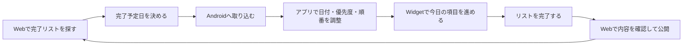
```mermaid
flowchart LR
    A[Webで完了リストを探す] --> B[完了予定日を決める]
    B --> C[Androidへ取り込む]
    C --> D[アプリで日付・優先度・順番を調整]
    D --> E[Widgetで今日の項目を進める]
    E --> F[リストを完了する]
    F --> G[Webで内容を確認して公開]
    G --> A
```

単に「共有テンプレートをコピーする」のではありません。検索時には、そのリストがどんな状況に向いているかを確認できます。取り込み時には、自分が終えたい日を基準に相対日付が実際の日付へ変換されます。公開時には、タイトル、項目、日付、優先度、検索用の文脈を本人が確認できます。

## 2. Cuckoo Cueが大切にすること

### 2.1 計画のために、毎回アプリを開かせない

タスク管理アプリは、整理する場所としては優秀でも、実行するたびに一覧を探しに行くと道具として重くなります。Cuckoo Cueでは、整理はアプリ、実行はWidgetという役割分担を明確にしています。

Widgetには全項目を無秩序に詰め込まず、優先度、期限、リスト順、項目順を使って候補を並べます。完了と取り消しもWidget内で行えるため、生活の流れを中断しません。

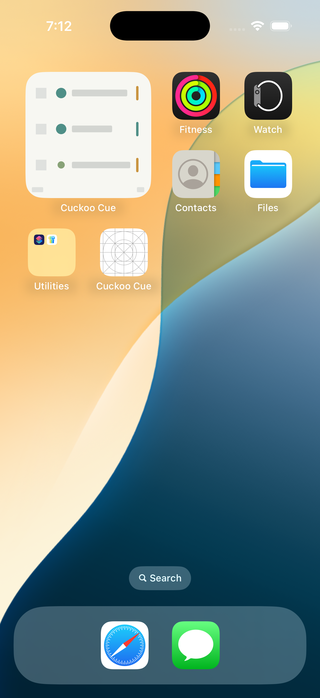

### 2.2 終わったリストを、捨てずに経験へ変える

引っ越し、旅行準備、端末移行、役所の手続き。こうした作業は頻繁ではない一方、次に発生したときには「前回何をしたか」を思い出すコストが高いものです。

Cuckoo Cueでは、完了済みリストをそのまま公開するのではなく、再利用に必要な形へ整えてから残します。絶対日付ではなく「完了日の35日前から28日前」のような相対的な期間として保存するため、別の日程にも適用できます。

### 2.3 他人の正解ではなく、完了した実例から始める

Web検索の対象は、ユーザーが実際に完了し、公開前に確認したリストです。検索結果にはタイトルだけでなく「どんな状況に向いているか」、項目数、日付範囲、項目のプレビューが表示されます。

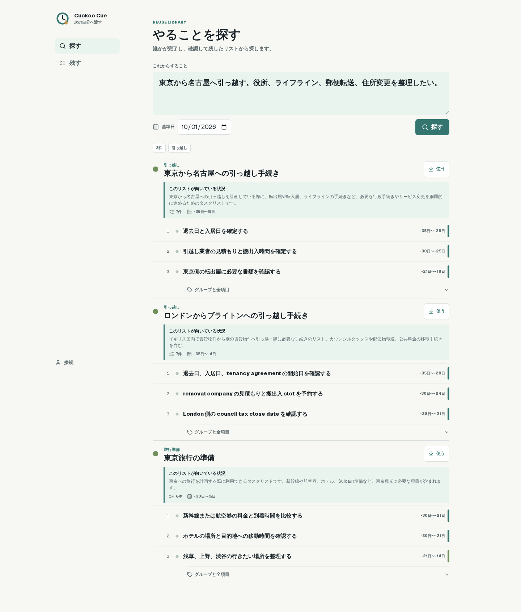

検索結果は命令ではなく、出発点です。取り込んだリストは独立した自分のコピーになるため、不要な項目を消し、順番を変え、日付や優先度を調整できます。

## 3. アプリとしての「あたりまえ」

Cuckoo Cue独自の循環を成立させる前提として、日常のタスク管理に必要な基本操作を備えています。

### 3.1 用事ごとにリストを分けられる

「週末の用事」「引っ越し準備」「リリース準備」のように、目的や終わりが共有される項目を一つのリストへまとめます。リスト一覧では、タイトルと未完了件数、主要な項目を確認できます。

<table>
  <tr>
    <td>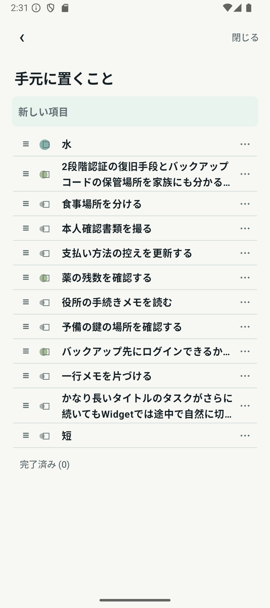</td>
    <td>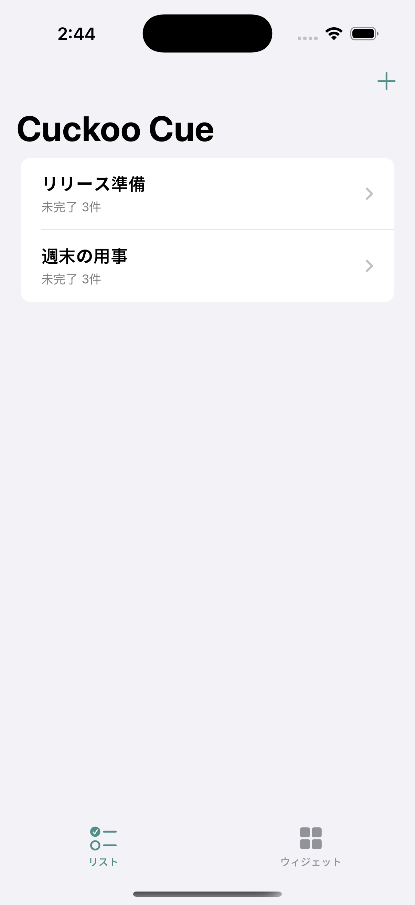</td>
  </tr>
  <tr>
    <td align="center">Android：密度の高い編集画面</td>
    <td align="center">iOS：標準的なリスト一覧</td>
  </tr>
</table>

新しいリストは名前を付けて作成できます。Androidでは、目的が終わったリストを閉じて日常の一覧やWidgetから外せます。

### 3.2 項目をすばやく追加・編集できる

項目には、少なくとも次の情報を持たせられます。

- やることの名前
- 開始可能日
- 期限
- 優先度
- リスト内の順番
- 未完了／完了の状態

Androidでは一覧の流れを保ったまま項目を展開し、タイトル、期間、優先度、順番を編集できます。Enterによる連続追加、ドラッグや移動操作、削除も備えています。iOSでは項目追加シートからタイトル、優先度、期限を設定できます。

<table>
  <tr>
    <td>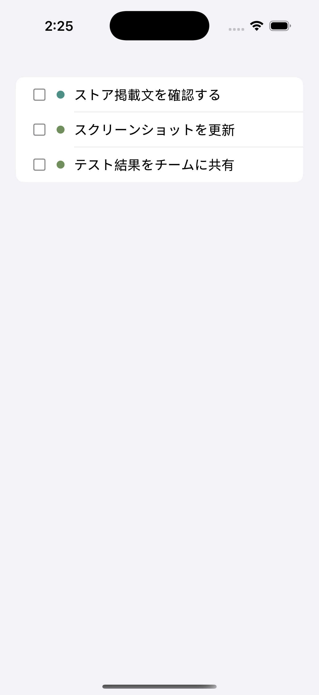</td>
    <td>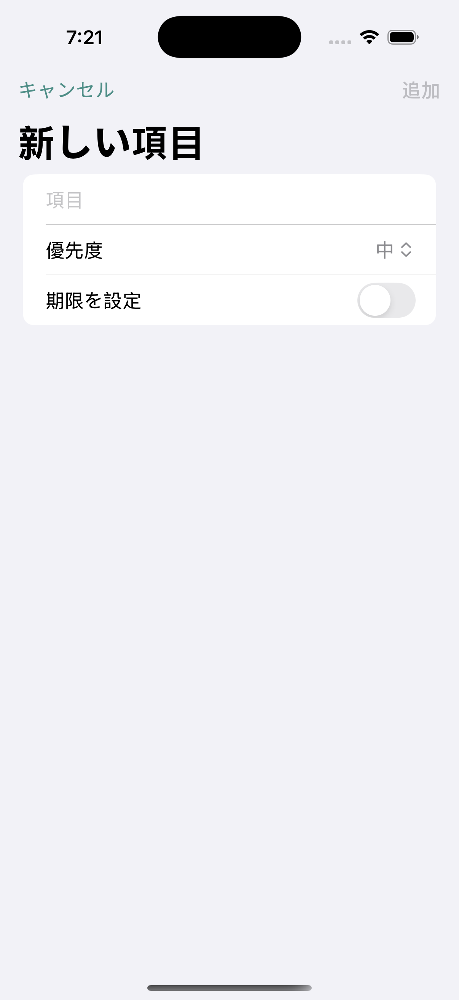</td>
  </tr>
</table>

### 3.3 完了しても、すぐ戻せる

アプリでもWidgetでも項目を完了できます。Androidアプリでは完了済みセクションから状態を確認して戻せます。Android／iOSのWidgetでは、直前の完了に対する「戻す」がその場に表示されます。iOSアプリ本体での完了取り消しは現在未実装です。

<table>
  <tr>
    <td></td>
    <td>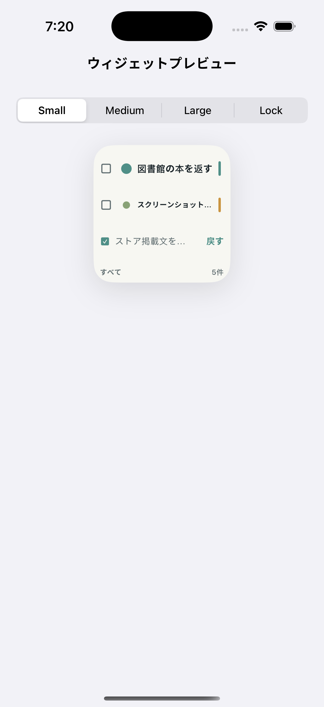</td>
  </tr>
  <tr>
    <td align="center">Android Widget</td>
    <td align="center">iOS Small Widget</td>
  </tr>
</table>

### 3.4 期限が近づけば、優先度が変わる

優先度は「強・中・弱」の3段階です。手動で指定しない場合は期限から自動計算されます。

| 状況 | 自動優先度 |
| --- | --- |
| 期限当日または期限超過 | 強 |
| 期限まで3日以内 | 中 |
| それより先、または期限なし | 弱 |

表示では色だけに依存せず、優先度の丸の大きさも変えています。iOS Widgetでは丸とチェックボックスを同じ領域へ重ね、タイトルの表示幅を確保しています。

### 3.5 並べ替えと表示順が予測できる

アプリ内では、自分の作業手順に合わせて項目を並べ替えられます。Widgetでは、AndroidとiOSで次の順序を共有しています。

1. 優先度が強い項目
2. 期限が早い項目
3. リストの順番
4. リスト内の項目順
5. 作成日時

そのため、プラットフォームを変えても「なぜこの項目が先に出ているのか」という意味が変わりません。

### 3.6 見た目を生活環境へ合わせられる

Widgetはライト、ダーク、システム連動のテーマを選べます。文字サイズもコンパクト、標準、大きめから選択できます。テーマを変えても、項目名、完了操作、優先度、リストを示す色、Undoという情報構造は維持されます。

<table>
  <tr>
    <td></td>
    <td>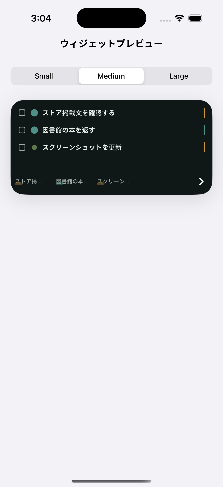</td>
  </tr>
</table>

<table>
  <tr>
    <td>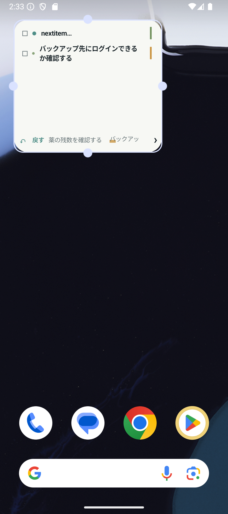</td>
    <td></td>
  </tr>
</table>

### 3.7 データがない状態にも、次の行動がある

初回起動、検索結果なし、表示対象なし、すべて完了、通信失敗を同じ空白画面にはしません。状態に応じて、項目の追加、検索条件の変更、弱い優先度の表示、再試行など、次にできることを示します。

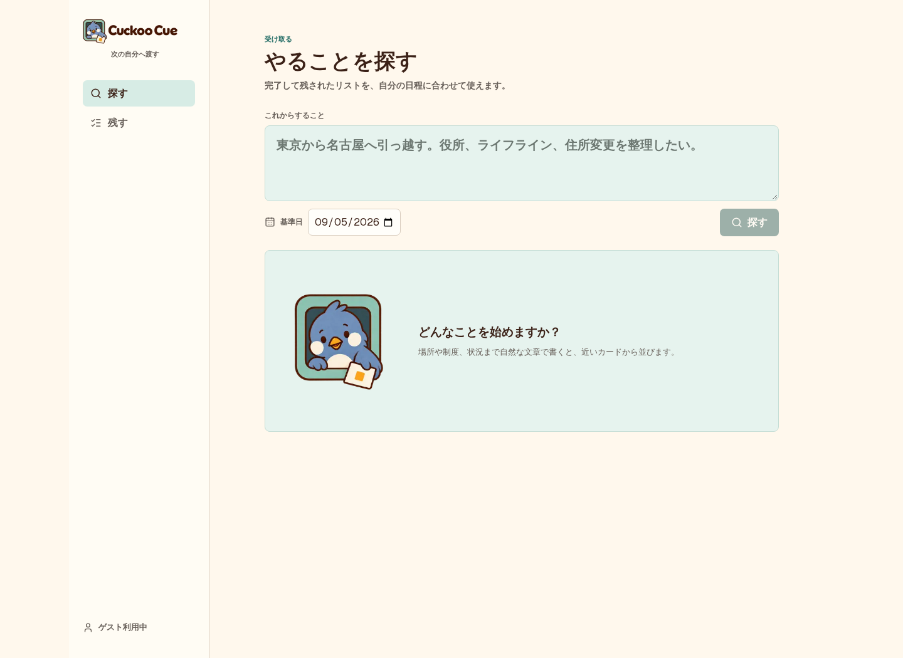

## 4. Widget――「確認する場所」ではなく「実行する道具」

WidgetはCuckoo Cueの中心的な操作面です。アプリの縮小版ではなく、ホーム画面で次の行動を選び、終わらせるために設計されています。

### 4.1 Android Widget

AndroidではWidgetサイズを柔軟に変更できます。縦に広げると多くの項目を表示でき、リストはスクロール可能です。

各行には次の情報があります。

- タップ可能な完了欄
- 優先度
- 項目名
- 項目を視覚的に追いやすくする右端の補助色

下部には表示中の項目を示す短いラベルが並び、選択した項目へ表示を絞れます。項目完了後はUndoが現れます。狭いWidgetと縦長Widgetでも、同じ操作の意味を維持します。

<table>
  <tr>
    <td>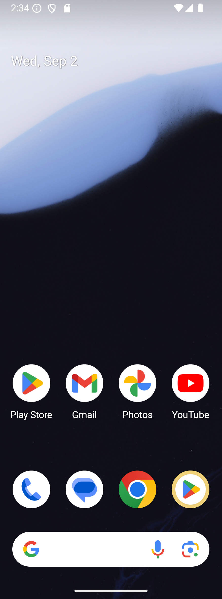</td>
    <td>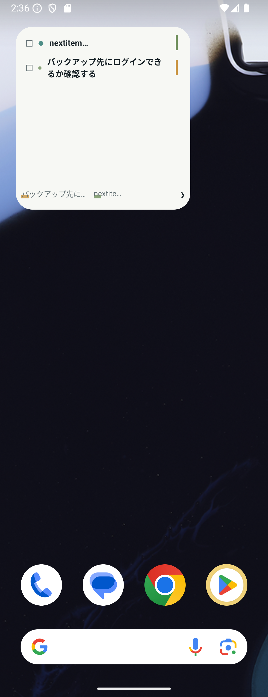</td>
  </tr>
</table>

### 4.2 iOS Widget

iOSは自由なリサイズやWidget内スクロールができないため、Small、Medium、Largeという固定ファミリーに適応しています。表示対象や並び順はAndroidと同じで、違うのは一度に見える件数とページ操作です。

| ファミリー | 主な用途 | 表示件数 |
| --- | --- | ---: |
| Small | 最小面積で今日の候補を見る | 3件 |
| Medium | タイトルを読みやすく表示する | 3件 |
| Large | まとまった候補を一覧する | 7件 |
| Lock Screen | 最上位の1件をすばやく確認する | 1件 |

<table>
  <tr>
    <td>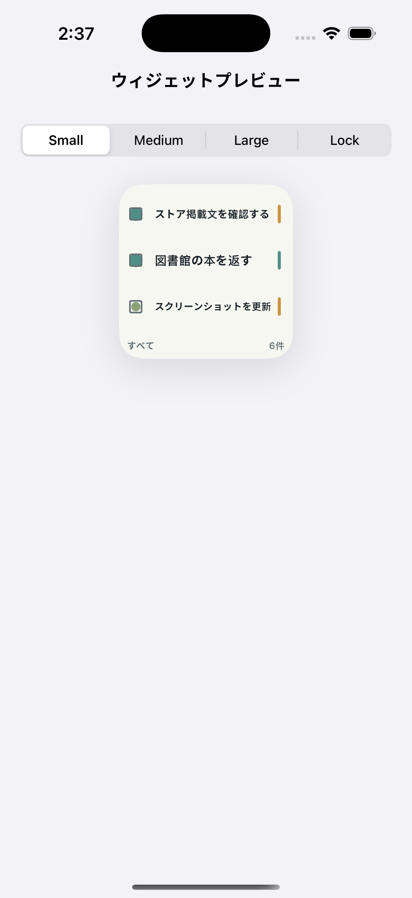</td>
    <td>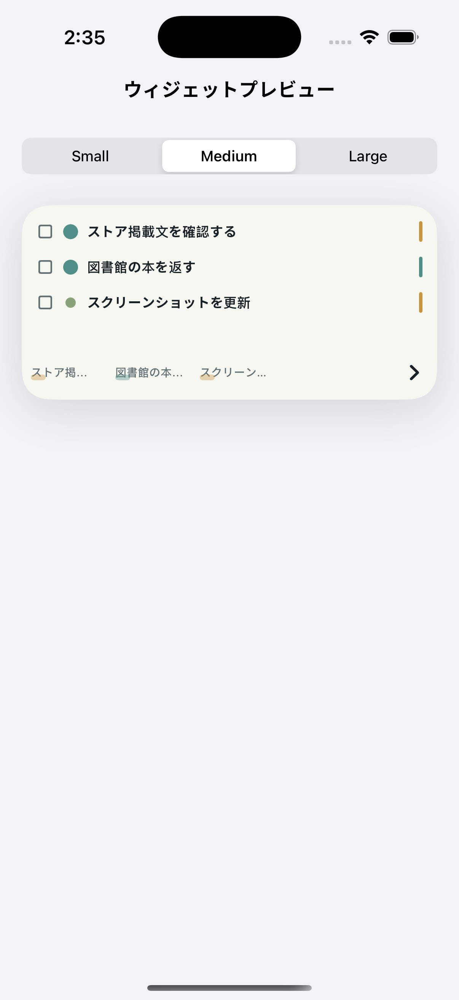</td>
    <td>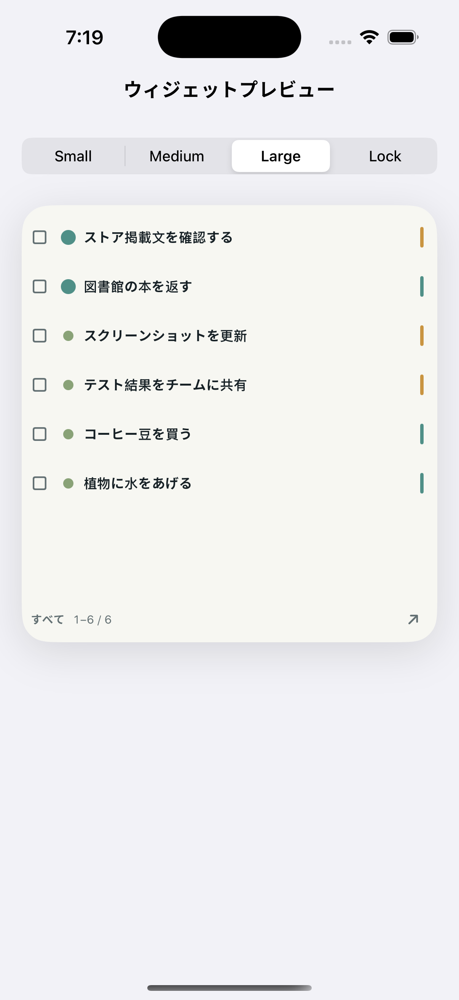</td>
  </tr>
</table>

MediumとLargeでは表示件数単位で次のページへ進みます。たとえばMediumで4〜6件目を見るために、1件ずつ3回送る必要はありません。

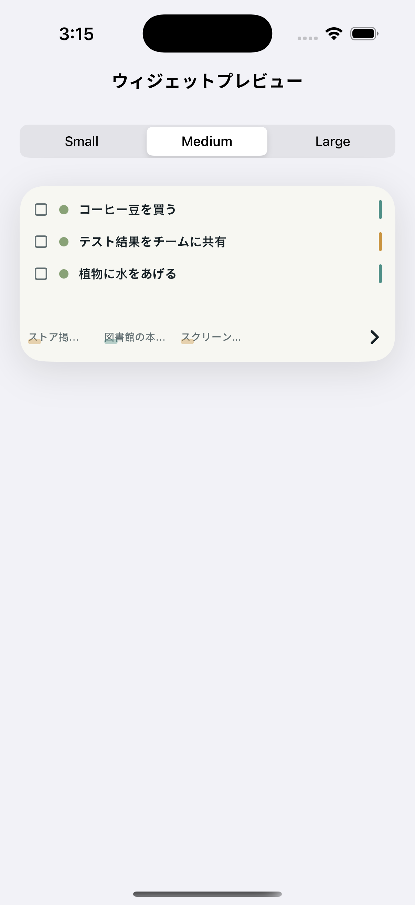

Widgetごとに表示するリストを指定でき、「弱い優先度も表示する」かも選択できます。複数のWidgetを、仕事用、家庭用、週末用として置き分けられます。

<table>
  <tr>
    <td>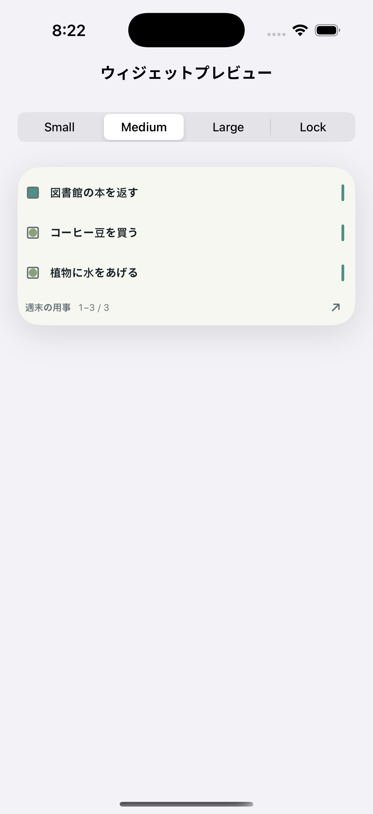</td>
    <td>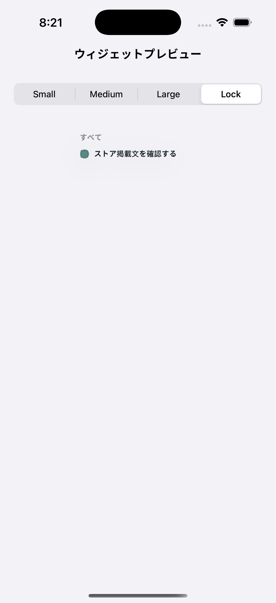</td>
  </tr>
</table>

Widgetの外部リンクを押すと、設定したリストへ直接移動します。iOS 18以降ではControl CenterとAction Buttonからも優先項目の一覧を開けます。Smart Stackでは、強い優先項目がある状態を関連度へ反映します。

## 5. Web――完了した経験を探し、受け渡す場所

Webは日々のタスクを管理する画面ではありません。共有された完了リストを検索することと、Androidで完了したリストを確認して公開することに役割を絞っています。

### 5.1 ログインせずに検索を始められる

初めて訪れたユーザーにはFirebaseの匿名セッションが自動的に作られます。Googleログイン画面で入口を塞がず、そのまま検索と公開リストの確認を始められます。

検索欄にはカテゴリ名だけでなく、状況を自然な文章で入力できます。

> 東京から名古屋へ引っ越す。役所、ライフライン、郵便転送、住所変更を整理したい。

場所、制度、移動条件などを書けば、単に「引っ越し」という語が一致した順ではなく、その状況に近い完了リストを上位に並べられます。登録ユーザーの場合も、プロフィール情報は弱い並べ替え材料であり、検索文の意図を上書きする強制フィルターにはしません。

### 5.2 検索結果だけで、向き不向きを判断できる

検索結果には次の情報を表示します。

- リスト名と大まかな分野
- 「このリストが向いている状況」
- 項目数と全体の日付範囲
- 主要な項目と、それぞれの相対期間
- 優先度とグループ

長いリストは最初から全項目を展開せず、主要項目を先に見せます。詳細を確認したいときだけ全項目を開けます。検索結果が増えた場合は、末尾へ近づくと次ページを取得します。キーボード利用者向けの明示的な再読み込み操作も残しています。

モバイル幅でも、検索、結果の確認、取り込み操作が横にはみ出さないよう調整されています。

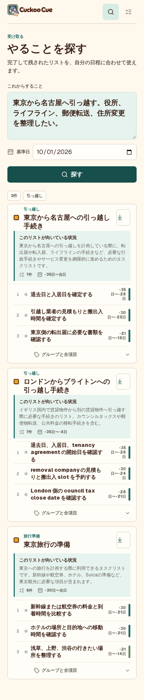

### 5.3 完了予定日から、実際の日程へ変換して取り込む

再利用したいリストを選ぶと、まず「いつまでに終えたいか」を指定します。公開リスト内の相対期間は、その完了予定日を基準に実際の日付へ変換されます。

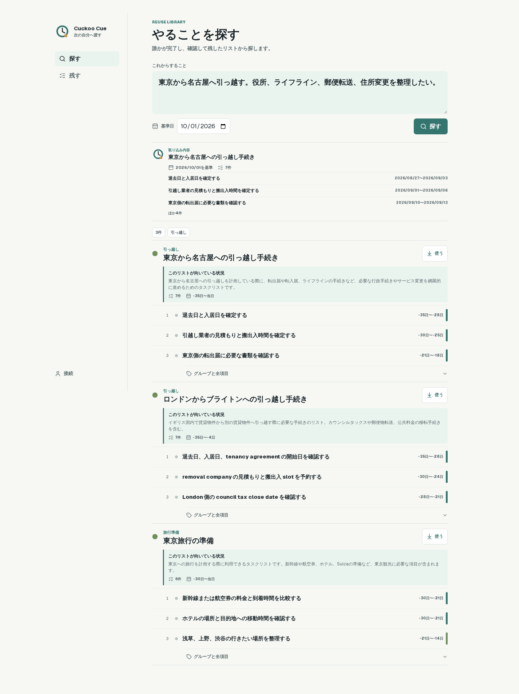

WebからAndroidへ渡すURLには、リストの全内容や個人情報を埋め込みません。公開リストのIDと完了予定日だけを渡し、Androidアプリが認証済みAPIから検証された内容を取得します。

Androidでは取り込み前にタイトルと項目数を確認し、取り込んだ後は独立したローカルリストとして開きます。

<table>
  <tr>
    <td></td>
    <td>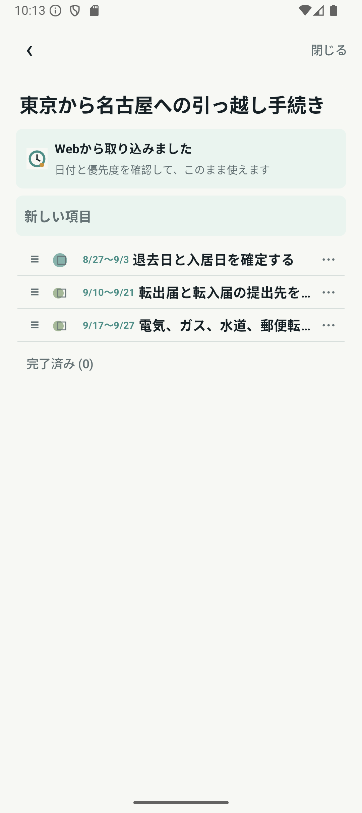</td>
  </tr>
</table>

取り込んだリストに元データへの従属関係はありません。同じリストを複数回取り込めば、それぞれ別の予定として扱われます。

### 5.4 完了したリストを、確認してから公開する

Androidでリスト内の項目を完了すると、「Webで確認して残す」導線が現れます。まず最新状態を同期し、同じGoogleアカウントで本人の完了リストを取得します。

公開画面では、次の内容を確認・編集できます。

- 公開タイトル
- 残す項目と項目順
- 開始日と終了日
- 優先度
- 検索用の分野
- どんな状況に向くかという説明
- 名前の付いた項目グループ

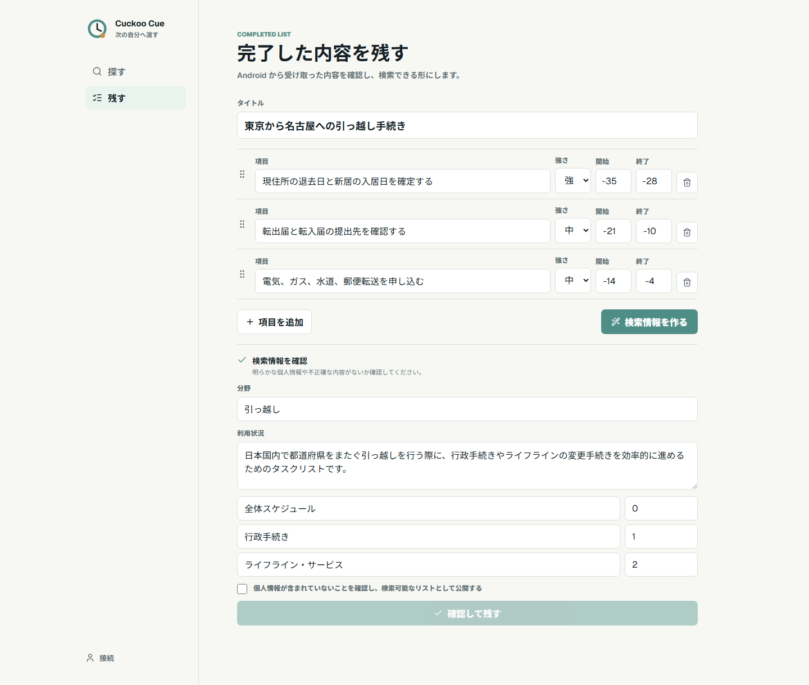

検索用の情報は生成されますが、そのまま自動公開はしません。ユーザーが内容を確認し、個人情報が含まれていないことに明示的に同意してから公開します。明らかな住所、連絡先、アカウント識別情報などは公開前の検証で拒否されます。

匿名ユーザーにGoogleログインを求めるのは、このような本人確認が必要な境界だけです。

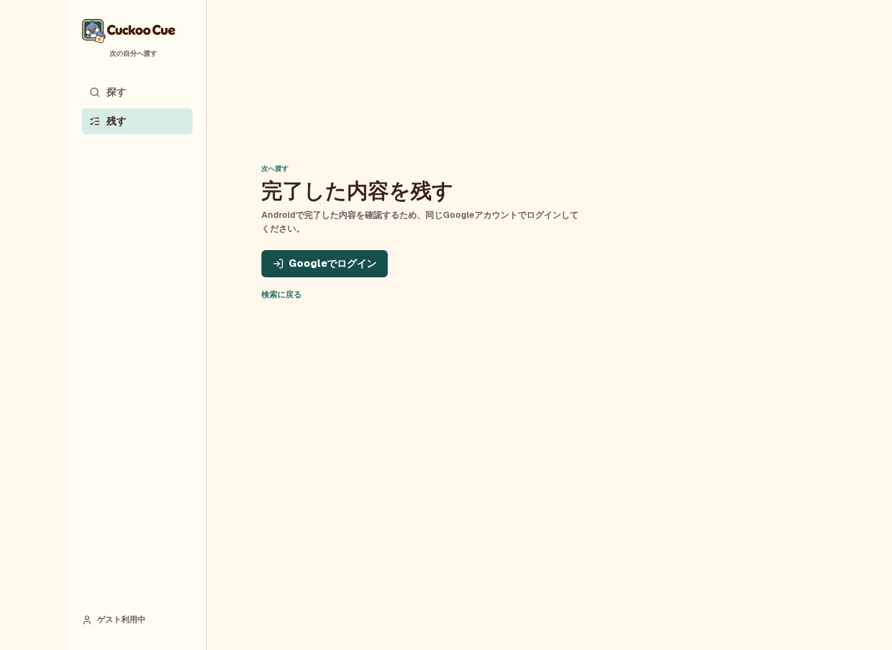

公開が完了すると、そのリストは共有検索の対象になります。

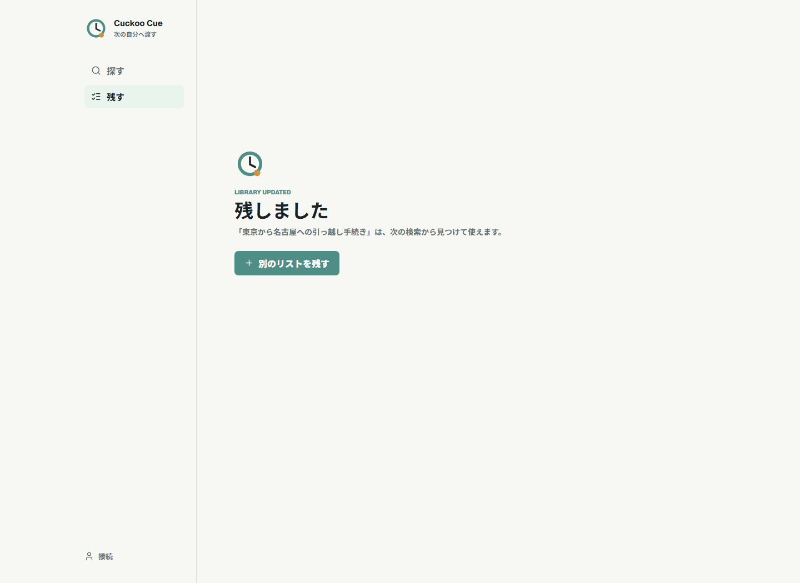

## 6. 具体的な利用例――引っ越し

引っ越しを例にすると、Cuckoo Cueの一連の使い方は次のようになります。

### 手順1：Webで経験を探す

「東京から名古屋へ引っ越す。役所、ライフライン、郵便転送を整理したい」と入力します。検索結果から、単なる引っ越し全般ではなく、行政手続きやサービス変更を含むリストを選びます。

### 手順2：完了予定日を決める

引っ越し日またはすべての手続きを終えたい日を指定します。「35日前から始める」「28日前までに終える」といった相対期間が、カレンダー上の具体的な日付へ変換されます。

### 手順3：Androidへ取り込み、自分向けに直す

不要な項目を削除し、自分が使っている電力会社や自治体に合わせて名前を変更します。先に着手したい項目は並べ替え、絶対に忘れたくない項目は優先度を「強」にします。

### 手順4：Widgetで日々進める

ホーム画面を見るたびに、期限と優先度に基づく候補が表示されます。完了はその場でチェックします。誤って完了した場合は、直後にUndoできます。

### 手順5：完了後、次の人へ残す

実際には不要だった項目を取り除き、役立った順番と日付を確認します。住所や契約番号などが混ざっていないことを確認して公開すれば、次のユーザーはその完了経験から始められます。

この循環により、最初のユーザーの試行錯誤が、次のユーザーの初期値になります。ただし、取り込んだ側は自由に編集できるため、経験の共有と個人の裁量を両立できます。

## 7. Android・iOS・Webの役割

| 機能 | Android | iOS | Web |
| --- | :---: | :---: | :---: |
| リスト作成・項目追加 | ✓ | ✓ | — |
| 項目完了 | ✓ | ✓ | — |
| 完了のUndo | アプリ／Widget | Widget | — |
| 開始日と期限の詳細編集 | ✓ | 一部 | — |
| 並べ替え・詳細な項目編集 | ✓ | 基本操作 | — |
| Home Screen Widget | ✓ | ✓ | — |
| Widget内スクロール | ✓ | OS制約により不可 | — |
| Widgetのページ送り | 不要／スクロール | ✓ | — |
| Lock Screen Widget | — | ✓ | — |
| Control Center／Action Button | — | iOS 18以降 | — |
| 完了リストの検索 | — | — | ✓ |
| 公開リストの取り込み | ✓ | 未接続 | 準備・受け渡し |
| 完了リストの公開 | ✓ | 未接続 | 確認・公開 |
| 匿名での検索 | — | — | ✓ |
| Google本人確認 | 同期・公開時 | 未接続 | 本人データ操作時 |

AndroidとiOSのWidgetは、候補の意味と並び順を共有します。ただし、OSが提供するWidget機能が異なるため、Androidはサイズ変更とスクロール、iOSは固定ファミリーとページ単位の移動を採用しています。

## 8. データとプライバシーの境界

Cuckoo Cueでは、操作中の個人データと、公開された再利用リストを分けています。

### スマートフォン内の作業データ

AndroidではRoomを即時の正本として使い、アプリとWidgetの操作をすぐ反映します。Googleログイン後は、本人に紐づくリストのスナップショットをFirestoreへ同期します。この領域は公開検索の対象ではありません。

iOSでは、アプリとWidgetがApp Group内のスナップショットを共有します。現在、Androidの公開・取り込み経路やクラウド復元とは接続されていません。

### 共有される完了リスト

Webで本人が確認して公開した内容だけが、共有検索用のBigQueryコーパスへ保存されます。端末内の絶対日付は相対期間へ変換され、削除した項目は公開されません。

### 認証

- 検索と公開リストの取得：匿名セッションで利用可能
- Android所有リストの取得、検索情報の生成、公開：Googleログインが必要
- API：Firebase ID tokenで認証
- `run_id`：識別子であり、認可の代わりには使わない

### Memory Bank

登録ユーザーについて、検索結果の並べ替えに弱く使える短い属性を保持します。検索文そのもの、Widget操作、公開リストの内容をMemory Bankへ保存する設計ではありません。プロフィールは検索意図を上書きせず、候補の細かな順位調整にだけ使います。

## 9. 見た目と操作の設計

### 情報密度を目的に合わせる

アプリの編集画面は、多くの項目を続けて扱える密度を優先します。Widgetは項目名と完了操作を優先し、Webの検索結果は「このリストが自分に合うか」を判断する文脈を優先します。同じカードを全画面へ流用せず、各画面の仕事に合わせています。

### ブランドを必要な場所だけに置く

青いカッコウがカードを渡すマークは、初回状態、認証、ナビゲーションなど、向きや受け渡しの意味が必要な場所に使います。密度の高い結果一覧や編集フォームでは、マスコットを繰り返さず、内容を主役にします。

### 操作を色だけに依存させない

優先度は色と丸の大きさ、完了状態はチェック形状、項目の補助情報は右端のレールやラベルで示します。アクセシビリティラベルを持つ操作、キーボードで利用できるWeb操作、明示的なエラーと再試行を用意しています。

### 小さい画面でも、機能を消さない

iOS Smallでは長いタイトルを1行へ省略しますが、対象項目そのものを3件に限定して捨てるわけではありません。Medium／Largeでは全文を読みやすくし、ページ送りで後続項目へ到達できます。AndroidではWidgetの高さとスクロールを利用します。

## 10. 現在の制約と、誤解してほしくないこと

Cuckoo Cueの現在の実装には、次の境界があります。

- **iOSのWeb再利用経路は未接続です。** iOSアプリとWidgetはローカルで利用できますが、Web検索からの取り込み、完了リストの公開、Androidとのクラウド同期はまだ実装されていません。
- **クラウドから端末への復元は未実装です。** AndroidからWebへ完了リストを渡す同期はありますが、複数端末の競合解決と復元UIは別途設計が必要です。
- **iOS Widgetはスクロールできません。** これはWidgetKitの制約であり、Small／Medium／Largeの件数とページ送りで対応しています。
- **ストア公開導線は正式URLと公式バッジ待ちです。** App Store／Google Playの正式な掲載情報が確定するまで、推測したURLや独自ストアバッジは表示しません。
- **AndroidのRelease App Link確認は署名鍵待ちです。** 現在のデバッグ署名ではHTTPS App Linkのアプリ解決を確認済みですが、リリース署名証明書の登録後に再検証が必要です。
- **Googleのアカウント選択画面は自動E2Eの外です。** API認証やインストール済みAndroidへの解決は検証していますが、実ブラウザでのアカウント選択と未インストール時の導線は手動確認項目です。

制約を明示する理由は、できていない機能を「連携済み」に見せないためです。Cuckoo Cueの価値は、実際に動作する端末内操作、Widget、検索・取り込み・公開の境界に基づいて説明します。

## 11. 品質確認

2026年9月5日時点で、次の経路を継続的に検証しています。

- WebのESLintとNext.js本番ビルド
- デスクトップ／モバイル幅のPlaywright E2E
- WebのAxeアクセシビリティ検査
- 実サービスを使った検索、ページング、公開、冪等性、取り込みAPI
- AndroidのRoom、日付範囲、App Link、取り込み、Widget操作
- iOSのモデルテスト、アプリUI、全Widgetファミリー、実ホーム画面Widget
- ダークテーマ、大きな文字、空状態、Undo、ページ送り、リスト指定

詳細な検証記録は[2026-09-03以降のE2E検証](e2e-verification-2026-09-03.md)、Webの契約と実装状況は[Web Search/Save Spec](web-search-save-spec.md)にあります。

## 12. スクリーンショット索引

### Android

- [アプリのタスクリスト](review-screenshots/android/01-app-task-list.png)
- [インライン編集操作](review-screenshots/android/02-app-inline-edit-controls.png)
- [ホーム画面Widget](review-screenshots/android/03-widget-home.png)
- [完了とUndo](review-screenshots/android/04-widget-complete-undo.png)
- [ダークテーマ](review-screenshots/android/05-widget-dark.png)
- [大きな文字](review-screenshots/android/06-widget-large-text.png)
- [狭いWidget](review-screenshots/android/07-widget-narrow.png)
- [縦長Widget](review-screenshots/android/08-widget-tall.png)
- [Android取り込みE2E](review-screenshots/android/e2e/README.md)

### iOS

- [Small Widget](review-screenshots/ios/widget-small.png)
- [Medium Widget](review-screenshots/ios/widget-medium.png)
- [Large Widget](review-screenshots/ios/widget-large.png)
- [Lock Screen Widget](review-screenshots/ios/widget-lock-screen.png)
- [実ホーム画面Widget](review-screenshots/ios/widget-states/widget-actual-home-screen.png)
- [Undo](review-screenshots/ios/widget-states/widget-undo-small.png)
- [リスト指定](review-screenshots/ios/widget-states/widget-scoped-run-medium.png)
- [ページ送り](review-screenshots/ios/widget-states/widget-paged-medium.png)
- [優先項目なし](review-screenshots/ios/widget-states/widget-priority-empty-medium.png)
- [弱い優先度を含める](review-screenshots/ios/widget-states/widget-include-quiet-medium.png)
- [全iOSキャプチャの説明](review-screenshots/ios/README.md)

### Web

- [匿名での入口](review-screenshots/web/e2e/00-anonymous-entry-production.png)
- [検索前の空状態](review-screenshots/web/e2e/01-empty-desktop.png)
- [検索結果](review-screenshots/web/e2e/02-search-results-desktop.png)
- [取り込み準備](review-screenshots/web/e2e/03-import-ready-desktop.png)
- [公開前レビュー](review-screenshots/web/e2e/04-save-review-desktop.png)
- [モバイル検索結果](review-screenshots/web/e2e/05-search-results-mobile.png)
- [Androidへの受け渡し](review-screenshots/web/e2e/06-android-save-handoff-mobile.png)
- [公開完了](review-screenshots/web/e2e/07-save-published-desktop.png)
- [モバイルの空状態](review-screenshots/web/e2e/08-empty-mobile.png)
- [公開時のGoogleログイン](review-screenshots/web/e2e/09-google-login-on-save.png)
- [全Web E2Eキャプチャの説明](review-screenshots/web/e2e/README.md)

## 13. Cuckoo Cueの魅力

Cuckoo Cueの魅力は、機能の数ではなく、タスクが持つ時間の流れを切らないことにあります。

始める前には、誰かの完了経験を借りられます。実行中は、アプリの中へ何度も戻らずWidgetから進められます。終わった後には、今回の経験を次の自分や別の人へ渡せます。

計画、実行、完了、再利用が別々のサービスへ分断されず、一つの循環になります。それでも、共有されたリストを正解として押しつけることはありません。取り込んだ後は自分のコピーとして自由に変えられ、公開前には本人が内容とプライバシーを確認します。

**「何をすればよいか分からない」状態から始められ、日々は小さな操作で進められ、終わった経験が次回の初期値になる。** それがCuckoo Cueが提供したい当たり前であり、ほかのチェックリストとの違いです。
