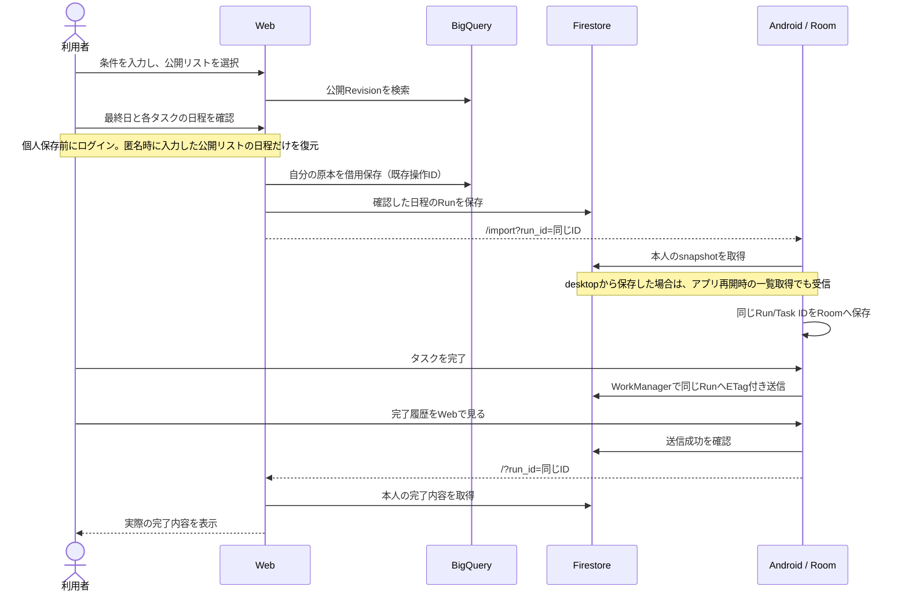
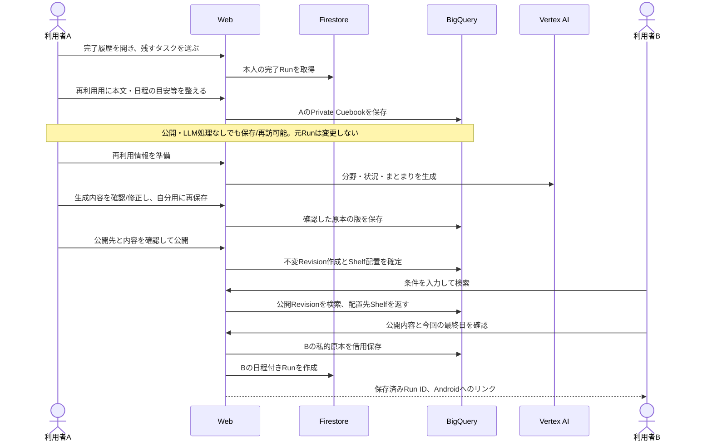
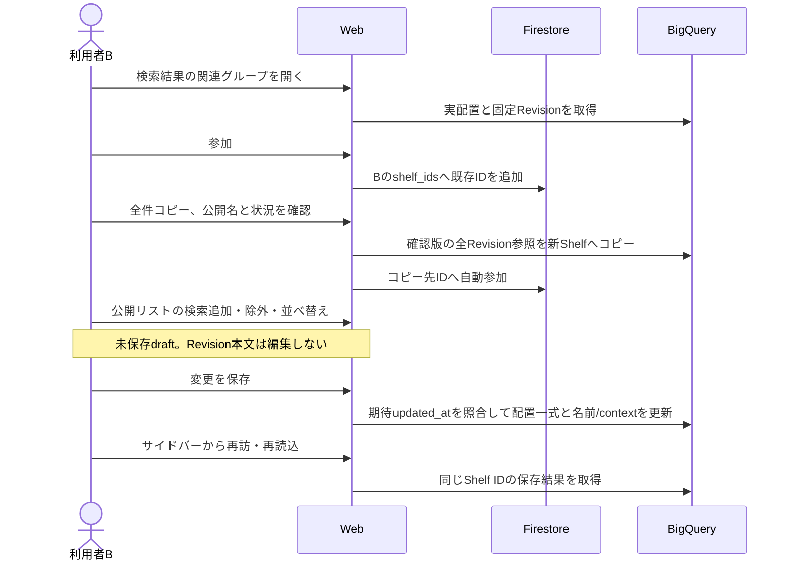

# Web体験仕様

Status: Implementation / 合意済みUI基準に沿って段階実装中

Updated: 2026-09-12

## 1. この文書の役割

WebのUC・画面・受け入れ条件をこの1文書で管理する。ドメインと保存・データ遷移の基礎は [design_v2.md](design_v2.md) を参照する。現行Web実装は要件の根拠にしない。

「確定」はユーザーが明示した要件。「提案」「未決」は実装への承認ではない。design_v2.mdとの差分は第5節に記録し、合意したデータ契約だけを同文書へ反映する。

## 2. 確定している体験

- Webの中心は、条件に合うものを探し、再利用し、まとまりを整えるサイクル。
- 一からのタスク作成・日々の実行・管理はAndroid/iOS/Widget側に置く。Webにはタスクリスト管理へのリンクを用意する。再利用時はWebで日程設定まで完了し、自分のRunを保存・同期してモバイルへ渡す。
- ユーザーは目的とコンテキストを含めた条件を入力し、他人が公開した再利用用の内容を検索する。design_v2.mdでは公開CuebookRevisionが対応する。
- 検索結果の一部として「猫2匹飼っている人向け」などのShelfへの導線を出す。
- 採用UIは案A。検索結果と公開リスト詳細では関連グループへのリンクだけを出し、その場に参加ボタンは置かない。遷移先のグループ詳細で、紐づくCuebook一覧と参加ボタンを表示する。閲覧だけでは参加状態を変更しない。
- 初期の関連Shelfは、検索で見つかった公開Revisionが配置されているShelfに限定する。ShelfItemの参照を根拠とし、検索条件との類似性だけでは推薦しない。配置先がなければ関連Shelfの導線は出さない。
- 参加はユーザーが既存Shelf IDの一覧を持つことで表現する。参加操作はShelfやRevisionを複製しない。
- 参加が1件以上あればサイドバーに参加グループを表示する。
- サイドバーの構成は「探す」「完了履歴」「参加グループ」。参加0件時にはグループの一覧を表示しない。
- 自分の完了履歴の、実際に完了したタスク内容をもとに編集して整えたCuebookを、公開RevisionとしてShelfに配置できる。その過程で新しいShelfを作成できる。
- 完了履歴で選んだタスクを、そのまま新しいRunとしてもう一度使う経路も用意する。この経路は日付・優先度をクリアし、Cuebook編集や最終日入力を必須にしない。「再利用用に整える」とは分ける。
- 整えた内容は自分のPrivate Cuebookとしても保存する。Webとモバイルで同じ原本を取得・編集できる保存・同期を導入する。原本の再訪・整理にPrivate Shelfを使う案はD7のモックで試す。導入済みのデータモデルとは扱わない。
- 参加グループからShelfをforkできる。棚内のCuebook全件について特定のRevisionを固定して引き継ぐ。選択した一部のCuebookだけを複製する意味ではない。
- 親しみやすいWebの画面とする。業務アプリ風の密度・管理画面構成を目標にしない。Androidのタスクリスト表現を一部コンポーネントに採用できる。

「グループ」は現時点ではShelfを指す表示語。共同編集や交流機能は、この名前だけを根拠に追加しない。

## 3. 要件を固める手順

1. UCとデータの対応を決める。まずD1〜D3を合意し、検索対象・履歴からの公開・fork対象を確定する。
2. 操作契約を決める。D4〜D9を、推奨案と具体例でまとめて確認する。
3. 同じサンプルで低忠実度モックを作る。desktop/mobileの検索結果、Shelf詳細、履歴からShelf作成、派生編集を確認する。各操作をUCとデータ遷移に紐づける。
4. 受け入れ条件で通し確認する。未決事項が主要UCを止めないことを確認してからUI実装へ進む。

別々のPRD・ペルソナ資料・画面仕様書は作らない。この文書の表を更新し、モックをリンクする。決定IDは維持し、決まった内容と理由を同じ行へ追記する。

## 4. 主要UC

仮の共通シナリオ: 猫2匹と転居する人が準備を探し、モバイルで実行し、完了後に自分の経験を再利用可能な形で残す。属性は検索条件の具体例であり、ユーザー像をこの属性へ限定しない。

| ID | きっかけ・操作 | 到達したい状態 | データの根拠・未決 |
| --- | --- | --- | --- |
| UC1 | 「猫2匹と東京から名古屋へ引っ越す」と入力 | 自分の条件に合うリストとShelfを見つける | 検索対象D1、Shelfとの関連D4 |
| UC2 | 検索中にShelfを開いて参加 | 後日サイドバーから同じShelfに戻れる | ユーザーのShelf ID一覧。更新・解除D5 |
| UC3 | リストを選び、Webで日程を設定して再利用 | 自分のCuebookと日程設定済みRunが保存・同期され、モバイルで実行できる | 借用元Revision、日程設定・同期・遷移D6 |
| UC4 | 実際に完了したタスク内容を編集してCuebookを整え、Shelfへ置く | 自分のPrivate Cuebookが保存され、その公開RevisionがShelfに残る。原本はモバイルでも編集・再利用できる | 私的保存・同期と公開の分離はD2で確定。同期詳細はD10 |
| UC5 | 参加Shelf内のCuebook全件を、特定のRevisionで固定してfork | 元Shelfとは独立したShelfを整えられる | ShelfとShelfItemを作成し、既存Revisionを固定参照。D3 |
| UC6 | 自分のShelfを整え、後日また開く | contextと構成が保存され、他の利用者も利用できる | 作成者権限。編集範囲・再訪導線D7 |

Cuebook自体に完了状態はない。完了履歴の事実はRunが持ち、元Cuebookとの関係はsource_cuebook_idで表す。

## 5. 決定事項とデータギャップ

| ID | 状態 | 決めること・design_v2.mdとの差分 | 提案・判断基準 |
| --- | --- | --- | --- |
| D1 | 対象・保存先確定 | 検索するのは他人が公開した再利用用の内容。Cuebook/Shelf/公開Revision/配置はBQ、Run系はFirestore | 私的なCuebook/Runをそのまま公開検索しない。旧BQ Entryとの物理対応は残るが、Firestore公開モデルをBQへ別途projectionする案は撤回 |
| D2 | 方針確定 | 完了Runの完了タスクを編集し、自分のPrivate Cuebookとして保存。その公開RevisionをShelfへ配置する | 原本をWebとモバイルで共有する。棚なしで保存できる従来契約に対し、Private Shelfによる整理をD7で再検討する。同期詳細はD10 |
| D3 | 確定 | 棚内のCuebook全件を、それぞれ特定のRevisionで固定して引き継ぐ | 元Shelfに現在配置されているRevisionを使う。新Shelfは固定Revisionへの参照を持ち、元ShelfやCuebookの後続変更へ自動追従しない。初期モックに版選択は設けない |
| D4 | 初期仕様確定 | 検索で見つかった公開Revisionが置かれているShelfだけを関連導線に出す | ShelfItemの配置関係を使う。条件が似たShelfの推薦は初期対象外。旧BQ Entryに配置関係がなければ関連Shelfを推測生成しない |
| D5 | 操作方針確定 | 参加＝ユーザーの既存Shelf ID一覧。検索結果からグループ詳細へ遷移し、Cuebook一覧を確認して参加する。検索結果には参加ボタンを置かない | 参加先の現在の内容を参照し、解除はIDの除去のみ。参加による編集権限は付与しない。解除してもShelfや借用済みCuebookは消えない。物理契約の追記は別途必要 |
| D6 | 導線・受渡し方式確定 | Webで最終日を入力し、保存された日単位のduration/相対日程から各タスクの日付を自動生成。今回のRunをFirestoreに保存し、AndroidへRun IDだけを渡す | Androidは本人の同じRunを受信し、再作成や日程再入力をしない。desktopでは別途アプリで受信できる。iOSは後追い。実装・一周の検証状態は第16節。方式選定の未決ではない |
| D7 | 編集方針確定・Private Shelf案を試す | Shelfの名前・context・Revision追加/除外/順序を編集。自作/forkした公開Shelfへ自動参加する。Private Shelfで原本整理・再訪を簡潔にできるか試す | 既存公開Revision本文は不変で、変更は新Revision。Private Shelfは現在の「Shelfは公開」と異なる。私的原本を格納するか、既存Revisionを参照するか、棚なし原本の扱いを未決として記録する。モック内の「自分のCuebook」は仮の到達経路 |
| D8 | 方針確定 | 検索/閲覧はゲスト可。端末間で共有する個人状態の永続化時にアカウントへ接続する | 参加・私的保存・公開・forkの操作前に接続し、ログイン後は元の操作へ戻る。実際の認証連携はモック対象外 |
| D9 | 未決 | 検索の絞り込み/順位、ページング、空・失敗・再試行、公開確認と部分失敗 | 検索失敗と0件は別表示。参加・公開・forkの失敗を成功表示にしない。保存済み内容と未確定編集を区別し、再試行で重複作成しない |
| D10 | 保存先確定・物理契約未決 | Private Cuebookの共有正本はBQ、Runの実行中・完了履歴はFirestore。所有権・競合・削除・未同期データ・編集途中の保存契約が残る | 公開後も原本を保持し、公開失敗時にも保存済み原本を失わない。BQ保存だから公開という意味ではない。table/STRUCT・競合等を保存先決定から推測追加しない |

「Private Cuebookは本人専用」「Revision本文は不変」「既存のShelfは公開」「Shelf編集は作成者のみ」を基礎制約として扱う。Private ShelfはD7の検討差分で、公開Shelfへのvisibilityカラム追加などを先回りして実装しない。ローカル限定保存はD2の合意で撤回済み。

2026-09-11 D2/D6補足: 完了履歴からの「タスクだけもう一度使う」は、選択した本文を日付・優先度・完了状態なしの新Runとして保存する別経路。Cuebook編集・最終日入力は不要。D6の最終日入力は、相対日程を使って今回の日程を生成する経路に適用する。詳しい契約はdesign_v2.md 8.1.1と本書第13節。

D4の判断背景として、ユーザーは「Shelfのプライベート性を高めることで汚れづらくなる」と想定している。個人の意図に沿った構成を保てるかを確認する仮説として記録する。この発言だけで非公開Shelfや新しい閲覧制限の導入を確定しない。閲覧範囲と参加者の編集権限は別の契約である。

## 6. 画面骨子

| 場所 | 主な内容 | 主な操作 |
| --- | --- | --- |
| 探す | 条件入力、検索結果、結果に関係するShelf | 詳細確認、再利用、Shelfへ移動 |
| 日程設定 | 借りる内容、最終日、自動生成された各タスクの今回の日程 | 必要箇所を修正、FirestoreへRun保存、Run IDでAndroidへ移動 |
| Shelf詳細 | 名前、context、Revisionのリスト、参加状態 | 参加、再利用、各CuebookのRevisionを固定してShelf全体を派生作成 |
| 完了履歴 | 自分の完了Runとその内容 | 完了タスクをもとにCuebookを編集し、Shelfへの配置へ進む |
| 履歴からのCuebook編集 | 完了タスクをもとにした再利用用の内容 | 内容を編集して自分のCuebookを保存し、公開するRevisionを確定 |
| Shelf作成・編集 | 名前、context、配置するRevision | 確認、公開/更新 |
| 共通ナビ | 探す、完了履歴、参加グループ、タスクリスト管理へのリンク | 移動、モバイルへの接続 |

詳細を別ページにするか展開表示にするかはモックで判断する。モバイル幅でも同じ情報へ到達できる構成にする。実在する配布先・App Linkが確定してからリンクを設定する。

## 7. 受け入れ条件と確認方法

- 初見の人が「何を探せるか」「どこでタスクを管理するか」「参加と再利用の違い」を画面から説明できる。
- UC1〜UC6を同じサンプルで通し、表示・操作・保存結果に矛盾がない。
- 関連Shelfには結果Revisionの実際の配置先だけが現れる。条件が似ていても配置関係のないShelfは出さない。
- 参加は同じShelfへの参照を残し、forkは独立したShelfを作る。どちらも元Revisionを書き換えない。
- 完了履歴は本人だけが取得できる。公開する内容は確定操作で特定できる。
- 整えたCuebookは自分用として保存され、同じユーザーのモバイルでも取得・編集できる。私的原本の変更は既存の公開Revisionを変更しない。Private Shelfへの所属契約はD7で別途確認する。
- 再利用時はWebで日程を確定し、保存・同期が成功するまでモバイル移動を成功扱いしない。端末が未接続の場合に「端末同期済み」と誤表示しない。
- 中断・再読込・ログイン復帰・API失敗でも、未保存を保存済みと表示せず、意図しない重複を作らない。
- desktop/mobile双方で、主要操作・長いタスク名・空状態・失敗状態・キーボード操作を確認する。

モック段階は少人数のシナリオ操作と読み取り確認で評価する。実装後は同じUCのデータ契約テストと主要経路の実API E2Eで確認する。API差し替えによる画面テストだけをデータフロー完了の証拠にしない。

### 7.1 実装中も維持する受入基準

2026-09-11合意。案Aの構成を維持し、モックのフォーム・余白をそのまま本番へ持ち込まない。新しい大規模設計書は作らず、第10節の既存IDに以下の基準・検証結果を結び付ける。

| 基準 | 受入条件 | 関連する既存ID |
| --- | --- | --- |
| 読むことが中心 | 本文・代表タスク・件数で比較できる。全件を展開でき、未設定値や編集操作を常時反復しない | W02-3, W03-1, C04, C05 |
| 操作対象が明確 | 今回のRun、私的原本、公開版を区別し、一方の編集で他方を変更しない | G03, G04, W13-2 |
| 最終日から自動生成 | 個別日程を変更でき、最終日変更時に維持/再計算を選べる。完了操作日を基準にしない | G07, G08, W04-1 |
| 手になじむ編集 | 本文・日程・優先度・順序を近くで操作。行内検証、取消、focus維持。並べ替えは他の値を変えない | W12-6, C06 |
| 失敗から復帰 | 入力・取得済み結果を保持し、失敗箇所だけ再試行。重複作成しない | W18-2, W19-2, W20-2 |
| 正確な状態表示 | 未保存、サーバー保存、端末受信を混同しない。確認不能な受信や処理段階を推定表示しない | W19-1, C08 |
| 視覚的一貫性 | 承認済みブランド素材とZen Kaku Gothic New。説明文追加で導線不備を補わない | C04, C05, C07 |
| データ設計の維持 | UI都合でモデル・遷移を追加しない。必要な変更は既存ギャップへ記録して共有 | G01–G14 |

画面だけでなく利用のまとまりごとに「操作・期待結果・証拠」を記録する。正常/空/読込/失敗/再試行/復帰、320/390/768/1024/1440px、長文・200件・null・キーボードを確認する。スクショは視覚、UI E2Eは操作、実APIと保存データはデータ契約の証拠として区別する。「実装済み」と「受入確認済み」は別であり、モックAPIの通過だけでは本番ギャップを解消にしない。

## 8. モックで確認すること

D3・D5・D8とD7の編集/自動参加は推奨案を採用。D6は最終日からの自動日程生成・Firestore Run保存・Run ID受渡しまで確定。D1の旧BQとの物理対応、D7のPrivate Shelf、D9・D10の詳細は未確認。iOSは後追いとし、初回の未決事項に戻さない。

[操作モック](../web/prototypes/experience/index.html) は現行Webから分離し、サンプルだけで動かす。検索、日程設定、自分のCuebook整理の3画面を主なレビュー対象にする。履歴、関連Shelf、公開確認、同期成功/失敗は補助画面でつなぐ。API/DB/認証/端末同期は接続しない。

| 確認対象 | モックの仮置き | 未確認・データギャップ |
| --- | --- | --- |
| 私的原本への再訪 D7 | 「自分のCuebook」から「自分だけ」の棚へ入る | サイドバーへの追加可否。Private Shelfの所有権・格納対象・棚なし原本・削除時の原本保持。既存公開Shelfと混同しない |
| 日程と同期 D6/D10 | 最終日から今回の日程を自動生成し、必要箇所を修正して保存。Run IDでAndroidへ進む | duration/相対日程のfield対応と生成結果の保持を検証。共有保存成功と端末反映完了の区別。未インストール・端末未接続・実App Link |
| 整理と公開 D2/D7 | 私的原本を保存してから公開内容と公開Shelfを確認 | 私的保存成功後の公開失敗の再開、公開先作成の原子性、下書き/競合 |
| 探す D1/D9 | 固定サンプルを検索。関連Shelfは実際の配置のみ | 実検索API、順位、全件ページングの確認には使えない |

公開Revisionに独自のcontextフィールドは追加しない。モックの検索結果に出す文脈は配置先Shelf.contextから取得する。タスクの日数はdesign_v2.mdのrelative_dayに対応する単点のサンプルで、nullable日程や従来のstart/end rangeとの整合は未検証。モック用author表示はサンプル名で、実ユーザーの表示名取得契約は未確認。

撮影結果: [探す](review-screenshots/web/experience-mock/01-search-desktop.png)、[日程設定](review-screenshots/web/experience-mock/02-schedule-desktop.png)、[自分のCuebook](review-screenshots/web/experience-mock/03-library-desktop.png)。各画面のmobile版と同期成功/失敗・公開確認も同じフォルダにある。

UI検証は `web/scripts/capture-experience-mock.mjs` で再実行できる。320/390/768/1024/1440pxの横はみ出し・画像読み込み、desktop/mobileのaxe、参加・日付変更・保存・公開失敗・fork・検索失敗を確認する。結果は [verification.json](review-screenshots/web/experience-mock/verification.json) に記録する。

モックの見た目や操作が成立しても、これらの契約や実APIのデータフローが検証済みになったとは判断しない。

## 9. Web全画面の3案比較

採用案だけを見る場合は [案A・全画面と操作後の状態](../web/prototypes/concepts/adopted.html) を使用する。2026-09-11の再利用サイクル改訂版へ更新済み。幅1440pxの20画面と操作後の8状態、各画面のスマホ幅画像へリンクする。最新の対応範囲は第11節。それ以前のモック作業記録は以下に残す。

### モックの修正範囲

案Aの画面構成を維持し、今回のレビューで指摘された表示語・文言・編集時のわかりにくさを修正した。画面上のCuebookは「自分のリスト」、操作は「編集」「日程を設定」など具体的な語へ変更。内部のCuebook/Revisionの名前や保存モデルは変更しない。B/Cは過去比較用として維持する。

| 対象 | モックで修正すること | 今回確定しないこと |
| --- | --- | --- |
| 日程編集 | 基準日・全体の日程範囲・個別変更件数を表示。変更行の識別、元の目安への復帰、直前操作の取り消し。個別日付の変更がある状態で基準日を変える際は再計算を確認する | 本番のカレンダーUI、null日程、start/end range、端末同期。基準日変更時の確認方法は今回の操作案 |
| 再利用用の編集 | 本文の入力欄を明示。日数は符号付き数値だけでなく「日前/当日/日後」で入力し、既存relative_dayへ変換。上下移動、削除の取り消し、未保存表示、変更破棄、保存と公開の分離 | 新しい日付フィールド・タスクモデルは追加しない。null日程や本番の下書き/競合/Undo永続化は未決のまま |

[日程変更中](review-screenshots/web/three-concepts/a/schedule-edited-desktop.png) と [リスト編集中](review-screenshots/web/three-concepts/a/editor-edited-desktop.png) も撮影する。検証スクリプトは `web/scripts/capture-mock-editors.mjs`。操作の取消・再計算確認・保存失敗時の保持を1440/390/320pxで確認し、実APIの成功とは区別する。

前節の「3画面」は依頼の取り違え。Web全体の3つのUI案を比較し、案Aを採用した。参加導線は「関連グループのリンク → グループ詳細のCuebook一覧 → 参加」に更新。B/Cは比較時点の未採用案として残す。[全画面比較](../web/prototypes/concepts/index.html) で同じ画面のA/B/Cを横並びにし、desktop/mobileを切り替える。各画面から操作モックも開ける。

| 案 | 全体の見せ方 | 得意なこと | 負担・懸念 |
| --- | --- | --- | --- |
| A リスト中心（採用） | タスク本文を1列で読み、詳細・日程・公開先へ順に進む。参加はグループ詳細のみ | Androidに近い読み方。一度に理解する範囲が小さい | 比較時の往復と、長い画面のスクロール |
| B 本棚中心 | Cuebookを並べ、関連グループと私的な棚の表現を揃える。詳細では本文と関連情報を分ける | 候補の見比べと、自分の棚への再訪 | 一覧の本文量は減り、長いリストには詳細表示が必要 |
| C 一覧＋詳細 | desktopでは検索/履歴の一覧を残して内容を切り替える。日程・編集では対象情報を横に置く | 一覧と内容を往復せず比較・確認できる | 初見の情報量が増える。mobileでは縦積みにするため効率差が縮む |

3案とも同じモデル・操作を使い、色違いだけではなく情報配置を比較する。サイドバー、私的原本と公開Revisionの分離、実配置を根拠にした関連Shelf、全件固定版コピーは共通。Private Shelfの物理モデルは追加しない。

画面・状態の範囲は各案で共通の20件: 検索入口、検索結果、公開リスト詳細、日程設定、同期完了、参加グループ詳細、全件コピー、自作グループ編集、完了履歴一覧、完了内容、自分のCuebook一覧、再利用用編集、公開確認、公開完了、アカウント接続、アプリへの導線、検索0件、検索失敗、同期失敗、公開失敗。

検索/同期などの処理中表示、私的保存失敗、参加失敗は操作状態として確認する。全ページの全状態を網羅した本番仕様ではない。ページング・未同期/競合・削除伝播・withdrawn・Private Shelfの複数棚操作など、D1/D6/D7/D9/D10の未確認事項は引き続き未決。

アカウント接続、保存、公開、同期はインメモリのシミュレーション。実認証や端末遷移は行わず、ストアURLを仮作成しない。画面選択メニューはレビュー用に保存済み/参加済みなどのサンプル状態を用意する。通常の操作では参加・私的保存の前に接続画面へ進み、元の操作へ戻る。

## 10. 実装前レビュー: 編集対象と全画面の不足

レビュー日: 2026-09-10。案Aのモックは画面構成の合意に使えるが、編集契約・実データ接続の合格を意味しない。以下は現行doc、モック全20画面のコード、Web API、Android/iOSの保存・実行経路を照合した指摘一覧。実機・本番APIの再検証は今回行っていない。

同日のユーザー確認で訂正: 最終日1つの入力から自動日程生成することを「欠損」とした指摘は撤回。Run ID受渡しは確定方式で、受信側の不足は実装TODO。Cuebook/Shelf系はBQ、Run系はFirestoreに統一し、旧docのFirestore公開モデルを採用しない。iOSは後追いで解消扱いとする。IDを維持して該当指摘を訂正し、未決事項を水増ししない。

既存のD1〜D10は維持する。以下のG/W/C番号はレビュー指摘の追跡IDであり、別の仕様決定軸ではない。「不足」は合意済み要件または実用上必要な接続が足りないこと、「不整合」は確認した表現・実装のずれ、「未決」は承認なしに選べない境界、「要検証」は実接続による確認が残ることを示す。優先度はP0＝主要サイクルまたはデータ保全を阻害、P1＝該当画面の実用化前、P2＝操作品質の仕上げ。

### 10.1 まず分ける編集対象

「編集画面を良くする」だけでは不十分。原本・今回の予定・公開版・グループのどれを変えるかで、同じタスク行でも操作を分ける。

| 対象 | Webでの編集・操作 | 変更を波及させない対象 | 判定 |
| --- | --- | --- | --- |
| 公開されたリスト（Revision） | 閲覧、借用、配置先グループへ移動。元の本文は編集しない | 公開版の本文・他人の原本 | 確定 |
| 自分の再利用用原本（Private Cuebook） | リスト名、タスク本文・構成・順序を整えて保存。開始/期限の相対日、優先度も保持・確認できる編集を推奨 | 作成済みRun、過去の公開Revision、元の完了履歴 | 原本編集は確定。nullable/range等のUI契約は残る |
| 今回の予定（新規Run） | 最終日を入力して日程を自動生成し、必要箇所だけ修正。今回だけの名前・本文・採用タスク・順序・優先度の調整も同じ流れで可能にする案 | 原本、借用元Revision、別のRun | 自動生成・Run ID受渡しはD6で確定。それ以外の今回限定編集範囲は提案 |
| 完了履歴（Run/RunTask） | 完了した事実を読む。実際に完了したタスクから新しい私的原本を作る | 履歴そのもの、元Cuebook | 確定。完了取り消しなど日々の管理はモバイル側 |
| 自分の公開グループ（Shelf/ShelfItem） | 名前、グループの文脈、固定版の追加・除外・並び順 | 配置済みRevisionの本文、他のShelf | D7で確定。本文を変える場合は原本編集→新Revision→明示配置 |
| 参加グループ | 参加/解除、自分の新しいShelfへ全件コピー | 元Shelf・他人の原本。参加は編集権限ではない | D3/D5で確定 |
| Private Shelf | 原本の整理・再訪に使う案 | 公開Shelfの現行契約 | D7の検討中。モックの「暮らし」を既成事実にしない |

再利用用原本へのタスク補足追加と、今回だけのRun編集は別の論点。完了履歴を初期材料にすることは確定しているが、「完了実績にないタスクを編集時に補足追加できるか」は、モックの追加ボタンだけでは承認済みにしない。

### 10.2 サイクルと端末の関係

以下は合意した到達点であり、実装済みのフロー図ではない。

```text
他人の公開Revision ──検索/詳細──┬── 実際の配置先Shelfを開く ── 参加IDを保存
                              │
                              └── 借用 ── 自分のPrivate Cuebookを保存
                                               │
                                      Webで最終日入力→日程自動生成
                                               │
                                      新しいRunをFirestoreへ保存
                                               │ Run IDだけを渡して受信
                                      Android（iOSは後追い）
                                               │
                                      端末内のRun/RunTask
                                               ↕
                                      Widgetで実行・完了・取消
                                               │ 完了状態を同期
                                      Webの本人用完了履歴
                                               │ 実際に完了したタスクを材料に
                                      新しいPrivate CuebookをBQへ保存
                                               │ 明示確認して公開
                                      BQの不変Revision + 公開Shelfへの配置
                                               │
                                      次の検索/グループ閲覧へ
```

Widgetは別の公開・保存対象ではなく、端末内の実行データを操作する入口。WebからWidgetへ直接配信するデータモデルを足さない。Widget操作をMemory Bankへ入れない方針と、完了状態をWebへ同期する必要性は別である。

| クライアント | 実装を読んで確認したこと | Web実用化への影響 |
| --- | --- | --- |
| Android | RoomにCuebookとRunがある。開始可能日・期限・優先度・順序を持つ。RunSyncClientはRunをPUTする上り経路 | Webが作成した同じCuebook/Runを受け取る下り経路が必要。PUTがあるだけでは双方向同期済みにならない |
| Android Widget | Repository経由で完了/取消し、同じRunの同期をenqueueする | 履歴にはWidgetでの完了も反映する。端末がオフラインなら未反映を成功扱いしない |
| iOS / Widget | App GroupのJSONを共有して実行する実装。確認したソースにWebの認証・Cuebook同期・Run受信経路はない | 後追い対応で確定。Android/Web実装のブロッカーにしない。初回に同等の連携成功を表示しない |
| Web | BQ検索、旧Entry公開、FirestoreのShelf/Revision公開、完了Run取得APIがある | 私的原本同期・履歴一覧・参加ID永続化・保存済みRun受信と、公開Revisionを検索する契約が不足 |

### 10.3 画面に先行するデータギャップ

ここを放置してフォームだけ作ると、画面に入力できても結果を保存・再取得できない。元の指摘IDは維持する。以下の指摘表は初回の実装監査を起点とし、全体の実装差分・残件は第14節、この往復経路の最新受入結果は第16節を参照する。

| ID | 優先 | 状態 | 問題と実用化に必要な対応 | 関係 |
| --- | --- | --- | --- | --- |
| G01 | P0 | 方針解消・実装TODO | Cuebook/Shelf/公開Revision/配置はBQに統一。現コードのFirestore公開経路をそのまま採用しない。BQの物理schema・旧Entry対応を整理し、保存した公開版を同じBQ検索から取得する。別projectionは増やさない | D1/D9、01〜03/14 |
| G02 | P0 | 不足 | 関連Shelfの根拠はRevisionの配置。現Shelf一覧は最大40件で、全件・逆引き用契約ではない。結果ごとに実際の配置先を取得できるようにし、無関係なShelfで補完しない | D4、02/03 |
| G03 | P0 | 実装TODO | Private Cuebookの共有保存先はBQで確定。本人専用の保存・一覧・更新・同期を実装する。公開用`publicCuebooks`というFirestore containerは採用しない。物理schema/競合契約はD10に残る | D2/D10、04/11〜14 |
| G04 | P0 | 実装・経路検証済み | snapshotとAndroid送受信に`source_cuebook_id`、`target_anchor_day`、`source_task_id`を保持。同一Run/Task ID・null日程・優先度を往復照合。第16節 | D6/D10、04/09/10 |
| G05 | P0 | 実装・経路検証済み | Firestoreへ保存した本人の同じRunを通常起動/App Linkで取得。`/import`は読み取り専用のWeb受け皿。実Google・配備後の受入は別ゲート。第16節 | D6、04/05/16/19 |
| G06 | P0 | 一部解消・残件あり | ETagで古い送信を拒否し、同一内容の再送を許可。WorkManagerで通信失敗を再送。既存Runの他端末変更マージ・競合UI・削除伝播・アカウント別Room表示は未完 | D10、全編集画面 |
| G07 | P0 | 実装・経路検証済み | Androidが予定最終日を保持・送信し、Webは`target_anchor_day`から相対化する。完了操作時刻では代用しない。欠損した旧履歴は日程nullとして通知し推定しない。第16節 | D2/D6、10/12 |
| G08 | P1 | 指摘訂正・要検証 | 最終日1つからduration/相対日程で自動算出するUIは正しい。全タスクの開始/期限の手入力を要求しない。検証対象は生成結果・null・優先度がRun保存/受信/再利用で失われないこと。現`normalizeRevisionTasks`の期限null補完は別の変換処理の確認事項 | D2/D6/D10、03/04/12/13 |
| G09 | P0 | 旧実装の不整合・実装TODO | 置換対象のFirestore公開APIは初回の`source_cuebook_id`を申告で所有開始し、既存Revision時は所有者等の検証前にreturnする。BQ実装へこの挙動を移さず、私的原本の所有権、確認snapshotとの一致、同じ要求の再送をサーバーで保証する | D2/D8/D10、13/20 |
| G10 | P0 | 不足 | 参加はモックのSetのみで永続化経路がない。本人のShelf ID一覧の取得/追加/除去が必要。作成・fork後の自動参加も失敗時に再開できるようにする | D3/D5/D7、06〜08/14 |
| G11 | 対象外 | 解消・後追いTODO | Android先行で確定。iOSは後から同じデータ契約へ追いつかせる。初回の実装・検証のブロッカーにしない | D6、05/15/16 |
| G12 | P1 | 不整合/未決 | Widgetの表示順は優先度・期日等を使い、原本の配列順そのものではない。null優先度は現行両OSで期限から計算、弱は通常表示から除外される。Androidの並べ替えは優先度も変更する。Webの順序操作まで同じ副作用を持たせるかは別判断 | D6/D10、04/12/16 |
| G13 | P1 | 要検証/未決 | 開始可能日は保存されるが、確認した両OSのWidget候補抽出は開始日で除外していない。Webで開始日を入力しても「その日までWidgetに出ない」とは約束できない。日程データの保持と露出制御の意味を分けて決める | D6、04/16 |
| G14 | P1 | 旧実装の不整合・実装TODO | 現Firestore Shelf更新は追加が別API、forkは毎回新ID、新Shelf作成と公開も別操作。BQ側で確認画面どおりの保存・再試行・同時変更に対応する。旧実装の件数上限80や分割APIを未検討で引き継がない | D3/D7/D9、07/08/13/20 |

### 10.4 全20画面の問題一覧

1行を1指摘として扱う。画面を増やすこと自体を要求しているのではなく、同一画面内の状態・操作として解決してよい。

#### 01 検索入口

| ID | 優先/状態 | 問題 | 必要な修正・受け入れ条件 |
| --- | --- | --- | --- |
| W01-1 | P1/不足 | 自然文入力の実検索接続がなく、固定サンプル判定だけ | G01の検索対象へ接続。目的と条件を同じ入力で受け、匿名認証を裏で処理してGoogleログインを入口の必須操作にしない |
| W01-2 | P1/不足 | 初回読込・認証準備失敗・連打・IME変換中送信の扱いがない | 準備中/送信中/失敗を分け、同じ入力を保持。基準日入力やアプリ紹介ページを入口に戻さない |

#### 02 検索結果

| ID | 優先/状態 | 問題 | 必要な修正・受け入れ条件 |
| --- | --- | --- | --- |
| W02-1 | P0/不足 | mock件数と順位では全検索結果を評価できない | 実APIの候補・順序・cursorに接続。スクロール追加読込、重複防止、末尾、追加分だけの再試行を実装。取得済み件数を総件数と偽らない |
| W02-2 | P1/不整合 | 最初のShelf.contextをリスト固有の説明のように表示する | 文脈の出所をグループとの配置で示す。複数配置/配置なしに対応し、Revisionの新context fieldで穴埋めしない |
| W02-3 | P1/不足 | 先頭3タスク固定のため、実際に必要な内容を比較しにくい | 一覧内の展開/折り畳みと全件の到達性を確保。比較後に検索条件・スクロール・展開状態へ戻れる |
| W02-4 | P1/不足 | 関連グループリンクが固定例でしか成立しない | G02に接続。結果上は参加ボタンを置かず、実在する配置先だけを出す。複数リンクが多いときは段階的に表示 |

#### 03 公開リスト詳細

| ID | 優先/状態 | 問題 | 必要な修正・受け入れ条件 |
| --- | --- | --- | --- |
| W03-1 | P1/不足 | 本文しか読めず、日程の目安・優先度を借りる前に確認できない | 同じ固定Revisionのタイトル・全タスク・順序・相対開始/期限・優先度を読む。日程未設定も表示する |
| W03-2 | P0/未決 | 「使う」の先が日付フォームだけで、自分の原本を持つ段階と今回だけの調整が区別されない | 借用→私的原本→今回の予定の操作境界を定める。「保存だけして後で使う」を提供するかは提案として確認する |
| W03-3 | P1/不足 | 固定サンプルで404/公開停止/他画面からの直接アクセスを扱わない | 存在しない版を別の版で代用しない。対象Revision IDを固定して戻り先を保持し、閲覧だけで保存/参加しない |

#### 04 今回の日程設定

| ID | 優先/状態 | 問題 | 必要な修正・受け入れ条件 |
| --- | --- | --- | --- |
| W04-1 | P0/未決 | 自分には不要なタスクでも全件使うしかなく、本文・順序・優先度も調整できない | 日程に加え今回限定の採用/除外・本文・名前・順序・優先度を編集できる案を確定する。原本編集と混ぜない |
| W04-2 | P1/指摘訂正 | 最終日1つの入力を日程欠損と判定したのは誤り | duration/相対日程から各タスクの予定を自動生成し、必要箇所だけ修正する。G08の生成・保存・受信の往復を検証する |
| W04-3 | P1/不整合 | サンプルIDにより「引っ越し日/出発日」をハードコードしている | 入力は最終日。データにない名前を推定せず汎用表示を使う。初期値を実完了操作日や当日で勝手に代用しない |
| W04-4 | P1/未決 | 基準日変更は個別修正を全部再計算する確認だけ | 個別修正を保持するか再計算するかを定め、影響行を示す。取消・戻る操作で元に戻せる。高度な休日補正等は追加しない |
| W04-5 | P0/不足 | 「日程を確定して同期」はbooleanを変えるだけで、原本/Runを保存しない | G03〜G06に接続。確定内容・同一ID・所有者・部分成功を検証し、二重クリック/再試行で重複しない |
| W04-6 | P1/不足 | 画面へ入り直すと日程を再初期化し、変更を失う | 詳細往復・ログイン往復・再読込時の編集保持を決める。新しい利用と中断再開を区別する |
| W04-7 | P1/不足 | 日付の地域差と過去日程を考慮していない | 基準日/予定日を日単位で扱い、ユーザーのtime zoneとの変換を統一。過去日は黙って今日にずらさず確認できるようにする |

#### 05 保存後・モバイル受け渡し

| ID | 優先/状態 | 問題 | 必要な修正・受け入れ条件 |
| --- | --- | --- | --- |
| W05-1 | P0/不足 | 保存結果と端末反映を確認せず成功状態に入る | サーバー保存結果を表示する。端末反映の確認手段がなければ「端末同期済み」としない。専用ackモデルを先回りで追加しない |
| W05-2 | P0/不足 | アプリ案内へ移るだけで対象Runを渡せない | 対応スマホは保存した同じRunへ遷移。リンク再実行は再作成ではない。desktopは別途アプリで受信できることを保証する |
| W05-3 | P1/不整合 | 完了サマリーが元Revisionのタイトル・引っ越し日固定 | 保存したRunの名前・基準日・採用タスク数を表示。今回の修正が成功表示にも一致する |

#### 06 グループ詳細・参加

| ID | 優先/状態 | 問題 | 必要な修正・受け入れ条件 |
| --- | --- | --- | --- |
| W06-1 | P0/不足 | 参加状態がリロードや別端末に残らない | G10に接続し、参加後だけサイドバーへ追加。解除はmembershipだけに作用し、失敗時は元の状態を保つ |
| W06-2 | P1/不足 | 所有者を表示名`Yuki`との一致で判定する | 実owner ID/権限に接続。本人のみ編集、参加者は閲覧/借用/fork。表示名から権限を推測しない |
| W06-3 | P1/不足 | 空Shelf、消えた配置、取得失敗、大量配置の表示がない | ロード状態と実件数を表示。欠けたRevisionを別リストで埋めない。参加状態の読込失敗を未参加と誤表示しない |
| W06-4 | P1/不足 | グループから詳細/日程に進むと戻り先が検索になり、文脈を失う | 流入元Shelf・スクロールを保持。参加後のShelf更新も取得し、fork済みShelfは元の更新へ追従しない |

#### 07 グループ全件コピー

| ID | 優先/状態 | 問題 | 必要な修正・受け入れ条件 |
| --- | --- | --- | --- |
| W07-1 | P0/不足 | 確認した全件/版と実行時のコピー対象が一致する保証がない | 確認対象の固定Revision一覧を特定し、元Shelf変更時の再確認方針を決める。リスト本文を自分の原本へ全件複製する操作にはしない |
| W07-2 | P0/不足 | 再試行でShelfが増え、コピー成功・参加失敗も扱えない | 同一操作を特定して結果へ戻す。自動参加だけ失敗した場合にコピーをやり直さない |
| W07-3 | P1/不足 | コピー後に何を編集できるかが本文編集と紛らわしい | 公開される新Shelf名/context/配置を確認し、その編集へ進む。借用元Revision本文の所有権は移らない |

#### 08 自分のグループ編集

| ID | 優先/状態 | 問題 | 必要な修正・受け入れ条件 |
| --- | --- | --- | --- |
| W08-1 | P1/不足 | 公開リスト追加が全サンプル入りselectで、内容を見て選べない | 検索/参照して固定Revisionの内容・版を確認して配置。自分の原本を未公開のまま公開Shelfへ混ぜない |
| W08-2 | P0/不足 | 追加・除外・順序変更を1保存に見せるがAPI契約は別々 | G14に沿い確認した配置一式を保存できるようにする。途中失敗・競合時に一部だけを全成功としない |
| W08-3 | P1/不足 | 除外の取消、未保存離脱、保存前との差がない | 除外は配置だけの変更とする。取消/破棄/未保存表示を用意し、Revisionや私的原本を削除しない |
| W08-4 | P1/未決 | 新しい版を作った後、既存配置をどう入れ替えるかが不明 | 自作の新Revisionを明示的に配置する導線を設計。旧版併置か置換かを確認し、他Shelfやfork先は自動更新しない |

#### 09 完了履歴一覧

| ID | 優先/状態 | 問題 | 必要な修正・受け入れ条件 |
| --- | --- | --- | --- |
| W09-1 | P0/不足 | 本人の完了Run一覧取得経路がなく、固定1件しかない | 本人だけの履歴をページング取得。モバイルで同じ原本を複数回使った履歴をRunごとに区別する |
| W09-2 | P1/不足 | 履歴0件と端末未同期/読込失敗が同じに見える | 同期済みデータ0件と取得失敗を区別。端末の状態を未取得なら断定せず、更新操作を用意する |
| W09-3 | P1/未決 | 完了取消やアーカイブ後の一覧への反映が未定 | 完了判定はRunの実状態に従う。取消後も既に保存した原本/公開版を勝手に消さない。アーカイブ履歴の表示範囲を決める |

#### 10 完了内容

| ID | 優先/状態 | 問題 | 必要な修正・受け入れ条件 |
| --- | --- | --- | --- |
| W10-1 | P0/不整合 | 予定上の基準日と完了操作日をサンプルでは分けるが、変換経路は混同する | G07を解消。基準8/30、完了操作9/2でも8/23の期限が意図なく-10日にならないことを検証する |
| W10-2 | P1/不足 | 完了チェックと本文だけでは再利用材料の正確性を確認できない | 実際の本文・開始/期限・優先度・順序と完了した事実を参照可能にする。削除タスクを復活させず、履歴に編集チェックボックスを置かない |
| W10-3 | P0/不足 | 「編集」が全体で1つのdraftを上書きし、保存済み原本との関係も曖昧 | 新しい私的原本を作る操作として開始する。途中編集の別リストを失わず、既存原本へのRun差分反映は導入しない |

#### 11 自分のリスト

| ID | 優先/状態 | 問題 | 必要な修正・受け入れ条件 |
| --- | --- | --- | --- |
| W11-1 | P0/不足 | 編集/公開しかなく、自分の原本を次に使う導線がない | 同じ原本から新しいRunの日程設定へ進める。過去のRunを再開したり原本を毎回複製したりしない |
| W11-2 | P0/不足 | 履歴由来だけを表示し、借用した原本・モバイル作成原本・複数件を扱えない | G03の本人の原本一覧に接続し、個別IDで開く。未保存draftを保存済みデータとして一覧に混ぜない |
| W11-3 | P1/未決 | 「暮らし/自分の棚」はPrivate Shelf承認前の仮置き | D7で格納対象・所属なし・再訪先を決める。非公開ShelfのデータモデルをUI都合で確定しない |
| W11-4 | P1/不足/未決 | 原本の公開版への再訪、増えた原本の整理/削除がない | 原本と既存公開先へ到達可能にする。原本削除時のRun/Revision保持をD10で決めてから削除を実装する |

#### 12 再利用用リスト編集

| ID | 優先/状態 | 問題 | 必要な修正・受け入れ条件 |
| --- | --- | --- | --- |
| W12-1 | P0/不整合 | 相対日単点しか編集できず、開始/期限/priorityが欠落 | 実データに沿って既存値を表示・保持・修正。nullを0日や固定の弱優先度に変えない。公開時の推奨値として確認できる |
| W12-2 | P1/未決 | 完了実績にないタスクの追加をmockだけで許容している | 完了タスクのみを初期材料にする。一般化のための補足追加まで許すか決める。実績そのものを追加/改ざんしない |
| W12-3 | P0/不足 | タスクを配列位置だけで編集し、並べ替え/同期時の同一性がない | 私的原本のTask IDを維持し、追加時だけ新ID。本文/日程/優先度/順序を同じタスクとして移動する |
| W12-4 | P1/不足 | 作成元が常に履歴扱いで、原本編集/借用後編集/新規保存が曖昧 | 対象原本を固定し、新規保存か既存更新かを区別。公開済み版や既存Runへの変更と誤認させない |
| W12-5 | P0/不足 | 保存がメモリのみで、再読込・競合・他端末変更を保持できない | 本人の原本へ保存して再取得。自動draft保存の有無はD10で決める。失敗中に公開へ進まず、競合時の入力も残す |
| W12-6 | P1/不足 | 項目多数では全行の上下/削除ボタンが支配し、検証エラーは一括通知だけ | タスクを読める行高・文字サイズを保ち、詳細編集を必要箇所に展開。行内エラー、追加後focus、末尾への操作、取消を用意する |

#### 13 公開内容・公開先確認

| ID | 優先/状態 | 問題 | 必要な修正・受け入れ条件 |
| --- | --- | --- | --- |
| W13-1 | P0/不足 | 本文だけ確認し、相対日程や優先度を見ず公開してしまう | 実際に送るタイトル・全タスク・順序・相対開始/期限・優先度・公開先contextを確認する。原本や履歴の非公開情報を一括送信しない |
| W13-2 | P0/不足 | 確認中に別端末が原本を更新した場合の対象版が不明 | 確認したsnapshotを特定し、その内容を公開。現在の原本を黙って再読込して別内容を公開しない |
| W13-3 | P1/不足 | 新グループ作成が常に初期選択で、保存先混同/重複作成を誘う | 所有する公開Shelfへの配置と新規作成を区別。私的棚・参加した他人の棚を公開先として選べない |
| W13-4 | P0/不足 | 新Shelf→Revision→配置→自動参加の部分失敗を扱えない | G09/G14を解消。何が既に成功したかを復元し、再試行で空Shelf/Revisionを増殖させない |
| W13-5 | P0/不足/未決 | 明らかな個人情報の除外と誤公開後の停止経路が不足 | 旧Entry経路の安全性検査を新Revision経路にも適用するか見直す。公開内容の目視確認は必要。withdraw APIはv2で対象外なので、誤公開対応を運用で行うか範囲変更するかを公開開始前に決める |

#### 14 公開完了

| ID | 優先/状態 | 問題 | 必要な修正・受け入れ条件 |
| --- | --- | --- | --- |
| W14-1 | P1/不足 | 可変draftを成功表示に使い、公開した版そのものへのリンクがない | サーバーが返したRevisionと配置先を表示。原本・公開版・グループに戻り分ける |
| W14-2 | P0/不整合 | 公開できても検索に出るデータ経路が成立していない | G01を通し、匿名の別ユーザーが検索/閲覧/借用できるまで確認する。検索反映に遅延がある方式なら公開成功と分ける |

#### 15 アカウント接続

| ID | 優先/状態 | 問題 | 必要な修正・受け入れ条件 |
| --- | --- | --- | --- |
| W15-1 | P0/不足 | boolean切替のため、実ログイン・同一UID・モバイルとの所有者一致が未検証 | 匿名閲覧から登録済みユーザーへ移り、端末と同じ所有データを取得。別アカウントへ私的データを引き継がない |
| W15-2 | P0/不足 | 復帰操作をメモリ内関数で持ち、認証redirectで失う | 対象ID・入力内容・途中操作を復帰可能にする。戻っただけで公開等を二重実行しない。接続取消でも入力を失わない |
| W15-3 | P1/不足 | 認証エラー、期限切れ、アカウント切替・ログアウト時の処理がない | 検索閲覧は維持し、個人操作だけ再認証。前ユーザーの履歴/原本/参加状態/draftを次ユーザーへ表示しない |

#### 16 アプリへの導線

| ID | 優先/状態 | 問題 | 必要な修正・受け入れ条件 |
| --- | --- | --- | --- |
| W16-1 | P1/実装TODO | 初回の対応表示をAndroid先行に揃える | iOS未接続を実装ブロッカーにしない。Androidの実在・動作確認した配布先とRun IDのApp Linkを使用し、ロゴ/リンクを捏造しない |
| W16-2 | P0/不足 | 汎用案内しかなく、保存済みRun・未インストール・別アカウントを区別しない | 対応端末では対象Runを開く。開けない場合も共有保存済み内容を失わず、同じIDで再開する |
| W16-3 | P1/不整合 | Webの並び順/表示件数がそのままWidgetに出るように受け取れる | 日常操作はモバイルへ渡し、Widgetは端末側ルールで表示。Webで端末Widget設定を増やしたり、開始日まで非表示と未実装の保証をしない |

#### 17 検索0件

| ID | 優先/状態 | 問題 | 必要な修正・受け入れ条件 |
| --- | --- | --- | --- |
| W17-1 | P1/不足 | 正規表現非一致を0件にしており、実検索の正常終了を根拠にしない | APIが正常に0件を返したときだけ表示。timeout/domain解釈失敗を0件や別条件へfallbackしない |
| W17-2 | P1/不足 | 条件修正・元の結果へ戻る状態契約がない | 入力を保持して修正再検索できる。無関係なグループや未実装の推薦を空欄埋めに使わない |

#### 18 検索失敗

| ID | 優先/状態 | 問題 | 必要な修正・受け入れ条件 |
| --- | --- | --- | --- |
| W18-1 | P1/不足 | 失敗サンプルのみで、timeout/retryの実挙動と連動しない | サーバーの上限付き再試行後に失敗を示す。利用者の再検索操作へ戻し、古い応答で新検索を上書きしない |
| W18-2 | P1/不足 | 初回検索失敗と次ページ取得失敗が区別されない | 次ページだけ失敗したら取得済み結果は残す。cursor期限切れ時は同条件からの再検索を選べる |

#### 19 保存・同期失敗

| ID | 優先/状態 | 問題 | 必要な修正・受け入れ条件 |
| --- | --- | --- | --- |
| W19-1 | P0/不足 | 原本保存失敗/Run保存失敗/端末未受信を「同期失敗」にまとめる | 成功済み段階と未完了段階を分けて提示し、必要な操作だけ再試行する。端末オフラインは保存失敗と断定しない |
| W19-2 | P0/不足 | timeoutでサーバーだけ成功したケースを回復できない | 同じ操作の保存結果を照会して再開。新しいRunを作り直さない |
| W19-3 | P1/不足 | 日程以外の今回編集や画面離脱後の復元を扱わない | 入力の保持範囲を本文・採用タスク・順序・優先度にも揃える。既に保存されたものを破棄扱いしない |

#### 20 公開失敗

| ID | 優先/状態 | 問題 | 必要な修正・受け入れ条件 |
| --- | --- | --- | --- |
| W20-1 | P0/不足 | 本当に永続化されていないのに「自分用の保存内容は残っている」と表示する | 私的原本の保存をサーバーで確認した場合だけ表示。保存先IDを保持して原本へ戻れる |
| W20-2 | P0/不足 | 公開成功・応答失敗や配置だけの失敗を回復できない | G09/G14の冪等操作結果から復元し、同じRevisionを重ねて作成しない。公開先を変えた再要求は単純retryと区別 |
| W20-3 | P1/不足 | 入力不備・権限・競合・障害をすべて同じ再公開ボタンで扱う | 該当箇所の編集/再認証/再確認/再試行に分ける。編集へ戻っても原本と公開先入力を失わない |

### 10.5 画面をまたぐ不足

| ID | 優先/状態 | 問題 | 必要な修正・受け入れ条件 |
| --- | --- | --- | --- |
| C01 | P1/不足 | 検索・グループ・自分の原本の流入元が混ざり、戻り先と選択状態が固定 | URL/履歴で対象IDと画面を復元し、戻る/進む/別タブ/直接リンクを確認。非公開本文をURLに詰めない |
| C02 | P1/不足 | 参加グループが増えた場合や参照先が消えた場合のサイドバーがない | 0件時は非表示を維持し、複数件の到達性・長い名称・読込失敗を処理。自作グループは参加解除後も本人の管理先から再訪可能にする |
| C03 | P1/未決 | 削除・公開停止・競合・再開・再利用済み原本の状態が20枚の外に落ちる | 新ページの乱立ではなく既存画面の状態として定義。削除/withdrawのスコープはD7/D10とv2の対象外一覧に整合させる |
| C04 | P1/不整合 | 読取専用タスクにも空のチェック四角があり、Webで完了操作できそうに見える | 閲覧/採用選択/実行完了で見た目と操作を分ける。Androidの配色・タスク行は参考にしつつ、実行用チェックをそのままコピーしない |
| C05 | P2/不足 | desktopで余白・行数・操作位置が均一すぎ、比較/編集にスクロールが多い | 親しみやすい1列を維持し、本文と編集箇所に密度を配分。長文/大量行でも主操作へ到達でき、mobileでは日程/本文を読める配置にする |
| C06 | P1/要検証 | 少数サンプルとaxe結果だけでは実際の編集性能・支援技術対応を判断できない | 長い日本語/英語・200タスク・null・200%拡大・キーボード・画面読み上げ・ソフトキーボードを検証。行の並べ替え/エラー/非同期更新後のfocusを維持 |
| C07 | P1/不足 | サンプル著者名・基準日ラベル・棚名が本番データのように固定される | 実在データの供給元を明確にし、供給契約がない表示は捏造しない。採用ブランド/Zen Kaku Gothic Newを維持し、レビュー用UI・過剰説明文を除去 |
| C08 | P1/要検証 | 画面シミュレーションの成功と実データサイクルの成功が混同される | ログは必要な操作ID/対象ID/失敗段階を追跡し、私的本文やprofileを無差別に出さない。以下の実API/端末検証を別の合格条件として扱う |

### 10.6 実装順と合格条件

保存先（Cuebook/Shelf系はBQ、Run系はFirestore）、最終日からの自動日程生成、Run ID受渡し、Android先行は確定済み。再度方式選定に戻さない。G01/G03のBQ物理schema・所有権とG04/G05の同一Run取得を接続し、G07/G08の往復を検証する。W03-2/W04-1/W12-2の追加編集範囲とG09/G10/G14の公開・参加・forkの残契約を詰める。iOSは後追いTODOであり初回を止めない。

既存の自然文検索・全件遅延ページング・失敗時に別条件へfallbackしない方針は、再度白紙に戻す事項ではない。D9ではこの方針を実際のRevision取得にどう接続するか、未確認の詳細だけを詰める。

| 検証 | 実データで確認する合格条件 |
| --- | --- |
| 公開→借用→実行 | ユーザーAの公開Revisionを匿名/ユーザーBが検索し、実配置先に参加。Bが借用・Web日程確定後、Androidが同じ原本/Run IDと個別編集結果を受信する |
| 日程の往復 | 開始のみ/期限のみ/両方null/期間/基準日前後/日跨ぎtime zoneで欠損しない。基準8/30・予定8/23・完了操作9/2の区別を保持する |
| 原本と今回の分離 | 今回のRun変更が原本/公開Revisionへ波及しない。私的原本を変更しても既存Runは不変。公開更新は新Revisionで明示配置される |
| Widget→履歴→再公開 | Widgetで完了・取消した結果が本人の履歴へ同期される。完了タスクから新原本を作成し、公開後に別ユーザーが取得できる。履歴は書き換えない |
| 途中失敗 | 原本成功/Run失敗、Run成功/応答失敗、Shelf成功/公開失敗、公開成功/参加失敗を個別に起こし、同じ操作再送で重複や入力喪失がない |
| 端末/アカウント | オフライン端末の古い変更で新しい原本/Runを消さない。別ユーザーの私的データを取得できない。未対応iOSに利用成功を表示しない |
| 参加とfork | 参加はID追加のみ、解除はID除去のみ。forkは確認した全Revision参照の新Shelfで、元Shelf/本文の所有権を変えず更新にも追従しない |
| 実用操作 | 全20画面で正常・空・読込・失敗・再試行・中断復帰を通す。スクリーンショットだけでなくAPI結果、保存ID、端末内データを照合する |

### 10.7 調査根拠

仕様の根拠はdesign_v2と本書の合意事項。以下のコードは「現状の不足」の証拠であり、既存挙動をそのまま次仕様へ昇格させない。design_v2の第5節は過去時点の実装記録なので、そこだけで現在のAPI有無を判断していない。

| 対象 | 読んだ実装・確認箇所 |
| --- | --- |
| 全画面とモック動作 | [screens.js](../web/prototypes/concepts/screens.js)、[editors.js](../web/prototypes/concepts/editors.js)、[actions.js](../web/prototypes/concepts/actions.js)、[core.js](../web/prototypes/concepts/core.js)。`schedule-form`はboolean変更、原本は単一draft、`listTasks`は本文だけ |
| 実画面の見た目 | [日程](review-screenshots/web/three-concepts/a/schedule-edited-desktop.png)、[編集](review-screenshots/web/three-concepts/a/editor-edited-desktop.png)、[検索](review-screenshots/web/three-concepts/a/results-desktop.png)、[公開確認](review-screenshots/web/three-concepts/a/publish-desktop.png)、[グループ編集](review-screenshots/web/three-concepts/a/group-edit-desktop.png)、[自分のリスト](review-screenshots/web/three-concepts/a/private-desktop.png)、[Androidのタスク行](review-screenshots/android/01-app-task-list.png) |
| Androidのモデル・変換 | [Entities.kt](../android/app/src/main/java/app/cuckoocue/data/Entities.kt)、[CuckooRepository.kt](../android/app/src/main/java/app/cuckoocue/data/CuckooRepository.kt)の`createRunFromCuebook`/`importRun`/`reuseCompletedRun` |
| Android同期と完了基準 | [RunSyncClient.kt](../android/app/src/main/java/app/cuckoocue/data/RunSyncClient.kt)の`toSyncJson`、[CuckooDao.kt](../android/app/src/main/java/app/cuckoocue/data/CuckooDao.kt)の`setRunCompletionAnchor`/`refreshRunCompletionAnchor`/`movePendingTask` |
| Widgetとの関係 | [CuckooCueWidget.kt](../android/app/src/main/java/app/cuckoocue/widget/CuckooCueWidget.kt)の`CompleteCueAction`/`UndoCueAction`、[PriorityExposure.kt](../android/app/src/main/java/app/cuckoocue/data/PriorityExposure.kt) |
| iOSの保存/実行 | [CueModels.swift](../ios/Shared/CueModels.swift)、[CueStorage.swift](../ios/Shared/CueStorage.swift)、[CueStore.swift](../ios/Shared/CueStore.swift)、[CueWidgetIntents.swift](../ios/Shared/CueWidgetIntents.swift)、[CuckooCueApp.swift](../ios/CuckooCue/CuckooCueApp.swift) |
| Web同期/受渡し | [synced-run.ts](../web/src/lib/synced-run.ts)、[runs API](../web/src/app/api/runs/[id]/route.ts)、[run-transfer.ts](../web/src/lib/run-transfer.ts)、[Revision import API](../web/src/app/api/shelf-revisions/[id]/import-payload/route.ts) |
| 検索・公開・Shelf | [search API](../web/src/app/api/search/route.ts)、[bigquery.ts](../web/src/lib/bigquery.ts)、[shelves.ts](../web/src/lib/shelves.ts)の`listShelves`/`updateShelf`/`publishCuebookRevision`/`forkShelf`/`normalizeRevisionTasks`、[schema.ts](../web/src/lib/schema.ts) |
| 認証・安全性 | [auth.ts](../web/src/lib/auth.ts)、[現行Web](../web/src/components/cuckoo-cue-web-app.tsx)、[旧Entry公開](../web/src/app/api/task-list-entries/route.ts)、[Revision公開](../web/src/app/api/cuebook-revisions/route.ts) |

## 11. 再利用サイクルをつないだモック改訂

2026-09-11。第10節への訂正とユーザーの反映承認を受け、採用案Aだけを更新した。B/Cは未採用の比較用。アプリ本体・BQ・Firestore・Android/iOS実装は変更していない。

[操作する](../web/prototypes/concepts/app.html) / [全画面を見る](../web/prototypes/concepts/adopted.html)

| 場所 | 今回のモック対応 | 実装との区別 |
| --- | --- | --- |
| 公開詳細・検索結果 | 読取専用のタスク表示、詳細で相対日程・優先度を確認。結果内でタスク展開、実配置グループへのリンク | 検索はサンプル。BQの全文検索・順位・ページングを検証するものではない |
| 今回使う内容 | 最終日入力から日程自動生成。名前・本文・使うタスクの選択・順序・優先度・個別日程を今回の予定だけに適用 | 編集項目はモック上で確認する操作案。依存関係や新しい日程モデルは追加していない |
| 日程変更 | 詳細はタスク行を開いて編集。最終日変更時は個別日付を保持するか、すべて再計算するか選べる | 日単位のサンプル相対日を展開。実APIの変換契約とは別に検証する |
| 原本・今回・公開版 | コピーを別々に保持。今回除外したタスクは借用した原本に残り、本文変更も公開版へ波及しない | メモリ内の既存domain objectの再現。物理schemaの提案ではない |
| 保存・Android | 保存後は未受信。受渡しは同じRun IDのみ。アプリを開けないときも保存内容は残る | 上部の検証操作で受信・完了を再現。実機遷移・同期は行わない。配布URLは捏造しない |
| 完了履歴 | 予定の最終日と実完了日を別表示。再利用用の日数は予定最終日から戻す | 検証用に最終日の3日後の完了操作を再現。これは実利用時の完了日ルールではない |
| 再利用用編集 | 完了履歴を変更せず新しい原本を保存。本文・順序・相対開始/期限・優先度、追加/除外/取消を操作できる | 補足追加を含む編集体験の確認用。実績へのタスク追加ではない |
| 自分のリスト | 複数の原本を表示し、個別に編集・公開・もう一度使う。使うたびに新Run、原本は同じ | Private Shelfの「暮らし」固定表示を外した。棚の物理モデルは追加していない |
| 公開 | 保存した原本snapshotの本文・日程・優先度・順序と公開先を確認。公開後は固定版とグループへ移動できる | 公開版をサンプル検索へ追加。実BQの保存・検索反映を検証したわけではない |
| 失敗と再開 | Run保存失敗、原本保存失敗、公開失敗、Androidを開けない状態を分ける。再試行で入力を保持 | 部分成功・通信応答喪失・競合・再読込後の永続復元は本番実装TODOのまま |

上部の「Android受信を再現」「Androidで全件完了を再現」はレビュー専用であり、Webのタスク管理機能ではない。Androidの受信は同じRunの状態だけを変え、受渡し再操作でRunを増やさない。iOSは後追いのまま。

検証は [capture-reuse-flow.mjs](../web/scripts/capture-reuse-flow.mjs)。1440/390/320pxで次を操作し、メモリ内データを照合する。

- グループ詳細から参加し、ログイン復帰後も同じグループへ戻る。
- 最終日入力で日付生成、個別変更・除外・優先度変更・順序変更を行い、失敗後に再保存する。
- 原本の全タスクと公開版が変わらず、今回のRunだけに採用タスクと変更が入る。
- 同じRun IDで受信・完了を再現し、履歴から新しい原本を作る。予定最終日と完了操作日の差で日数がずれない。
- 原本保存・公開の失敗時に入力を失わず、公開確認と公開版が一致する。
- 保存した原本を別の最終日で再度使い、同じ原本から別Runが生成される。
- 全20画面を3幅で確認し、desktop/mobileはaxe・画像読み込みも検証する。

結果と操作後データ: [verification.json](review-screenshots/web/reuse-flow/verification.json)。第10節の指摘全件を本番実装で解消したという意味ではない。認証redirectをまたぐ復元、通信・DB保存・実機同期等の本番TODOは残す。

## 12. 本体実装・読み取りと編集部品

2026-09-11。第7.1節の基準を実装へ移す最初の単位。静的モックではなくNext.js本体の検索結果・詳細閲覧・タスク編集を変更した。全20画面の刷新完了ではなく、保存先・APIの移行は未実施。旧Entry検索/公開と旧Firestore Shelf APIを新設計の完成形として採用したわけではない。

| 既存ID | 本体で変更したこと | 受入確認の範囲・残り |
| --- | --- | --- |
| W02-3, W03-1, C04/C05 | 本文・件数・代表タスク中心の一覧、全件展開、日程/優先度を読める詳細。未設定値の反復と完了操作に見えるチェックを出さない | UI操作確認済み。詳細を閉じると展開状態とfocusが戻る。Revision検索への切替、直接リンク・別タブ復帰はG01/C01で残る |
| W02-1, W17-1, W18-1/2 | 読込・0件・失敗を分離。次ページ失敗後の自動再送を止め、取得済み結果を残して明示再試行。重複IDを追加しない | HTTP失敗を含むUI契約テスト。実BQの順位・cursor寿命・全件到達性の評価ではない |
| W12-6, C06 | 安定した編集行、本文・nullable相対開始/期限・優先度・順序・追加/削除・取消/やり直し・行内エラー。順序変更は日程/優先度を変えない | 編集前の値への取消、null保持、日程逆転エラー、再読込後の入力、200件長文と5幅をUIで検証。原本保存APIと実端末での日程往復は未接続 |
| W13-1/2 | 公開確認をタイトル/タスク/再利用情報のsnapshotに結び付け、変更後は確認を解除。グループ名変更時のfocus喪失を修正 | 同一画面内の確認済み内容の判定を検証。サーバーの所有権・版競合・公開原子性を保証したものではない |
| W20-3, C01 | 公開失敗後も入力を維持し同じ操作ID/内容で再送。一時保存が使えないブラウザでは警告して画面内の入力を保持 | HTTP 503後の再送payload一致とStorage例外をUIで検証。サーバー側の重複防止、認証をまたぐ復帰、アカウント間の分離は未検証 |
| W04-3, C08 | 取り込み時の日付の初期値を空にし「最終日」へ統一。経過秒数による架空の処理段階表示を廃止 | 旧import経路の表示修正だけ。最終日からRun保存・同一Run IDのAndroid受信はG04/G05のTODO |
| C07/C08 | 採用済み素材・フォント・Lucideを維持。受入基準をWebのAGENTS.mdにも記載 | 新規ブランド/配布リンク/データモデルは追加していない |

検証コード: [reuse-quality.spec.ts](../web/tests/e2e/reuse-quality.spec.ts)、既存回帰 [workspace.spec.ts](../web/tests/e2e/workspace.spec.ts)。`web`から `npm run test:e2e` でbuildとUIテストを実行する。`npm`/`node`は作業環境指定のWSL実行ファイルを使う。`CUE_CAPTURE_DIR`を指定すると各状態の画像を保存する。テスト名に既存観点IDを含め、新しい画面でも同じ基準を追加検証する。

今回の結果: production build、lint成功。desktop/mobile計22テスト通過。200タスクの編集を320/390/768/1024/1440pxで確認し、詳細/編集/長文と既存検索フローのaxe検査で違反0件。実際のスマホのソフトキーボード・スクリーンリーダー・実API/DB/Androidの一周検証は未実施。

画像: [検索結果](review-screenshots/web/implementation-read-edit/results-expanded-desktop.png)、[詳細・スマホ](review-screenshots/web/implementation-read-edit/detail-mobile.png)、[タスク編集](review-screenshots/web/implementation-read-edit/editor-inline-desktop.png)、[編集・スマホ](review-screenshots/web/implementation-read-edit/editor-inline-mobile.png)、[入力エラー](review-screenshots/web/implementation-read-edit/editor-invalid-mobile.png)、[公開確認](review-screenshots/web/implementation-read-edit/publication-review-desktop.png)。[テスト結果](review-screenshots/web/implementation-read-edit/test-results.json)。画像のデータはテストfixture。本体にサンプルデータや成功応答は埋め込んでいない。

### 次の実装前に扱う境界

- G01/G02/G03/G09/G14: BQの原本・Revision・Shelf/配置を実検索と書込へ接続する。table/STRUCT、確認snapshot、冪等性、競合はまだ物理契約未確定。旧Firestore公開をそのまま拡張しない。
- G04/G05/G07/G08: 同期に由来IDと最終日を保持し、同じRunをAndroidで取得する。第13節でWeb相対化とRunのsnapshot取得APIを修正したが、Android送受信と日程往復は未完了。
- G10/D5: 既存Shelf ID一覧の永続化場所・APIは未実装。現在の公開Shelf一覧を参加一覧/検索結果の関連先とみなさない。
- D7: Private Shelfは追加しない。自分のリストへの再訪を、未合意の棚モデルの導入理由にしない。
- G06/D10, W13-5: 競合・削除・誤公開後の停止について、利用者に影響する未決方針を保存連携前に確認する。無条件上書きや削除伝播を黙って確定しない。

画面部品の実装継続に追加のUI指示は不要。上記のデータ契約を合意済みとみなすこと、あるいは本番データフローが検証済みと結論付けることはできない。

## 13. 編集の作り直し・完了履歴からの分岐

以下は2026-09-11時点の実装・検証記録。保存先や接続状況の最新差分は第14節を参照する。

2026-09-11、第12節の初回編集UIを置き換えた。Androidの実タスク行の優先度色・太めの本文・区切り線・並べ替えつまみを参照したが、Webでは本文・日程・優先度を直接操作できる一覧にする。Androidの「…」に主要編集を隠す構造まではコピーしない。

### 画面・操作契約

| 場面 | 操作・表示 | 変更対象 |
| --- | --- | --- |
| 完了履歴を開く | タスクを全選択で表示。必要なものだけ選べる。日程設定・編集をこの時点で強制しない | ブラウザ内の選択状態だけ |
| タスクだけもう一度使う | 選択した本文を元の順序でコピー。日付・優先度・完了状態をクリア。通信失敗後は選択と操作IDを固定して同じ操作を再試行 | 新しいFirestore Run。元Run/Cuebook/公開版は変更しない |
| 再利用用に整える | 選んだ実績を編集。絶対の基準日は出さない | 保存前の編集draft。Private Cuebook永続化はG03/G06の別途未接続経路 |
| 本文 | 入力枠を常時強調しないtextareaを直接編集。Enter/blurで編集単位を確定、Escapeでその編集を取消。IME変換中のEnterでは確定しない | task.text |
| 日程 | 「最終日の1週間前〜前日」「当日まで」等を表示。セルを押したときだけ相対日程を開き、適用/キャンセル/クリア。数値の丸めはしない | relative_start_day/end_day。最終日自体は編集しない |
| 優先度 | Androidと同じ強/中/弱の色・意味で直接選択。nullは「未設定」であり勝手に推定しない | default_priority |
| 並べ替え・削除 | つまみをmouse/touchで移動、上下キーでも操作可。「…」と削除ボタンは撤去。AndroidのTaskTitleEditor同様、本文が空の状態でBackspace/Deleteを押すと行を削除。タスク編集に完了checkboxを置かない | 移動で日程/優先度は変えない。削除は編集中draftだけに適用 |
| 修正の復帰 | 本文・日程・優先度・追加/削除・順序を取消/やり直し。適用済みdraftは再読込後も保持 | 画面内履歴/sessionStorage。サーバー原本保存と同義ではない |
| 再利用情報 | 本文・日程・優先度の編集でdomain/context/groupingを消さない。並べ替えではoffsetを追従。新規/復元taskでまとまりが判明しなければ未設定として選択を要求 | 既存enrichment draft。勝手なgroup追加/分類をしない。未設定がある間は公開不可 |
| スマホ幅 | 本文の下に日程と優先度を配置。横スクロールを要求せず、同じ項目を直接編集 | 同じtaskモデル |

2026-09-11追記（W12-6/C06）: desktopの編集領域上限を760pxから1100pxへ広げ、日程190px・優先度92px以外の可変幅を本文に割り当てる。検索等の領域幅は変えない。全文選択してBackspaceを押した1回目は文字だけを消し、空欄でもう一度押したときに行を削除する。IME変換中・キー長押しのrepeatでは行を削除しない。ソフトキーボードのcancelable beforeinput削除にも対応。空にして削除する操作を1単位として取消でき、直前の本文と日程・優先度を戻す。削除後は次の行（末尾なら前の行）、最後の1件なら追加欄へfocusを移す。0件の編集中draftは再読込しても復元するが、再利用情報の準備・公開は不可。保存先・domainモデルは変更しない。

主な部品: `task-editor.tsx`、`task-cells.tsx`、`completed-run-review.tsx`。固定の新規EntityやBQカラムは追加していない。完了RunのGET応答へtask_idsを加えたのは、既存RunTask IDを選択・検証に使うためであり、位置や本文をID代わりにしないため。

### 保存・日程の境界

- G04/G05: 新規`POST /api/runs/{id}/reuse`と`GET /api/runs/{id}/snapshot`は実Firestore実装。操作IDから同じ保存先を使い、transactionで重複を防止。再送で実行後の変更を上書きしない。Androidでの同一Run取得は未実装なので、未対応のApp Linkや「端末反映済み」は出していない。
- G07/W10-1: Webの相対化は予定最終日を使う。snapshotのtarget_anchor_dayをAndroid Roomと同じepoch millisとして受ける。未同期なら相対日程nullとし編集画面へ通知する。Androidの送信追加・既存履歴の日程復元は残る。
- G03/G06/G09/W13: BQのPrivate Cuebook保存→不変Revision公開→Shelf配置は未接続のまま。今回のeditor末尾の公開は旧Entry公開APIであり、私的保存が済んだとは表示していない。この境界をUIテスト通過で解消扱いにしない。
- 直接再利用の成功はFirestoreへの保存だけを意味する。Widgetで実行可能になったことやAndroidの受信完了は別途検証が必要。

検証: `tests/e2e/completed-reuse.spec.ts`、`reuse-quality.spec.ts`、`workspace.spec.ts`。API疎通は`scripts/verify-completed-reuse.mjs`を使い、`demo-cuckoocue`のローカルFirestoreエミュレータだけに対して実施。本番BQ/Firestore/Googleログイン/実Androidの一周検証ではない。

結果: production build / lint / diff whitespace検査成功。desktop/mobile計34テスト通過。320/390/768/1024/1440pxの200件長文、nullable値、IME対応の編集処理、取消/再読込、マウス・CDP touch入力・上下キーの並べ替えを確認。主要な閲覧/編集/選択画面のaxe検査で違反0件。実機IME・スクリーンリーダー・ソフトキーボードは未確認。エミュレータに対する20件のHTTP操作で、完了履歴取得→選択再利用→同一IDのsnapshot取得、同時重複送信、別ユーザー拒否、未完了/無効選択拒否、後続編集を壊さない再送を確認した。[UIテスト結果](review-screenshots/web/editor-inline/test-results.json)。

画像: [一覧編集・desktop](review-screenshots/web/editor-inline/editor-desktop.png)、[一覧編集・mobile](review-screenshots/web/editor-inline/editor-mobile.png)、[日程セル編集](review-screenshots/web/editor-inline/editor-schedule-desktop.png)、[完了履歴の選択](review-screenshots/web/editor-inline/completed-selection-desktop.png)。画像内のユーザーデータはUIテストfixture。実API操作と保存結果は[Firestore API検証記録](review-screenshots/web/editor-inline/firestore-api-verification.json)に全件記録する。

削除操作・幅の改修後の検証: build/lint成功、desktop/mobile計38テスト通過。本文を空にするだけでは行が消えず、次のBackspace/Deleteで消えること、1回の取消で元本文と日程・優先度が戻ること、IME/repeatの抑止、ソフトキーボード相当のbeforeinput、最後の行の削除と0件draft復元を確認した。実機ソフトキーボードは未確認。1440px幅では本文欄が550px以上かつ行幅の55%以上であることもassertする。最新画像: [desktop](review-screenshots/web/editor-keyboard-deletion/editor-desktop.png)、[mobile](review-screenshots/web/editor-keyboard-deletion/editor-mobile.png)。[テスト結果](review-screenshots/web/editor-keyboard-deletion/test-results.json)。API/保存先の変更はなく、前述の未接続事項は残る。

## 14. 保存・公開・再利用の接続（2026-09-12）

design_v2.md第16節の物理契約に対応する。第10節のG/W/Cは削除・再採番せず、以下を最新の実装差分として扱う。

| 対象 | 実装差分 | 残る境界 |
| --- | --- | --- |
| G01/G02 | 公開RevisionのBQ検索、実配置からの関連グループ、検索Jobの利用者・用途照合 | 新経路の検索品質評価を拡充。旧Entry/Firestore公開データは検索へ混在させない |
| G03/W11/W12 | owner限定のBQ原本一覧・取得・保存・更新。履歴から整え、自分用に保存して再訪する。公開は別操作 | AndroidのPrivate Cuebook双方向同期は未完。Private Shelfは追加しない |
| G04/G05/G07/G08 | 相対日程からFirestore Run保存、Run IDリンク、新規RunのAndroid受信。source IDと予定最終日を送受信。Web個別日程修正は第15節 | Androidエミュレータ上の検証済みApp Linkと実Firestoreの往復は第16節。物理端末・実Google・配備後の確認は残る |
| G06 | BQのexpected_updated_at、RunのETag、再送hash。Web原本の競合は入力保持と最新内容の確認後に明示更新 | 他端末による既存Run更新の自動取得/マージ、削除伝播、Androidの競合解消画面は未完。受信は新規Runのみ |
| G09/G14/W13 | 原本照合→不変Revision+配置のBQ transaction。固定操作IDで再送。私的保存後の公開失敗を区別。Shelf更新・全件forkは確認版を照合 | Shelf作成→公開→Firestore自動参加はDB横断で非原子的。再試行は固定IDを使うが、応答消失・認証redirectをまたぐ全操作復帰は追加確認が必要 |
| G10/W06 | users/{uid}.shelf_ids、参加/解除、参加したグループだけサイドバーに表示 | Shelf削除時のmembership整理は削除方針とともに未決 |
| W09 | 本人の同期済み完了履歴をページング。0件とエラーを区別し更新可能 | アーカイブ済みも実際に全件完了なら含める。完了取消の反映は同期されたsnapshotに従う |
| W15 | 編集workspaceをUID別保存。アカウント変更後の応答を私的状態へ反映しない。モバイルにも履歴/接続導線を用意 | 実Google redirect復帰・すべての操作intentの再開は未検証/一部未実装 |
| G11/G12/G13 | iOSは後追い。widgetの優先度ソート/開始日前表示は今回変更しない | Webの配列順がwidgetでも同じと約束しない |

検証の種類を分離する。
- `verify-reuse-lifecycle.mjs`: 実BQと実Vertex AI。公開データは`cuckoocue.cuckoo_cue_web_verification`だけに作成し、本番公開テーブルを評価fixtureで汚さない。Run/membershipはローカルFirestoreエミュレータ、認証はdev UID。すべてのAPI入力/応答を`review-screenshots/web/reuse-lifecycle/api-evidence.json`に保存する。
- `verify-completed-reuse.mjs`: Firestoreエミュレータで、完了履歴→本文だけ再利用、同時再送、別owner拒否、実行後の変更/削除を保持する再送、ETagによる古い送信の拒否を確認する。
- `owner-cycle.spec.ts`と既存のUIテスト: API応答を制御したdesktop/mobile操作・アクセシビリティ・画面キャプチャ。BQやGoogle認証、実AndroidのE2E証拠とはしない。
- Androidはコンパイルと契約テストを分ける。App Link受信・実認証・端末間同期が確認できるまでは、アプリ全体のE2E完了とは記載しない。

2026-09-12再確認: Shelf forkの初回は画面で確認した版、再送は同じ操作IDと版を使用する。再読込後に元Shelfが更新されても、複製対象を勝手に最新版に変えない。原本更新後の日程操作は別の編集版として初期化し、前の版の操作状態を引き継がない。

### 検証結果

- production build / lint / diff whitespace検査成功。PC・スマホ計44テスト通過。200件長文の320/390/768/1024/1440px表示、編集取消・null保持・キー操作・主要画面のaxe検査に加え、原本の競合確認、公開失敗から再読込後の同一要求再送、参加状態の永続化/解除失敗、元Shelf更新後も確認版を変えないfork再送を検証した。[UIテスト結果](review-screenshots/web/reuse-lifecycle/test-results.json)。
- 実BQ/VertexとFirestoreエミュレータの37 HTTP操作が成功。私的原本の同時再送/owner分離、実LLM補完、immutable公開、日程生成・DST・null保持、Run完了、履歴、公開後の原本変更からの分離、Shelf fork、参加、公開検索のページングを確認した。[全API入力・応答とBQ保存結果](review-screenshots/web/reuse-lifecycle/api-evidence.json)。検索品質全般を保証する評価ではない。
- Firestoreエミュレータの独立した23 HTTP操作も再実行成功。完了タスクから直接再利用、同時再送、別owner拒否、古いETag拒否、再利用後にタスク削除しても作成の再送で復元/複製されないことを確認した。[全入力・応答](review-screenshots/web/reuse-lifecycle/firestore-api-verification.json)。
- Androidは`compileDebugKotlin` / `compileDebugAndroidTestKotlin`成功。端末上のinstrumentation test実行と、実Google認証からWidgetまでのE2Eは未実施。

画像はAPI応答を制御したUIテストfixtureであり、本番ユーザーデータではない。[原本の保存後・PC](review-screenshots/web/reuse-lifecycle/private-saved-desktop.png)、[編集・スマホ](review-screenshots/web/reuse-lifecycle/editor-mobile.png)、[原本競合の確認](review-screenshots/web/reuse-lifecycle/private-conflict-desktop.png)、[公開再試行](review-screenshots/web/reuse-lifecycle/public-retry-desktop.png)、[完了履歴](review-screenshots/web/reuse-lifecycle/history-desktop.png)、[自分のリスト](review-screenshots/web/reuse-lifecycle/private-library-desktop.png)。

### 未完・未決の再確認

以下は未完のままであり、上記の実装差分をもって解消扱いにしない。新規Entityを追加して埋めるものでもない。

| 既存対象 | 残る実装・判断 | 現時点の利用者への影響 |
| --- | --- | --- |
| G03/G09 | Android `PublicShelfClient`は原本保存/確認版を含まない旧公開リクエスト。Android原本のBQ取得・編集同期と新公開契約への接続が必要 | Androidからの既存公開は新APIにそのまま接続できない。今回の変更を本番配備する前の必須確認 |
| G04/G05/W16 | `/import`のWeb受け皿とAndroidの受信再試行を実装。一周の検証状態は第16節 | 「Android反映済み」とは表示しない。実Google認証/本番環境と検証環境の証拠を分ける |
| G06 | 既存Runの他端末更新取得、Android競合UI、アカウント別ローカル表示、削除伝播 | 新規Run受信と古いPUT拒否だけでは一般的な双方向同期は成立しない |
| G06/G14/W20 | BQ Job自体が失敗確定した場合の再実行方式。現実装は固定Job IDの結果を再取得する。Shelf更新の応答消失後の復帰も残る | 通信切断からの同一Job再取得と、失敗済みJobの再実行は別。すべての503を再試行ボタンだけで回復できるわけではない |
| W04 | 日程編集は第15節で実装。今回限定の名前/本文/採用タスク編集の範囲は別途未決 | 今回は日程だけを変更し、実行内容の編集範囲を推測追加しない |
| W07/W08/G14 | Shelf一覧のページング | 公開Revisionの検索追加・全件コピー確認・一括配置編集・再訪は第18節。新しい版への自動置換はしない |
| W15 | 全操作の実ログインredirect復帰・別アカウント切替の検証 | 日程付き再利用に限る匿名→登録済み復帰は第16節。全操作の認証E2Eが完了したとはしない |
| W13-5/C03 | v2第4.3節の`withdrawn_at`は現BQ物理定義に未対応。公開停止API自体はMVP対象外 | 現APIはnullを返すだけ。停止可能な保存境界が実装済みであるとは扱わない |

本番Webへの配備は未実施。検証用BQへのデータ投入と、ローカル実装・検証を本番移行完了と混同しない。

## 15. 今回の日程の確定（2026-09-12）

W04-2/3/4/5/6/7に対応。検索結果・Shelfの公開版・自分のPrivate Cuebookから、同じ日程編集を開く。Cuebookを整える編集には最終日の入力を戻さない。

| 操作 | 表示と保存の契約 |
| --- | --- |
| 最終日を入力 | 原本の日単位の相対開始/期限から全タスクの開始日・期限を自動生成。元がnullなら空欄。日付・timezoneを表示する |
| 個別の日程修正 | 本文を見ながら開始日/期限を直接変更。空欄はnull。開始が期限より後なら行内エラーを表示し保存を止める。行の戻すボタンはそのタスクを現在の最終日からの自動生成値へ戻す |
| 最終日を変更 | 個別修正がなければ再計算。修正済みがあれば変更前後の最終日と件数を示し、「個別の変更を残す」「すべて再計算」「変更を取り消す」を選ぶ。未選択では保存不可 |
| 個別の変更を残す | 修正したタスクの開始/期限の組を絶対日付のまま保持。未修正タスクだけ新しい最終日から再計算する |
| 過去の日程 | 最終日または生成・修正した予定日が利用timezoneの今日より前なら確認checkboxを要求。当日へ黙って補正しない |
| 保存 | 確認した全タスクのIDと日付をAPIへ送信し、既存Run fieldに保存。公開版借用時に作る原本の日数は変更しない。優先度・本文・順序も原本どおり |
| 閉じる/再読込 | UID・原本/公開版ID・原本の版ごとのsessionStorageに日程と修正を保持。確定済みの操作は操作ID・timezone・全日程をまとめて保持する |
| 保存失敗 | 通信失敗/結果不明時は入力を固定して同一操作を再送。入力検証の400は保存前の拒否なので、入力を保持して編集に戻す。保存成功後の再訪では成功状態を表示し、「別の日程で使う」を押すまでは別Runを作らない |

BQのschema変更・新しいEntityはない。`task_dates`はAPIリクエストの確認snapshotであり、DBに別途保存する日程モデルではない。サーバーは原本とのTask ID全件一致・重複・実在する暦日・開始/期限の順序・timezoneを検証する。Runのabsolute dateへの変換はTemporalで行う。本文だけ再利用する経路には日程編集を強制しない。

本節の日程編集時点では、W04-1の今回限定の本文/採用タスク等の編集範囲、G05のApp Link/Android受信、W15の実Google認証復帰は解消対象外だった。G05のその後の実装・検証は第16節を参照する。

検証コードは`tests/e2e/schedule.spec.ts`と`scripts/verify-schedule.mjs`。実BQの検証用datasetとFirestoreエミュレータで21 HTTP操作を確認した。確認日程の全件ID照合、重複/欠落/未知IDの拒否、無効日/逆転/存在しない地域暦日の拒否、DST変換、nullと優先度・由来IDの保持、原本/公開版不変、同一操作再送、変更内容での再送拒否、完了後の相対日への逆変換まで含む。[最終成功実行の全入力・応答とBQ保存結果](review-screenshots/web/schedule/api-evidence.json)。途中でエミュレータ停止による接続エラーが発生し、起動し直したAPIプロセスで再実行した。本番Firestore・実認証・Android端末を使った証拠ではない。

画像はUIテストfixture。[日程編集・PC](review-screenshots/web/schedule/schedule-edited-desktop.png)、[日程編集・スマホ](review-screenshots/web/schedule/schedule-edited-mobile.png)、[最終日変更の選択](review-screenshots/web/schedule/schedule-keep-choice-desktop.png)、[200件長文・スマホ](review-screenshots/web/schedule/schedule-long-mobile.png)。

結果: production build / lint / diff whitespace検査成功。PC・スマホ50テストのうち48件は初回通過。既存の200件編集画面に対するaxe検査2件は60秒で時間切れとなったため、検査内容を変えず1 worker・180秒上限で単独再実行し、両方通過した（50件確認済み）。[初回結果](review-screenshots/web/schedule/test-results.json)、[2件の再実行結果](review-screenshots/web/schedule/retry-results.json)。日程編集のaxe検査、320/390/768/1024/1440pxの200件長文、個別修正保持/再計算/取消、日付クリア、入力拒否からの訂正、同一要求での再送、保存結果への再訪、検索/Shelf/原本の各入口を確認した。実機IME・ソフトキーボード・実Android受信は未確認。本番配備は行っていない。

## 16. 探して使い、完了履歴へ戻る（2026-09-12）

UC1/UC3と履歴への復帰を一つの受入単位とする。画面を追加した件数を完了基準にしない。第10節の元IDを維持し、この経路に関する現在の状態を以下に集約する。



| 既存ID | 今回の実装・確認対象 | この経路外に残すもの |
| --- | --- | --- |
| G04/G05/G08・W04/W05/W16 | 確認日程の保存、通常起動での新規Run受信、同じRunへのApp Link、再訪で実行状態を上書きしない、`/import`のWeb受け皿 | 既存Runの他端末変更マージ、iOS、未確認の配布先リンクは追加しない |
| G06・W19 | 永続化したWorkManager送信、通信失敗のbackoff、認証/入力/競合エラー時の自動再送停止、所有者を固定したJob | 競合解消UI、アカウント別Room表示、削除伝播は未完。双方向同期全体の解消とはしない |
| G07・W09/W10 | Androidで完了/Undo、Firestore履歴への反映、元の最終日による相対日復元、Webタブ復帰時の再取得 | 実行結果を既存Cuebookへ自動反映しない |
| W15 | 匿名で確認した公開内容の日程を、明示ログイン後に復元。自動保存せず再確認。私的draftは別UIDへ移さない。認証初期化前のAPI呼び出しを抑止 | 公開・fork等を含めた全操作のredirect復帰は別。実Googleの同意画面はエミュレータ検証で代用済みとしない |

`/import`には本人のサーバー保存結果だけを表示する。未ログインなら接続、404ならアカウント確認、通信失敗なら同じIDの再取得へ戻す。Androidを開けなかったことをRun保存失敗にせず、閲覧時に作り直さない。履歴は同期済み完了snapshotを根拠にし、未同期端末の状態を推測しない。

### 検証と再現

- `scripts/verify-run-journey.mjs`: 実検索→Web日程入力→AuthエミュレータのGoogle画面→日程復元/再読込→実BQ借用→実Firestore→Android UIAutomator→Web履歴。APIをrouteで差し替えない。認証だけはエミュレータ、BQ/Vertex/Firestoreは実サービス。Android側は`RunJourneyInstrumentedTest`で同じAPKの画面・Room・RunSyncClient・WorkManagerを使う。
- Android検証用URLはdebugビルドの`-PjourneyApiBaseUrl=http://127.0.0.1:3113`だけで指定する。HTTPはdebugのlocalhostだけ許可。本番URL、認証不要の受信API、検証用の完了APIを製品に追加しない。
- `tests/e2e/handoff.spec.ts`: 制御した応答でWebの失敗/再試行/別owner/不正リンク/履歴遷移/axeを確認。これは実データ経路の証拠とは別。
- 最終実行成功: [Webの19 HTTP入力/応答・BQ原本・Firestore保存結果・Android Chromeで取得した履歴](review-screenshots/web/run-journey/evidence.json)、[Android一周テスト](review-screenshots/web/run-journey/android-instrumentation.txt)。Run IDは`scheduled-08b4e4a4-4327-410e-beba-f031dfb1d1ed`。検索用の公開fixtureと借用原本は検証用BQ datasetに限り、クラウドFirestoreは毎回専用テストUIDを作成し、終了時にそのRunだけ削除した。本番公開データは変更していない。
- Web production build / lint成功。[関連26テスト](review-screenshots/web/run-journey/final-ui-results.json)と、最後に追加した直接リンク読込再試行・履歴復帰時の更新を含む[受け渡し8テスト](review-screenshots/web/run-journey/handoff-final-results.json)が成功（4テストは重複実行）。PC/mobile、axe、日程・本文だけ再利用・原本保存/競合の回帰を含む。[Android既存DAO/転送契約23テスト](review-screenshots/web/run-journey/android-contract-tests.txt)も成功。
- 途中の失敗はadbへの認証fixture文字列の引用、ActivityScenarioの終了待ち、画面描画前の撮影、読込後に消費されるURLへの誤ったテスト期待だった。最終版はChromeへ渡ったURLと、ログインredirect後に取得した履歴のRun IDを別々に照合する。失敗時もテストRunの片付けを行う。

| 受入項目 | 最終実行の結果 |
| --- | --- |
| 自然文検索から日程確定 | 「猫2匹と東京から名古屋へ引っ越す」で実公開Revisionを選択。最終日11/2、1件目の期限を10/27へ変更して保存 |
| ログインを挟む入力保持 | 匿名保存は403。Google providerのエミュレータでログイン後・再読込後も日程を復元し、本人の再確認で保存。無効tokenは401 |
| 同じRunを受信 | Android通常起動で新規Runを取得し、検証済みApp Linkで同じRunを表示。Web保存snapshotとAndroid Roomの送信形式を全フィールド一致で照合 |
| 元データの分離 | Run/Task/由来ID、優先度0/null、日程null、timezoneを保持。個別日程変更はBQ原本の日数を変更しない |
| オフライン実行 | Androidの実チェックボックスで全件完了。通信を切ってWorkManagerの待機Jobを確認し、再接続後の自動送信を実Firestoreで確認。手動PUTで代用しない |
| 再訪・Undo | 同じリンクの再受信で完了内容を上書きしない。Undo同期で履歴から外れ、再完了同期で戻る |
| Webへ戻る | 完了画面のボタンが同じRun IDをChromeへ渡す。同じテストユーザーのGoogle redirect後、Android Chrome上に本人の完了履歴を表示。PCのWeb履歴でも確認 |
| 相対日程へ戻る | 実完了日ではなく11/2を基準に、1件目の開始-14/期限-6日、2件目の開始0/期限nullを復元 |

再現の前提:
1. `cuckoo_cue_web_verification`の公開検索fixtureを既存の`verify-reuse-lifecycle.mjs`で用意し、ADCで検証BQ・Vertex・Firestoreへ接続できるようにする。`tests/journey-firebase.json`でAuthエミュレータ9099を起動する。
2. Webを3113で起動。`CUE_ALLOW_DEV_AUTH=false`、`GOOGLE_CLOUD_PROJECT=cuckoocue`、`CUE_BIGQUERY_DATASET=cuckoo_cue_web_verification`、`FIREBASE_AUTH_EMULATOR_HOST=127.0.0.1:9099`を指定し、`FIRESTORE_EMULATOR_HOST`は設定しない。クライアントFirebase設定4値と`NEXT_PUBLIC_FIREBASE_AUTH_EMULATOR_URL=http://127.0.0.1:9099`も必要。これはlocalhost限定の検証構成であり配備しない。
3. Android `assembleDebug assembleDebugAndroidTest -PjourneyApiBaseUrl=http://127.0.0.1:3113`でAPKを作成・インストール。`adb reverse tcp:3113 tcp:3113`と9099の同設定を行い、`pm get-app-links app.cuckoocue`でドメインがverifiedであることを確認する。試験は通信設定と端末timezoneを一時変更し、終了時に元へ戻す。
4. Webディレクトリで`CUE_JOURNEY_CLOUD_FIRESTORE=true CUE_BIGQUERY_DATASET=cuckoo_cue_web_verification FIREBASE_AUTH_EMULATOR_HOST=127.0.0.1:9099 node scripts/verify-run-journey.mjs`。初期Android Chromeは匿名状態を推奨。既存の検証ユーザーならログアウトして今回のユーザーへ接続する。通常利用へ戻す際はlocalhost接続の検証APKを通常debug/releaseへ戻す。

画像: [日程確定](review-screenshots/web/run-journey/02-schedule-desktop.png)、[保存済み受け皿](review-screenshots/web/run-journey/03-saved-desktop.png)、[Android受信](review-screenshots/web/run-journey/android-received.png)、[Android完了](review-screenshots/web/run-journey/android-completed.png)、[PC完了履歴](review-screenshots/web/run-journey/04-completed-desktop.png)、[Android Chrome完了履歴](review-screenshots/web/run-journey/06-android-chrome-history.png)。画面下部の赤い帯はFirebase Authエミュレータの警告で、本番UIではない。

本番Web配備・実Googleアカウント・物理端末での受入は別ゲート。クラウドFirestoreは検証済みだが、検証用APKの配備と本番リリースを混同しない。既存Runの多端末マージ・削除同期・iOSはこの経路の成功で解消扱いにしない。

根拠: [Firebase Authエミュレータ接続](https://firebase.google.com/docs/emulator-suite/connect_auth)、[App Linksの検証](https://developer.android.com/training/app-links/test-applinks)、[WorkManager](https://developer.android.com/jetpack/androidx/releases/work)。

## 17. 完了履歴を整えて公開し、別ユーザーが使う（2026-09-12）

UC4→UC1→UC3を一つの受入単位とする。G03/G09、W09〜W13のWeb経路が対象。AndroidでのPrivate Cuebook編集同期・直接公開、iOS、公開停止、全操作の実Google redirect復帰を、この経路の成功で解消扱いにしない。



### 実装差分

| 既存対象 | 修正・維持する契約 |
| --- | --- |
| G03/W11/W12 | 私的保存は公開を必須にしない。選択しなかった完了タスクを含めない。タイトル・本文の編集は元Runへ書き戻さない。最終日の入力をCuebook編集へ戻さない |
| W09/W11/W15 | `?view=history`は認証後に入口指定として消費し、その後の自分のリスト/編集画面を再読込で復元する。匿名時には認証後まで入口を保持する |
| G09/W13/W20 | グループ名・contextも既存の公開安全検査で確認。作成前の入力拒否は訂正できる。公開結果不明の再送は確認した同じID・内容を使い、私的原本を失わない |
| G10/W06 | 公開後は現在の画面のままShelf一覧と参加状態を更新し、作成したグループをサイドバーへ反映。検索画面へ移動しないと現れない状態を解消 |
| G02/W02/W03 | 検索結果と詳細に、その公開Revisionが実際に配置されているShelfへのリンクを表示。遷移だけでは参加せず、グループ画面の参加操作と分離する |
| W12/C01 | 一時保存禁止時の復帰処理がさらにStorage例外を投げない。編集内容と既存の警告を維持 |
| C06/W13 | 入力済みtextareaの名前が内容で変わらないよう、再利用状況・公開先状況のラベルを明示 |

新規Entity、Private Shelf、BQ列、履歴から原本への追跡列は追加しない。公開Revisionの本文は原本の確認snapshot。借用先は新しいIDを持つため、著者の後続編集や完了状態を引き継がない。グループ作成後の公開失敗で、作成済みの公開グループまで巻き戻るとは約束しない。

### 検証

`scripts/verify-publication-journey.mjs`を使用。BQは`cuckoo_cue_web_verification`、Vertex・Firestoreは実サービス。別々のブラウザcontextで2ユーザーがFirebase SDKのGoogle providerへ接続するが、認証画面はAuthエミュレータ。API差し替えはしない。

入口のRunは第16節でAndroidが実際に完了した保存snapshotを、新しい専用ユーザーへRun APIで登録したfixture。履歴選択を確認する追加の完了タスクを1件含む。今回Androidの実行操作を再度行った証拠とは区別する。出口は別ユーザーの借用原本と日程付きRunの保存・再取得までで、Android受信そのものは第16節の検証範囲。

実データ経路は成功。[全API入力/応答・生成内容・確認済み原本・公開版・借用結果・BQ/Firestore保存値](review-screenshots/web/publication-journey/evidence.json)を保持する。認証tokenは記録しない。検証用BQの今回の2ユーザーに対して原本2件・公開Revision1件・Shelf1件を直接照合した。クラウドFirestoreの専用テストRun2件は証拠取得後に削除し、BQの検証データは残す。本番の公開datasetは変更していない。

| 受入項目 | 検証結果 |
| --- | --- |
| 履歴から必要な内容だけ残す | 完了3件から2件を選択し、本文を編集。元の完了Runは全フィールド不変 |
| 私的保存と再訪 | enrichmentなしで保存でき、別UIDのGETは404。公開検索に私的原本IDが出ない。自分の一覧への遷移・再読込・再編集が可能 |
| LLM生成と本人確認 | 実Vertexによるdomain/context/groupingを記録。本人が状況を修正し、確認した原本を再保存してから公開 |
| 公開入力拒否 | グループの状況にメールアドレスを含めると422。Shelfは作成されず原本も変わらない。訂正して公開可能。完全な匿名化の保証とはしない |
| 公開と再試行 | 作成したグループがサイドバーに出る。同一公開要求を再送しても同じRevision。別UIDによる公開要求は404 |
| 別ユーザーの検索 | 自然文検索で今回の公開Revisionを取得。その配置先へのリンクからグループに遷移でき、閲覧だけでは参加しない |
| 日程付き再利用 | 最終日2026-12-10から期限-6日を12-04へ変換。日程null・優先度0/nullを保持。新しい私的原本IDとTask ID、由来Revision IDを持つRunをFirestoreへ保存・再取得 |
| 独立性と重複防止 | 元の完了状態を持ち込まない。同じ借用要求の再送でRunを増やさない。著者は借用者Runを読めない。著者が原本を後編集しても、公開Revision・借用原本・保存済みRunは不変 |

この試験は経路の受入であり、LLM生成・検索順位の品質評価全体ではない。今回の生成contextは「猫を連れた国内引っ越し」という粗い文で、利用者の確認操作で猫の数・区間・交通手段を補った。その修正が保存・公開・別ユーザーの検索結果に反映されることを照合した。多様な入力に対する生成情報の保持率や、検索の期待順位は別の評価が必要。

UI回帰は`publication-recovery`、`owner-cycle`、`reuse-quality`、`completed-reuse`、`handoff`、`schedule`のPC/mobile全54件が成功（3.6分）。[実行結果](review-screenshots/web/publication-journey/final-ui-results.json)。制御した応答で503後の再読込/同一要求再送、入力保持、Storage利用不可、axe等を確認した。これらの応答差し替えテストは上記の実サービス検証と区別する。最終コードのproduction build・lint・`git diff --check`も成功。途中のUI回帰実行はbuild差し替え時に中断し、最終buildで全件を再実行した。

再現は第16節のWeb/認証エミュレータ/ADC設定を使用し、Webディレクトリで`CUE_JOURNEY_CLOUD_FIRESTORE=true CUE_BIGQUERY_DATASET=cuckoo_cue_web_verification FIREBASE_AUTH_EMULATOR_HOST=127.0.0.1:9099 node scripts/verify-publication-journey.mjs`を実行する。第16節の`evidence.json`が入力fixtureとして必要。`FIRESTORE_EMULATOR_HOST`は設定しない。この試験のためにAndroidを再操作する必要はない。

画像: [履歴から選択](review-screenshots/web/publication-journey/01-history-selection-desktop.png)、[自分用保存](review-screenshots/web/publication-journey/02-private-saved-desktop.png)、[公開前確認PC](review-screenshots/web/publication-journey/03-approved-desktop.png)、[同mobile](review-screenshots/web/publication-journey/04-approved-mobile.png)、[公開済み](review-screenshots/web/publication-journey/06-published-desktop.png)、[別ユーザーの検索](review-screenshots/web/publication-journey/07-reader-search-desktop.png)、[配置先グループ](review-screenshots/web/publication-journey/07-reader-group-desktop.png)、[日程確定](review-screenshots/web/publication-journey/08-reader-schedule-desktop.png)、[再利用保存](review-screenshots/web/publication-journey/09-reader-saved-desktop.png)。赤い帯はAuthエミュレータの警告。本番配備・実Google認証での受入は未実施。

## 18. 関連グループに参加し、全件コピーして配置を整える（2026-09-12）

UC2→UC5→UC6を一つの受入単位とする。保存モデルを増やさず、BQのShelf/items/不変Revision、Firestoreの既存`shelf_ids`を使う。参加とコピーは別操作。コピーしたリストを実行する場合だけ、既存の日程設定→借用/Run保存へ進む。



| 既存ID | 今回の契約と対応 | 残る範囲 |
| --- | --- | --- |
| G02/W06-1〜3 | 実配置リンクから詳細。参加読込未確認を未参加にしない。失敗は明示再取得、参加成功後にサイドバーへ反映。欠けたRevisionを黙って除外した全件表示にしない | Shelf削除時のmembership整理、一覧のページング |
| G14/W07-1〜3 | コピー前に公開名/contextと全件の固定版を確認。新IDのShelf/itemsだけを作る。応答不明・自動参加失敗は同じ要求で再試行。元が変わっても確認済み版を無断で変更しない | BQコピーとFirestore参加は単一transactionではない。途中はコピー済み・参加未完になりうる |
| W08-1〜3 | 公開検索→版/内容を確認→配置に追加。名前/context/追加/除外/順序を一つのPATCHで保存。取消、破棄、未保存表示、UID別draft復元、同一要求再送、競合後の最新確認を実装 | 原本・公開本文の編集ではない。新しいRevisionの自動差替え・withdrawはしない |
| W06-4/C01 | `?shelf_id=...`を読込開始時に保持。再読込・ログイン後に同じIDを再取得。再訪でも未保存draftは勝手にサーバー値へ差し替えない | 実Google redirectの受入は別。解除した自作Shelfの一覧管理導線はC02の残件 |
| C04/C06 | 既存のタスク表示・日程再利用部品、Zen Kaku Gothic New、アイコン付き操作を使用。全タスク展開と幅ごとのはみ出し確認 | 全Web画面刷新の完了とはしない |

追加APIは`GET /api/cuebook-revisions/{id}`のみ。公開済みの固定版を配置前に確認する読取口であり、非公開Cuebook IDからは取得できない。グループの文面の安全検査をforkにも適用する。全件コピーは自作のグループにも使える。未保存の配置をコピーせず、サーバー保存済みの確認版を対象とする。

競合時は入力を残して保存を止め、最新の名前・context・配置を取得して表示する。利用者が確認した後にだけ、新しい操作IDと確認した`updated_at`で自分の編集を適用する。コピー時の競合は最新の全件を確認し直してから実行する。公開一覧を作り直す、既存データをresetする、互換列を追加する、といった回避は行わない。

### 検証

`scripts/verify-shelf-journey.mjs`で、別ブラウザcontextの2ユーザー、実BQ/Firestore/Vertex検索、Authエミュレータを使用する。API差し替えなし。承認済み内容の原本・公開版3件を実APIで用意し、うち2件を配置した元Shelfへ参加する。全件コピー後は1件を外し、別の1件を公開検索から追加、順序と名前/contextを保存して再訪する。LLM enrichment品質の再評価ではない。

実サービス検証は成功。[46件のAPI入力/応答とBQ/Firestore保存値](review-screenshots/web/shelf-journey/evidence.json)を保持する。最終実行の元Shelfは`567355a1-3347-438f-843e-aab0b3a49fd1`、コピー先は`97a21ebb-8f90-4a21-8624-986c40ba1a31`。

| 受入項目 | 確認結果 |
| --- | --- |
| 参加と再訪 | 閲覧時のmembershipは0件、参加後だけ元Shelf IDがFirestoreに残る。再読込でも参加済み。コピー後は元/コピー先の2ID |
| 全件固定コピー | 元の2件すべてについてRevision ID・本文・順序が一致。新Shelfのownerは実行者、由来は元Shelf ID |
| 配置編集 | 2件目を先頭へ移動、1件目を除外、取消、再除外、3件目を実公開検索から追加。名前/contextも修正。保存前はBQ不変 |
| 中断と再訪 | 未保存draftを再読込で復元し、配置一式を保存。サイドバー→同じIDへ再訪→再読込で、新しい名前/contextと2件の順序が一致 |
| 分離・権限 | 別ownerからコピー先のPATCHは404。Private Cuebook IDによる公開版GETも404。元Shelfを空配置/context変更してもコピー先は不変、3件のRevision本文も不変 |
| 再送・保存件数 | コピーと配置保存を同一要求で再送しても重複しない。BQを直接照合し、著者の原本3件・公開版3件、Shelf2件のみ。コピー実行者の私的原本・Runは0件 |

認証はAuthエミュレータのGoogle providerであり、実Google同意画面・本番配備は未実施。検証用BQの作成データと専用テストUIDのmembershipは証拠として保持する。既存利用者のデータを変更・resetしない。実サービス検証は正常系と権限拒否/再送、503や競合の意図的な故障注入はUIテストで別に確認する。

UI側は`tests/e2e/shelf-journey.spec.ts`と既存回帰を使用する。参加状態の読込失敗、コピー後の自動参加失敗相当の503、元更新後の同一要求再送、配置保存の応答消失、競合の明示確認、取消・破棄、読込途中の再読込、保存中の別画面移動、200件全展開、320/390/768/1024/1440px、axeを対象とする。[回帰64件の実行記録](review-screenshots/web/shelf-journey/final-ui-results.json)と[最終変更・長文再確認の記録](review-screenshots/web/shelf-journey/final-followup-results.json)を分けて保持する。

最初の64件中、長文200件のPC/mobileは90秒の試験上限へ到達した。traceでは幅ごとの表示/編集/focusの検査通過後、axe解析中の時間超過を確認した。最後の再検査は同じ検査項目を維持し、1 worker・180秒・trace記録なしで実行し、長文2件を含む20件がすべて成功した。重複を除いた関連72ケースは最終結果がすべて成功。最終コードのproduction build・lint・`git diff --check`も成功。端末での操作レイテンシー測定とは扱わない。

再現: 第16節のWeb/ADC/Authエミュレータ設定を使用し、Webディレクトリで`CUE_JOURNEY_CLOUD_FIRESTORE=true CUE_BIGQUERY_DATASET=cuckoo_cue_web_verification FIREBASE_AUTH_EMULATOR_HOST=127.0.0.1:9099 node scripts/verify-shelf-journey.mjs`。`FIRESTORE_EMULATOR_HOST`は設定しない。Android操作や前回の履歴fixtureは不要。

画像: [関連グループ](review-screenshots/web/shelf-journey/01-related-group.png)、[参加後](review-screenshots/web/shelf-journey/02-joined.png)、[全件コピー確認](review-screenshots/web/shelf-journey/03-copy-confirmation.png)、[公開版を検索して追加](review-screenshots/web/shelf-journey/04-add-public-revision.png)、[未保存編集の復元](review-screenshots/web/shelf-journey/05-unsaved-restored.png)、[保存後に再訪PC](review-screenshots/web/shelf-journey/06-revisited-desktop.png)、[同mobile](review-screenshots/web/shelf-journey/07-revisited-mobile.png)。赤い帯は認証エミュレータの警告で、本番UIではない。
